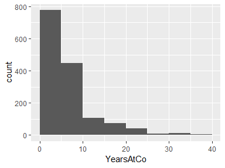

# Data report overview
The dataset examined has the following dimensions:

---------------------------------
Feature                    Result
------------------------ --------
Number of observations       1470

Number of variables            35
---------------------------------

# Codebook summary table

--------------------------------------------------------------------
  Variable            Class         # unique  Missing  Description  
                                      values                        
--------------------- ----------- ---------- --------- -------------
  **[Age]**           numeric             43  0.00 %   Employee Age            
  
  **[Attrition]**     numeric              2  0.00 %   Attrition              
  
  **[Travel]**        numeric              3  0.00 %   Business Travel              
  
  **[DailyRate]**     numeric            886  0.00 %   Daily Rate             
  
  **[Department]**    numeric              3  0.00 %   Department             
  
  **[DisFromHome]**   numeric             29  0.00 %   Distance From Home             
  
  **[Education]**     numeric              5  0.00 %   Education Level              
  
  **[EduField]**      numeric              6  0.00 %   Field of Education             
  
  **[EmpCount]**      numeric              1  0.00 %   Employee Count              
  
  **[EmployeeID]**    numeric           1470  0.00 %   Employee ID             
  
  **[EnvSatis]**      numeric              4  0.00 %   Environmental Satisfaction             
  
  **[Gender]**        numeric              2  0.00 %   Gender             
  
  **[HourlyRate]**    numeric             71  0.00 %   Hourly Rate             
  
  **[JobInvolve]**    numeric              4  0.00 %   Job Involvement             
  
  **[JobLevel]**      numeric              5  0.00 %   Job Level              
  
  **[JobRole]**       numeric              9  0.00 %   Job Role              
  
  **[JobSatis]**      numeric              4  0.00 %   Job Satisfaction             
  
  **[MaritalStat]**   numeric              3  0.00 %   Marital Status             
  
  **[MonIncome]**     numeric           1349  0.00 %   Monthly Income             
  
  **[MonthlyRate]**   numeric           1427  0.00 %   Monthly Rate             
  
  **[NumCoWork]**     numeric             10  0.00 %   Number of Companies Worked             
  
  **[Over18]**        character            1  0.00 %   Over Age 18              
  
  **[OverTime]**      numeric              2  0.00 %   OverTime             
  
  **[SalaryIncr]**    numeric             15  0.00 %   Percent Salary Hike             
  
  **[PerformRate]**   numeric              2  0.00 %   Performance Rate             
  
  **[RelateSatis]**   numeric              4  0.00 %   Relationship Satisfaction             
  
  **[StdHours]**      numeric              1  0.00 %   Standard Hours             
  
  **[StockOption]**   numeric              4  0.00 %   Stock Option Level             
  
  **[NumWorkYear]**   numeric             40  0.00 %   Total Working Years              
  
  **[TrainTime]**     numeric              7  0.00 %   Training Times Last Year             
  
  **[WorkLifeBal]**   numeric              4  0.00 %   Work/Life Balance              
  
  **[YearsAtCo]**     numeric             37  0.00 %   Years at Company             
  
  **[DuraCurRole]**   numeric             19  0.00 %   Years in Current Role              
  
  **[LastPromote]**   numeric             16  0.00 %   Years since Last Promotion             
  
  **[CurManage]**     numeric             18  0.00 %   Years with Current Manager             
--------------------------------------------------------------------

# Variable list
## Age

-----------------------------------
Feature                      Result
------------------------- ---------
Variable type               numeric

Number of missing obs.      0 (0 %)

Number of unique values          43

Median                           36

1st and 3rd quartiles        30; 43

Min. and max.                18; 60
-----------------------------------

<!-- -->

---

## Attrition

-----------------------------------
Feature                      Result
------------------------- ---------
Variable type               numeric

Number of missing obs.      0 (0 %)

Number of unique values           2

Median                            0

1st and 3rd quartiles          0; 0

Min. and max.                  0; 1
-----------------------------------

<!-- -->

---

## Travel

-----------------------------------
Feature                      Result
------------------------- ---------
Variable type               numeric

Number of missing obs.      0 (0 %)

Number of unique values           3

Median                            2

1st and 3rd quartiles          2; 2

Min. and max.                  1; 3
-----------------------------------

<!-- -->

---

## DailyRate

-------------------------------------
Feature                        Result
------------------------- -----------
Variable type                 numeric

Number of missing obs.        0 (0 %)

Number of unique values           886

Median                            802

1st and 3rd quartiles       465; 1157

Min. and max.               102; 1499
-------------------------------------

<!-- -->

---

## Department

-----------------------------------
Feature                      Result
------------------------- ---------
Variable type               numeric

Number of missing obs.      0 (0 %)

Number of unique values           3

Median                            2

1st and 3rd quartiles          2; 3

Min. and max.                  1; 3
-----------------------------------

<!-- -->

---

## DisFromHome

-----------------------------------
Feature                      Result
------------------------- ---------
Variable type               numeric

Number of missing obs.      0 (0 %)

Number of unique values          29

Median                            7

1st and 3rd quartiles         2; 14

Min. and max.                 1; 29
-----------------------------------

<!-- -->

---

## Education

-----------------------------------
Feature                      Result
------------------------- ---------
Variable type               numeric

Number of missing obs.      0 (0 %)

Number of unique values           5

Median                            3

1st and 3rd quartiles          2; 4

Min. and max.                  1; 5
-----------------------------------

<!-- -->

---

## EduField

-----------------------------------
Feature                      Result
------------------------- ---------
Variable type               numeric

Number of missing obs.      0 (0 %)

Number of unique values           6

Median                            3

1st and 3rd quartiles          2; 4

Min. and max.                  1; 6
-----------------------------------

<!-- -->

---

## EmpCount

* The variable only takes one (non-missing) value: \"1\". The variable contains 0 \% missing observations.

---

## EmployeeID

-------------------------------------------
Feature                              Result
------------------------- -----------------
Variable type                       numeric

Number of missing obs.              0 (0 %)

Number of unique values                1470

Median                               1020.5

1st and 3rd quartiles       491.25; 1555.75

Min. and max.                       1; 2068
-------------------------------------------

<!-- -->

---

## EnvSatis

-----------------------------------
Feature                      Result
------------------------- ---------
Variable type               numeric

Number of missing obs.      0 (0 %)

Number of unique values           4

Median                            3

1st and 3rd quartiles          2; 4

Min. and max.                  1; 4
-----------------------------------

<!-- -->

---

## Gender

-----------------------------------
Feature                      Result
------------------------- ---------
Variable type               numeric

Number of missing obs.      0 (0 %)

Number of unique values           2

Median                            1

1st and 3rd quartiles          0; 1

Min. and max.                  0; 1
-----------------------------------

<!-- -->

---

## HourlyRate

-------------------------------------
Feature                        Result
------------------------- -----------
Variable type                 numeric

Number of missing obs.        0 (0 %)

Number of unique values            71

Median                             66

1st and 3rd quartiles       48; 83.75

Min. and max.                 30; 100
-------------------------------------

<!-- -->

---

## JobInvolve

-----------------------------------
Feature                      Result
------------------------- ---------
Variable type               numeric

Number of missing obs.      0 (0 %)

Number of unique values           4

Median                            3

1st and 3rd quartiles          2; 3

Min. and max.                  1; 4
-----------------------------------

<!-- -->

---

## JobLevel

-----------------------------------
Feature                      Result
------------------------- ---------
Variable type               numeric

Number of missing obs.      0 (0 %)

Number of unique values           5

Median                            2

1st and 3rd quartiles          1; 3

Min. and max.                  1; 5
-----------------------------------

<!-- -->

---

## JobRole

-----------------------------------
Feature                      Result
------------------------- ---------
Variable type               numeric

Number of missing obs.      0 (0 %)

Number of unique values           9

Median                            6

1st and 3rd quartiles          3; 8

Min. and max.                  0; 9
-----------------------------------

<!-- -->

---

## JobSatis

-----------------------------------
Feature                      Result
------------------------- ---------
Variable type               numeric

Number of missing obs.      0 (0 %)

Number of unique values           4

Median                            3

1st and 3rd quartiles          2; 4

Min. and max.                  1; 4
-----------------------------------

<!-- -->

---

## MaritalStat

-----------------------------------
Feature                      Result
------------------------- ---------
Variable type               numeric

Number of missing obs.      0 (0 %)

Number of unique values           3

Median                            2

1st and 3rd quartiles          1; 2

Min. and max.                  1; 3
-----------------------------------

<!-- -->

---

## MonIncome

---------------------------------------
Feature                          Result
------------------------- -------------
Variable type                   numeric

Number of missing obs.          0 (0 %)

Number of unique values            1349

Median                             4919

1st and 3rd quartiles        2911; 8379

Min. and max.               1009; 19999
---------------------------------------

<!-- -->

---

## MonthlyRate

-----------------------------------------
Feature                            Result
------------------------- ---------------
Variable type                     numeric

Number of missing obs.            0 (0 %)

Number of unique values              1427

Median                            14235.5

1st and 3rd quartiles       8047; 20461.5

Min. and max.                 2094; 26999
-----------------------------------------

<!-- -->

---

## NumCoWork

-----------------------------------
Feature                      Result
------------------------- ---------
Variable type               numeric

Number of missing obs.      0 (0 %)

Number of unique values          10

Median                            2

1st and 3rd quartiles          1; 4

Min. and max.                  0; 9
-----------------------------------

<!-- -->

---

## Over18

* The variable only takes one (non-missing) value: \"Y\". The variable contains 0 \% missing observations.

---

## OverTime

-----------------------------------
Feature                      Result
------------------------- ---------
Variable type               numeric

Number of missing obs.      0 (0 %)

Number of unique values           2

Median                            0

1st and 3rd quartiles          0; 1

Min. and max.                  0; 1
-----------------------------------

<!-- -->

---

## SalaryIncr

-----------------------------------
Feature                      Result
------------------------- ---------
Variable type               numeric

Number of missing obs.      0 (0 %)

Number of unique values          15

Median                           14

1st and 3rd quartiles        12; 18

Min. and max.                11; 25
-----------------------------------

<!-- -->

---

## PerformRate

-----------------------------------
Feature                      Result
------------------------- ---------
Variable type               numeric

Number of missing obs.      0 (0 %)

Number of unique values           2

Median                            3

1st and 3rd quartiles          3; 3

Min. and max.                  3; 4
-----------------------------------

<!-- -->

---

## RelateSatis

-----------------------------------
Feature                      Result
------------------------- ---------
Variable type               numeric

Number of missing obs.      0 (0 %)

Number of unique values           4

Median                            3

1st and 3rd quartiles          2; 4

Min. and max.                  1; 4
-----------------------------------

<!-- -->

---

## StdHours

* The variable only takes one (non-missing) value: \"80\". The variable contains 0 \% missing observations.

---

## StockOption

-----------------------------------
Feature                      Result
------------------------- ---------
Variable type               numeric

Number of missing obs.      0 (0 %)

Number of unique values           4

Median                            1

1st and 3rd quartiles          0; 1

Min. and max.                  0; 3
-----------------------------------

<!-- -->

---

## NumWorkYear

-----------------------------------
Feature                      Result
------------------------- ---------
Variable type               numeric

Number of missing obs.      0 (0 %)

Number of unique values          40

Median                           10

1st and 3rd quartiles         6; 15

Min. and max.                 0; 40
-----------------------------------

<!-- -->

---

## TrainTime

-----------------------------------
Feature                      Result
------------------------- ---------
Variable type               numeric

Number of missing obs.      0 (0 %)

Number of unique values           7

Median                            3

1st and 3rd quartiles          2; 3

Min. and max.                  0; 6
-----------------------------------

<!-- -->

---

## WorkLifeBal

-----------------------------------
Feature                      Result
------------------------- ---------
Variable type               numeric

Number of missing obs.      0 (0 %)

Number of unique values           4

Median                            3

1st and 3rd quartiles          2; 3

Min. and max.                  1; 4
-----------------------------------

<!-- -->

---

## YearsAtCo

-----------------------------------
Feature                      Result
------------------------- ---------
Variable type               numeric

Number of missing obs.      0 (0 %)

Number of unique values          37

Median                            5

1st and 3rd quartiles          3; 9

Min. and max.                 0; 40
-----------------------------------

<!-- -->

---

## DuraCurRole

-----------------------------------
Feature                      Result
------------------------- ---------
Variable type               numeric

Number of missing obs.      0 (0 %)

Number of unique values          19

Median                            3

1st and 3rd quartiles          2; 7

Min. and max.                 0; 18
-----------------------------------

<!-- -->

---

## LastPromote

-----------------------------------
Feature                      Result
------------------------- ---------
Variable type               numeric

Number of missing obs.      0 (0 %)

Number of unique values          16

Median                            1

1st and 3rd quartiles          0; 3

Min. and max.                 0; 15
-----------------------------------

<!-- -->

---

## CurManage

-----------------------------------
Feature                      Result
------------------------- ---------
Variable type               numeric

Number of missing obs.      0 (0 %)

Number of unique values          18

Median                            3

1st and 3rd quartiles          2; 7

Min. and max.                 0; 17
-----------------------------------

<!-- -->

---

Report generation information:

 *  Created by Richard Hart (username: `Richard`).

 *  Report creation time: Sat Apr 13 2019 15:55:26

 *  Report was run from directory: `D:/Dropbox/Git_Projects/DDS6306_CaseStudy02`

 *  dataMaid v1.2.0 [Pkg: 2018-10-03 from CRAN (R 3.5.3)]

 *  R version 3.5.2 (2018-12-20).

 *  Platform: x86_64-w64-mingw32/x64 (64-bit)(Windows >= 8 x64 (build 9200)).

 *  Function call: `makeDataReport(data = hr, mode = c("summarize", "visualize", 
"check"), smartNum = FALSE, file = "codebook_hr.Rmd", checks = list(
    character = "showAllFactorLevels", factor = "showAllFactorLevels", 
    labelled = "showAllFactorLevels", haven_labelled = "showAllFactorLevels", 
    numeric = NULL, integer = NULL, logical = NULL, Date = NULL), 
    listChecks = FALSE, maxProbVals = Inf, codebook = TRUE, reportTitle = "Codebook for hr")`

