```r
sessionInfo()
```

```
## R version 3.5.2 (2018-12-20)
## Platform: x86_64-w64-mingw32/x64 (64-bit)
## Running under: Windows 10 x64 (build 17763)
## 
## Matrix products: default
## 
## locale:
## [1] LC_COLLATE=English_United States.1252 
## [2] LC_CTYPE=English_United States.1252   
## [3] LC_MONETARY=English_United States.1252
## [4] LC_NUMERIC=C                          
## [5] LC_TIME=English_United States.1252    
## 
## attached base packages:
## [1] stats     graphics  grDevices utils     datasets  methods   base     
## 
## other attached packages:
##  [1] MASS_7.3-51.1              corrplot_0.84             
##  [3] pastecs_1.3.21             tidyquant_0.5.5           
##  [5] forcats_0.3.0              stringr_1.4.0             
##  [7] dplyr_0.7.8                purrr_0.2.5               
##  [9] readr_1.3.1                tidyr_0.8.2               
## [11] tibble_1.4.2               ggplot2_3.1.0             
## [13] tidyverse_1.2.1            quantmod_0.4-14           
## [15] TTR_0.23-4                 PerformanceAnalytics_1.5.2
## [17] xts_0.11-2                 zoo_1.8-4                 
## [19] lubridate_1.7.4            readxl_1.2.0              
## 
## loaded via a namespace (and not attached):
##  [1] tidyselect_0.2.5 xfun_0.4         haven_2.0.0      lattice_0.20-38 
##  [5] colorspace_1.3-2 generics_0.0.2   htmltools_0.3.6  yaml_2.2.0      
##  [9] rlang_0.3.0.1    pillar_1.3.1     withr_2.1.2      glue_1.3.0      
## [13] modelr_0.1.4     bindrcpp_0.2.2   bindr_0.1.1      plyr_1.8.4      
## [17] Quandl_2.9.1     munsell_0.5.0    gtable_0.2.0     cellranger_1.1.0
## [21] rvest_0.3.2      evaluate_0.13    knitr_1.21       curl_3.2        
## [25] broom_0.5.1      Rcpp_1.0.0       backports_1.1.3  scales_1.0.0    
## [29] jsonlite_1.6     hms_0.4.2        digest_0.6.18    stringi_1.2.4   
## [33] grid_3.5.2       cli_1.0.1        quadprog_1.5-5   tools_3.5.2     
## [37] magrittr_1.5     lazyeval_0.2.1   crayon_1.3.4     pkgconfig_2.0.2 
## [41] xml2_1.2.0       rstudioapi_0.8   assertthat_0.2.0 rmarkdown_1.11  
## [45] httr_1.4.0       boot_1.3-20      R6_2.3.0         nlme_3.1-137    
## [49] compiler_3.5.2
```

### Clean Raw Data
  * There are 1470 rows and 35 columns in the employee raw data frame.

```r
require(readxl)
Employee_rawdata <- as.data.frame(read_excel("CaseStudy Info/CaseStudy2-data.xlsx"))
```

```
## readxl works best with a newer version of the tibble package.
## You currently have tibble v1.4.2.
## Falling back to column name repair from tibble <= v1.4.2.
## Message displays once per session.
```

```r
dim(Employee_rawdata)
```

```
## [1] 1470   35
```


### Prelimary Analysis


```r
# All employees are older than 18
hr <- subset(Employee_rawdata, Employee_rawdata$Age >= 18)
hr$Over18 <- NULL

# All employees had 80 standard work hours
hr$StdHours <- NULL

# All employee counts are 1
hr$EmpCount <- NULL

# Transform Categorical Variables to Indicator Variables
hr <- hr %>% mutate(Attrition=ifelse(Attrition=="Yes", 1, 0))
hr <- hr %>% mutate(Travel=ifelse(Travel=="Travel_Rarely", 2, 
                                                  ifelse(Travel=="Travel_Frequently", 3, 1)))
hr <- hr %>% mutate(Department=ifelse(Department=="Research & Development", 2, 
                                              ifelse(Department=="Sales", 3, 1)))
hr <- hr %>% mutate(EduField=ifelse(EduField=="Life Sciences", 2, 
                                                  ifelse(EduField=="Marketing", 3, 
                                                         ifelse(EduField=="Medical", 4,
                                                                ifelse(EduField=="Other", 5,
                                                                       ifelse(EduField=="Technical Degree", 6, 1))))))
hr <- hr %>% mutate(Gender=ifelse(Gender=="Male", 1, 0))
hr <- hr %>% mutate(JobRole=ifelse(JobRole=="Healthcare Representative", 2,
                                           ifelse(JobRole=="Laboratory Technician", 3,
                                                  ifelse(JobRole=="Manager", 4,
                                                         ifelse(JobRole=="Manufacturing Director", 5,
                                                                ifelse(JobRole=="Research Director", 6, 
                                                                       ifelse(JobRole=="Research Scientist", 7,
                                                                              ifelse(JobRole=="Sales Executive", 8,
                                                                                     ifelse(JobRole=="Sales Representative", 9, 0)))))))))
hr <- hr %>% mutate(MaritalStat=ifelse(MaritalStat=="Married", 2,
                                                 ifelse(MaritalStat=="Divorced", 3, 1)))
hr <- hr %>% mutate(OverTime=ifelse(OverTime=="Yes", 1, 0))
```

### Preliminary Analysis Continued
#### Percent Attriton for JobRole, Department, Business Travel, 
#### Education Field, Years of Education and Marital Status

```r
# Percent Attrition by Job Role
roles <- Employee_rawdata %>% group_by(JobRole, Attrition) %>% summarise(n = n())
roles[,c("Totals", "Percents")] <- NA
for (x in roles$JobRole)
{
  roles$Totals[roles$JobRole == x] <- sum(Employee_rawdata$JobRole == x)
  roles$Percents[roles$JobRole == x] <- roles$n[roles$JobRole == x] / roles$Totals[roles$JobRole == x] * 100
}
roles <- as.data.frame(roles)

# Percent Attrition by Department
depts <- Employee_rawdata %>% group_by(Department, Attrition) %>% summarise(n = n())
depts[,c("Totals", "Percents")] <- NA
for (x in depts$Department)
{
  depts$Totals[depts$Department == x] <- sum(Employee_rawdata$Department == x)
  depts$Percents[depts$Department == x] <- depts$n[depts$Department == x] / depts$Totals[depts$Department == x] * 100
}
depts <- as.data.frame(depts)

# Percent Attrition by Travel
travel <- Employee_rawdata %>% group_by(Travel, Attrition) %>% summarise(n = n())
travel[,c("Totals", "Percents")] <- NA
for (x in travel$Travel)
{
  travel$Totals[travel$Travel == x] <- sum(Employee_rawdata$Travel == x )
  travel$Percents[travel$Travel == x] <- travel$n[travel$Travel == x] / travel$Totals[travel$Travel == x] * 100
}
travel <- as.data.frame(travel)

# Percent Attrition by Education Field
educfield <- Employee_rawdata %>% group_by(EduField, Attrition) %>% summarise(n = n())
educfield[,c("Totals", "Percents")] <- NA
for (x in educfield$EduField)
{
  educfield$Totals[educfield$EduField == x] <- sum(Employee_rawdata$EduField == x)
  educfield$Percents[educfield$EduField == x] <- educfield$n[educfield$EduField == x] / educfield$Totals[educfield$EduField == x] * 100
}
educfield <- as.data.frame(educfield)

# Percent Attrition by Gender
gender <- Employee_rawdata %>% group_by(Gender, Attrition) %>% summarise(n = n())
gender[,c("Totals", "Percents")] <- NA
for (x in gender$Gender)
{
  gender$Totals[gender$Gender == x] <- sum(Employee_rawdata$Gender == x)
  gender$Percents[gender$Gender == x] <- gender$n[gender$Gender == x] / gender$Totals[gender$Gender == x] * 100
}
gender <- as.data.frame(gender)

# Percent Attrition by Years of Education
educyr <- Employee_rawdata %>% group_by(Education, Attrition) %>% summarise(n = n())
educyr[,c("Totals", "Percents")] <- NA
for (x in educyr$Education)
{
  educyr$Totals[educyr$Education == x] <- sum(Employee_rawdata$Education == x)
  educyr$Percents[educyr$Education == x] <- educyr$n[educyr$Education == x] / educyr$Totals[educyr$Education == x] * 100
}
educyr <- as.data.frame(educyr)

# Percent Attrition by Marital Status
marital_status <- Employee_rawdata %>% group_by(MaritalStat, Attrition) %>% summarise(n = n())
marital_status[,c("Totals", "Percents")] <- NA
for (x in marital_status$MaritalStat)
{
  marital_status$Totals[marital_status$MaritalStat == x] <- sum(Employee_rawdata$MaritalStat == x)
  marital_status$Percents[marital_status$MaritalStat == x] <- marital_status$n[marital_status$MaritalStat == x] / marital_status$Totals[marital_status$MaritalStat == x] * 100
}
marital_status <- as.data.frame(marital_status)

# Percent Attrition by JobRole
roles %>% filter(Attrition == "Yes") %>% ggplot(aes(x = reorder(JobRole, -Percents), y = Percents, fill=JobRole)) + 
  geom_bar(stat = "identity") + 
  coord_flip() + 
  xlab("Job Role") + ylab("Percent Attrition") +
  ggtitle("Percent Attrition by Job Role") +
  theme_classic() +
  theme(plot.title = element_text(size = 20, hjust = 0.5)) +
  guides(fill=guide_legend(title="Job Role"))
```

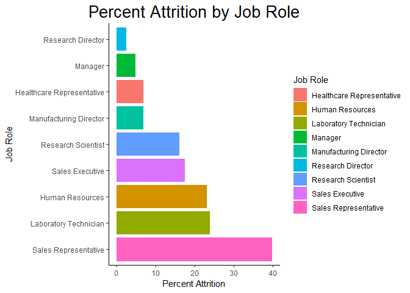<!-- -->

```r
# Percent Attrition by Department
depts %>% filter(Attrition == "Yes") %>% ggplot(aes(x = reorder(Department, -Percents), y = Percents, fill=Department)) + 
  geom_bar(stat = "identity") + 
  xlab("Department") + ylab("Percent Attrition") +
  ggtitle("Percent Attrition by Department") +
  theme_classic() +
  theme(plot.title = element_text(size = 20, hjust = 0.5)) +
  guides(fill=guide_legend(title="Department"))
```

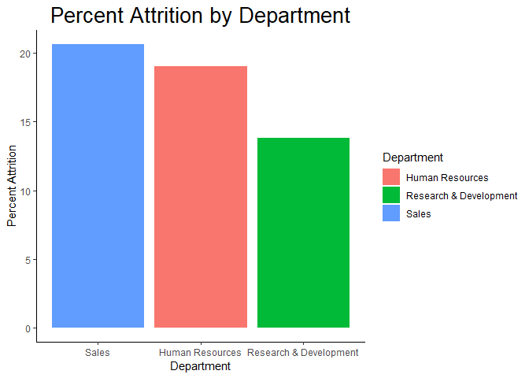<!-- -->

```r
# Percent Attrition by Travel
travel %>% filter(Attrition == "Yes") %>% ggplot(aes(x = reorder(Travel, -Percents), y = Percents, fill=Travel)) + 
  geom_bar(stat = "identity") + 
  xlab("Business Travel") + ylab("Percent Attrition") +
  ggtitle("Percent Attrition by Business Travel") +
  theme_classic() +
  theme(plot.title = element_text(size = 20, hjust = 0.5)) +
  guides(fill=guide_legend(title="Business Travel"))
```

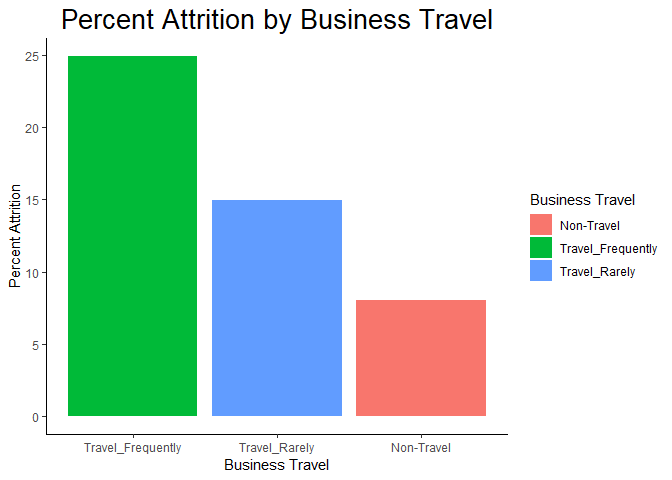<!-- -->

```r
# Percent Attrition by Education Field
educfield %>% filter(Attrition == "Yes") %>% ggplot(aes(x = reorder(EduField, -Percents), y = Percents, fill=EduField)) + 
  geom_bar(stat = "identity") + 
  xlab("Education Field") + ylab("Percent Attrition") +
  ggtitle("Percent Attrition by Field of Education") +
  theme_classic() +
  theme(plot.title = element_text(size = 20, hjust = 0.5)) +
  guides(fill=guide_legend(title="Education Field"))
```

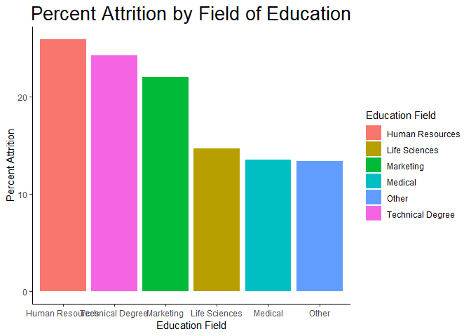<!-- -->

```r
# Percent Attrition by Gender
gender %>% filter(Attrition == "Yes") %>% ggplot(aes(x = reorder(Gender, -Percents), y = Percents, fill=Gender)) + 
  geom_bar(stat = "identity") + 
  xlab("Gender") + ylab("Percent Attrition") +
  ggtitle("Percent Attrition by Gender") +
  theme_classic() +
  theme(plot.title = element_text(size = 20, hjust = 0.5)) +
  guides(fill=guide_legend(title="Gender"))
```

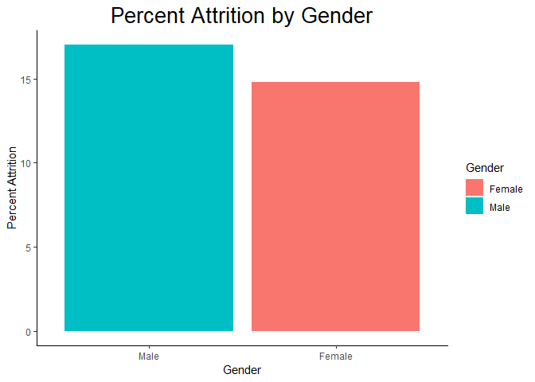<!-- -->

```r
# Percent Attrition by Years of Education
educyr %>% filter(Attrition == "Yes") %>% ggplot(aes(x = reorder(Education, -Percents), y = Percents, fill=Education)) + 
  geom_bar(stat = "identity") + 
  xlab("Years of Education") + ylab("Percent Attrition") +
  ggtitle("Percent Attrition by Years of Education") +
  theme_classic() +
  theme(plot.title = element_text(size = 20, hjust = 0.5)) +
  guides(fill=guide_legend(title="Years of Education"))
```

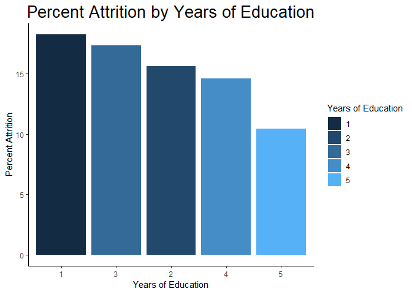<!-- -->

```r
# Percent Attrition by Marital Status
marital_status %>% filter(Attrition == "Yes") %>% ggplot(aes(x = reorder(MaritalStat, -Percents), y = Percents, fill=MaritalStat)) + 
  geom_bar(stat = "identity") + 
  xlab("Marital Status") + ylab("Percent Attrition") +
  ggtitle("Percent Attrition by Marital Status") +
  theme_classic() +
  theme(plot.title = element_text(size = 20, hjust = 0.5)) +
  guides(fill=guide_legend(title="Marital Status"))
```

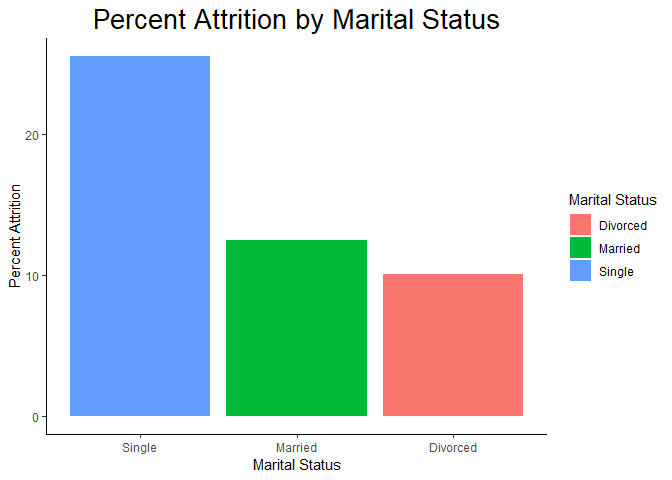<!-- -->

#### Correlation Plot of all variables

```r
# Build Correlation Plot
hrCorr <- cor(hr)
colnames(hrCorr) <- c("Age", "Attrition", "Business Travel", "Daily Rate", "Department", "Distance From Home", "Education", "Education Field", "Employee Number", "Environment Satisfaction", "Gender", "Hourly Rate", "Job Involvement", "Job Level", "Job Role", "Job Satisfaction", "Marital Status", "Monthly Income", "Monthly Rate", "Number of Companies Worked", "OverTime", "Percent Salary Hike", "Performance Rating", "Relationship Satisfaction", "Stock Option Level", "Total Working Years", "Training Times Last Year", "Work Life Balance", "Years At Company", "Years In Current Role", "Years Since Last Promotion", "Years With Current Manager")
rownames(hrCorr) <- c("Age", "Attrition", "Business Travel", "Daily Rate", "Department", "Distance From Home", "Education", "Education Field", "Employee Number", "Environment Satisfaction", "Gender", "Hourly Rate", "Job Involvement", "Job Level", "Job Role", "Job Satisfaction", "Marital Status", "Monthly Income", "Monthly Rate", "Number of Companies Worked", "OverTime", "Percent Salary Hike", "Performance Rating", "Relationship Satisfaction", "Stock Option Level", "Total Working Years", "Training Times Last Year", "Work Life Balance", "Years At Company", "Years In Current Role", "Years Since Last Promotion", "Years With Current Manager")
corrplot(hrCorr, method = 'color', number.cex = 0.65, tl.cex = 0.70, type = 'full', title = "Correlation Plot of all Variables", mar=c(0,0,2,0), diag=FALSE)
```

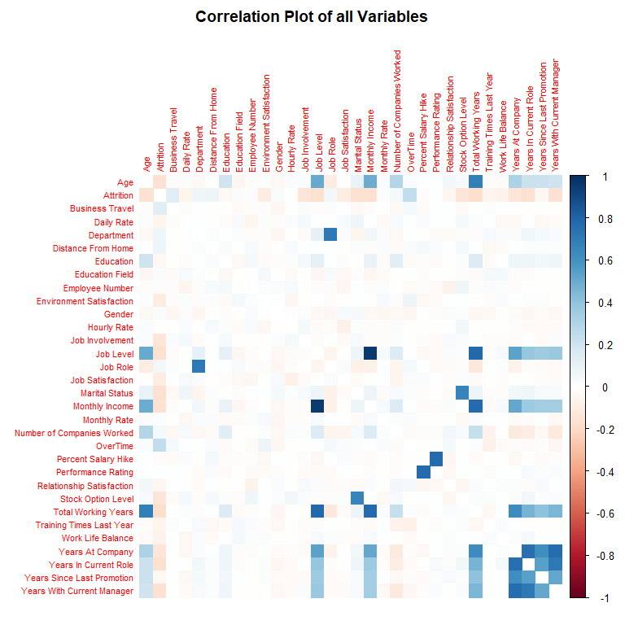<!-- -->


```r
require(pastecs)

# Consider Department, EducationBackground, JobRole, and Gender with Credentials
Credentials <- hr[,(names(hr) %in%
                                   c("Age","Education","JobLevel","PerformRate"))]
                                 
# Consider Marital Status with Satisfaction
LifeSatisfaction <- hr[,(names(hr) %in%
                                  c("DisFromHome","EnvSatis","JobInvolve","JobSatis","RelateSatis","WorkLifeBal"))]
                              
# Consider Overtime with Compensation                                  
Compensation <- hr[,(names(hr) %in%
                                  c("DailyRate","HourlyRate","MonthlyRate","MonIncome","SalaryIncr","LastPromote","StockOption"))]

Loyalty <- hr[,(names(hr) %in%
                             c("NumComWork","NumWorkYear","YearsAtCo","DuraCurRole","CurManage"))]

stat.desc(Credentials)
```

```
##                       Age    Education     JobLevel  PerformRate
## nbr.val      1.470000e+03 1.470000e+03 1.470000e+03 1.470000e+03
## nbr.null     0.000000e+00 0.000000e+00 0.000000e+00 0.000000e+00
## nbr.na       0.000000e+00 0.000000e+00 0.000000e+00 0.000000e+00
## min          1.800000e+01 1.000000e+00 1.000000e+00 3.000000e+00
## max          6.000000e+01 5.000000e+00 5.000000e+00 4.000000e+00
## range        4.200000e+01 4.000000e+00 4.000000e+00 1.000000e+00
## sum          5.427800e+04 4.282000e+03 3.034000e+03 4.636000e+03
## median       3.600000e+01 3.000000e+00 2.000000e+00 3.000000e+00
## mean         3.692381e+01 2.912925e+00 2.063946e+00 3.153741e+00
## SE.mean      2.382691e-01 2.671230e-02 2.887124e-02 9.411009e-03
## CI.mean.0.95 4.673839e-01 5.239831e-02 5.663324e-02 1.846045e-02
## var          8.345505e+01 1.048914e+00 1.225316e+00 1.301936e-01
## std.dev      9.135373e+00 1.024165e+00 1.106940e+00 3.608235e-01
## coef.var     2.474115e-01 3.515933e-01 5.363222e-01 1.144113e-01
```

```r
stat.desc(LifeSatisfaction)
```

```
##               DisFromHome     EnvSatis   JobInvolve     JobSatis
## nbr.val      1.470000e+03 1.470000e+03 1.470000e+03 1.470000e+03
## nbr.null     0.000000e+00 0.000000e+00 0.000000e+00 0.000000e+00
## nbr.na       0.000000e+00 0.000000e+00 0.000000e+00 0.000000e+00
## min          1.000000e+00 1.000000e+00 1.000000e+00 1.000000e+00
## max          2.900000e+01 4.000000e+00 4.000000e+00 4.000000e+00
## range        2.800000e+01 3.000000e+00 3.000000e+00 3.000000e+00
## sum          1.351300e+04 4.001000e+03 4.013000e+03 4.011000e+03
## median       7.000000e+00 3.000000e+00 3.000000e+00 3.000000e+00
## mean         9.192517e+00 2.721769e+00 2.729932e+00 2.728571e+00
## SE.mean      2.114435e-01 2.850980e-02 1.855896e-02 2.876446e-02
## CI.mean.0.95 4.147633e-01 5.592426e-02 3.640488e-02 5.642380e-02
## var          6.572125e+01 1.194829e+00 5.063193e-01 1.216270e+00
## std.dev      8.106864e+00 1.093082e+00 7.115611e-01 1.102846e+00
## coef.var     8.818982e-01 4.016073e-01 2.606516e-01 4.041844e-01
##               RelateSatis  WorkLifeBal
## nbr.val      1.470000e+03 1.470000e+03
## nbr.null     0.000000e+00 0.000000e+00
## nbr.na       0.000000e+00 0.000000e+00
## min          1.000000e+00 1.000000e+00
## max          4.000000e+00 4.000000e+00
## range        3.000000e+00 3.000000e+00
## sum          3.987000e+03 4.059000e+03
## median       3.000000e+00 3.000000e+00
## mean         2.712245e+00 2.761224e+00
## SE.mean      2.820012e-02 1.842632e-02
## CI.mean.0.95 5.531679e-02 3.614471e-02
## var          1.169013e+00 4.991081e-01
## std.dev      1.081209e+00 7.064758e-01
## coef.var     3.986398e-01 2.558560e-01
```

```r
stat.desc(Compensation)
```

```
##                 DailyRate   HourlyRate    MonIncome  MonthlyRate
## nbr.val      1.470000e+03 1.470000e+03 1.470000e+03 1.470000e+03
## nbr.null     0.000000e+00 0.000000e+00 0.000000e+00 0.000000e+00
## nbr.na       0.000000e+00 0.000000e+00 0.000000e+00 0.000000e+00
## min          1.020000e+02 3.000000e+01 1.009000e+03 2.094000e+03
## max          1.499000e+03 1.000000e+02 1.999900e+04 2.699900e+04
## range        1.397000e+03 7.000000e+01 1.899000e+04 2.490500e+04
## sum          1.179654e+06 9.686000e+04 9.559309e+06 2.104026e+07
## median       8.020000e+02 6.600000e+01 4.919000e+03 1.423550e+04
## mean         8.024857e+02 6.589116e+01 6.502931e+03 1.431310e+04
## SE.mean      1.052434e+01 5.302327e-01 1.227931e+02 1.856463e+02
## CI.mean.0.95 2.064433e+01 1.040094e+00 2.408684e+02 3.641601e+02
## var          1.628196e+05 4.132856e+02 2.216486e+07 5.066288e+07
## std.dev      4.035091e+02 2.032943e+01 4.707957e+03 7.117786e+03
## coef.var     5.028240e-01 3.085304e-01 7.239746e-01 4.972916e-01
##                SalaryIncr  StockOption  LastPromote
## nbr.val      1.470000e+03 1.470000e+03 1.470000e+03
## nbr.null     0.000000e+00 6.310000e+02 5.810000e+02
## nbr.na       0.000000e+00 0.000000e+00 0.000000e+00
## min          1.100000e+01 0.000000e+00 0.000000e+00
## max          2.500000e+01 3.000000e+00 1.500000e+01
## range        1.400000e+01 3.000000e+00 1.500000e+01
## sum          2.235800e+04 1.167000e+03 3.216000e+03
## median       1.400000e+01 1.000000e+00 1.000000e+00
## mean         1.520952e+01 7.938776e-01 2.187755e+00
## SE.mean      9.545859e-02 2.222389e-02 8.404751e-02
## CI.mean.0.95 1.872497e-01 4.359393e-02 1.648659e-01
## var          1.339514e+01 7.260346e-01 1.038406e+01
## std.dev      3.659938e+00 8.520767e-01 3.222430e+00
## coef.var     2.406346e-01 1.073310e+00 1.472939e+00
```

```r
stat.desc(Loyalty)
```

```
##               NumWorkYear    YearsAtCo  DuraCurRole    CurManage
## nbr.val      1.470000e+03 1.470000e+03 1.470000e+03 1.470000e+03
## nbr.null     1.100000e+01 4.400000e+01 2.440000e+02 2.630000e+02
## nbr.na       0.000000e+00 0.000000e+00 0.000000e+00 0.000000e+00
## min          0.000000e+00 0.000000e+00 0.000000e+00 0.000000e+00
## max          4.000000e+01 4.000000e+01 1.800000e+01 1.700000e+01
## range        4.000000e+01 4.000000e+01 1.800000e+01 1.700000e+01
## sum          1.658100e+04 1.030200e+04 6.217000e+03 6.061000e+03
## median       1.000000e+01 5.000000e+00 3.000000e+00 3.000000e+00
## mean         1.127959e+01 7.008163e+00 4.229252e+00 4.123129e+00
## SE.mean      2.029386e-01 1.597922e-01 9.449876e-02 9.306422e-02
## CI.mean.0.95 3.980802e-01 3.134452e-01 1.853669e-01 1.825529e-01
## var          6.054056e+01 3.753431e+01 1.312712e+01 1.273160e+01
## std.dev      7.780782e+00 6.126525e+00 3.623137e+00 3.568136e+00
## coef.var     6.898106e-01 8.741984e-01 8.566851e-01 8.653952e-01
```

```r
require(ggplot2)
ggplot(hr, aes(x=MonIncome)) + geom_histogram(color="black", fill="white",bins = 25) + 
  labs(title = "Histogram of Monthly Income", x = "Monthly Income", y = "Frequency") + 
  theme(plot.title = element_text(hjust = 0.5))
```

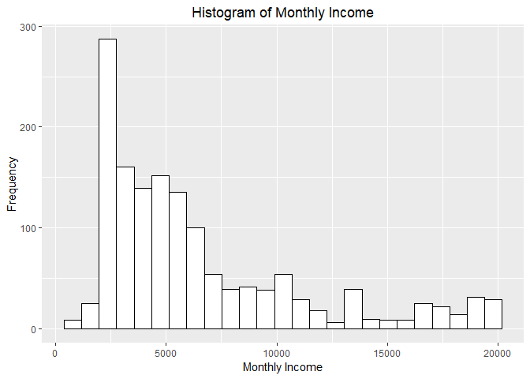<!-- -->

```r
ggplot(hr, aes(x=SalaryIncr)) + geom_histogram(color="black", fill="white",bins=4) + 
  labs(title = "Histogram of Percent Salary Hike", x = "Percent Salary Hike", y = "Frequency") + 
  theme(plot.title = element_text(hjust = 0.5))
```

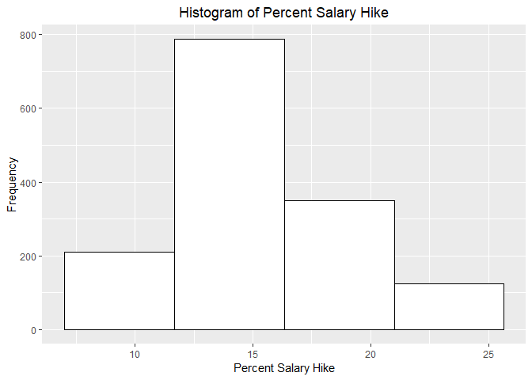<!-- -->


```r
Gender <- as.data.frame(table(Employee_rawdata$Gender))
colnames(Gender) <- c("Gender","Frequency")
Gender
```

```
##   Gender Frequency
## 1 Female       588
## 2   Male       882
```

```r
Education <- as.data.frame(table(Employee_rawdata$EduField))
colnames(Education) <- c("Education","Frequency")
Education
```

```
##          Education Frequency
## 1  Human Resources        27
## 2    Life Sciences       606
## 3        Marketing       159
## 4          Medical       464
## 5            Other        82
## 6 Technical Degree       132
```

```r
Occupation <- as.data.frame(table(Employee_rawdata$JobRole))
colnames(Occupation) <- c("Occupation","Frequency")
Occupation
```

```
##                  Occupation Frequency
## 1 Healthcare Representative       131
## 2           Human Resources        52
## 3     Laboratory Technician       259
## 4                   Manager       102
## 5    Manufacturing Director       145
## 6         Research Director        80
## 7        Research Scientist       292
## 8           Sales Executive       326
## 9      Sales Representative        83
```


```r
Management <- Occupation[c(4:6),]
colnames(Management) <- c("Position","Frequency")
Management
```

```
##                 Position Frequency
## 4                Manager       102
## 5 Manufacturing Director       145
## 6      Research Director        80
```


```r
ggplot(data=Employee_rawdata,aes(x=Age,y=MonIncome,color=Gender)) + 
            geom_point() + 
            geom_smooth(method = lm, se = FALSE, color = "black") +
            labs(title = "Correlation between Employee Age and Monthly Income", x = "Age (Years)", y = "Monthly Income ($)") +
            theme(plot.title = element_text(hjust = 0.5))
```

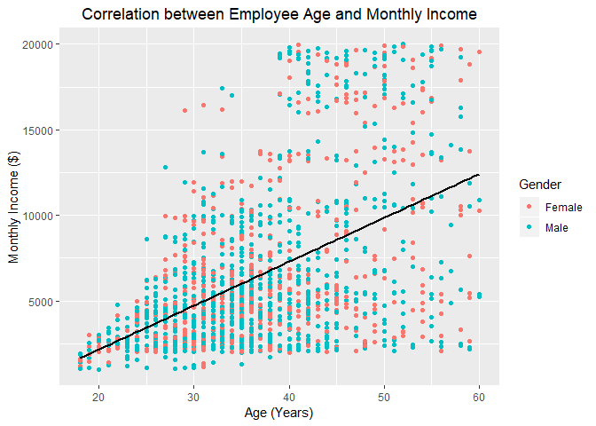<!-- -->

```r
# lm() function fits the Monthly Income and Age variables of the Employee dataset with a linear model using Monthly Income as the response variable and Age as the explanatory variable
# summary() function produces the result summaries of the linear model fit
# the square root of the R^2 value provides the correlation coefficient for the linear fit model of ABV and IBU
LinearCorrelation <- lm(MonIncome ~ Age, data = hr)
summary(LinearCorrelation)
```

```
## 
## Call:
## lm(formula = MonIncome ~ Age, data = hr)
## 
## Residuals:
##     Min      1Q  Median      3Q     Max 
## -9990.1 -2592.7  -677.9  1810.5 12540.8 
## 
## Coefficients:
##             Estimate Std. Error t value Pr(>|t|)    
## (Intercept) -2970.67     443.70  -6.695 3.06e-11 ***
## Age           256.57      11.67  21.995  < 2e-16 ***
## ---
## Signif. codes:  0 '***' 0.001 '**' 0.01 '*' 0.05 '.' 0.1 ' ' 1
## 
## Residual standard error: 4084 on 1468 degrees of freedom
## Multiple R-squared:  0.2479,	Adjusted R-squared:  0.2473 
## F-statistic: 483.8 on 1 and 1468 DF,  p-value: < 2.2e-16
```

```r
# R_squared <- 0.2479
Correlation.Age_Income <- sqrt(summary(LinearCorrelation)$r.squared)
Correlation.Age_Income
```

```
## [1] 0.4978546
```

```r
# unbalanced data - 1233 No vs 237 Yes
Attrition <- as.data.frame(table(hr$Attrition))
colnames(Attrition) <- c("Attrition","Frequency")
Attrition
```

```
##   Attrition Frequency
## 1         0      1233
## 2         1       237
```


### Basic Linear Regression

```r
attritlm <- lm(Attrition ~ ., data = hr)
summary(attritlm)
```

```
## 
## Call:
## lm(formula = Attrition ~ ., data = hr)
## 
## Residuals:
##      Min       1Q   Median       3Q      Max 
## -0.59553 -0.21218 -0.08490  0.07369  1.13985 
## 
## Coefficients:
##               Estimate Std. Error t value Pr(>|t|)    
## (Intercept)  6.469e-01  1.367e-01   4.732 2.44e-06 ***
## Age         -3.796e-03  1.336e-03  -2.842 0.004550 ** 
## Travel       8.238e-02  1.610e-02   5.118 3.51e-07 ***
## DailyRate   -3.170e-05  2.137e-05  -1.483 0.138242    
## Department   7.432e-02  2.410e-02   3.084 0.002080 ** 
## DisFromHome  3.544e-03  1.059e-03   3.346 0.000841 ***
## Education    4.802e-04  8.580e-03   0.056 0.955375    
## EduField     6.668e-03  6.449e-03   1.034 0.301333    
## EmployeeID  -8.218e-06  1.430e-05  -0.575 0.565631    
## EnvSatis    -4.030e-02  7.858e-03  -5.129 3.31e-07 ***
## Gender       3.909e-02  1.755e-02   2.227 0.026111 *  
## HourlyRate  -2.468e-04  4.231e-04  -0.583 0.559769    
## JobInvolve  -6.139e-02  1.209e-02  -5.079 4.30e-07 ***
## JobLevel    -3.584e-02  2.639e-02  -1.358 0.174654    
## JobRole     -8.061e-03  5.135e-03  -1.570 0.116661    
## JobSatis    -3.877e-02  7.804e-03  -4.968 7.57e-07 ***
## MaritalStat -5.388e-02  1.583e-02  -3.403 0.000685 ***
## MonIncome    1.288e-06  6.002e-06   0.215 0.830133    
## MonthlyRate  5.262e-07  1.205e-06   0.437 0.662502    
## NumCoWork    1.691e-02  3.831e-03   4.414 1.09e-05 ***
## OverTime     2.074e-01  1.918e-02  10.814  < 2e-16 ***
## SalaryIncr  -3.415e-03  3.697e-03  -0.924 0.355700    
## PerformRate  2.263e-02  3.748e-02   0.604 0.546003    
## RelateSatis -2.230e-02  7.968e-03  -2.799 0.005197 ** 
## StockOption -2.321e-02  1.351e-02  -1.717 0.086129 .  
## NumWorkYear -3.452e-03  2.404e-03  -1.436 0.151123    
## TrainTime   -1.258e-02  6.682e-03  -1.882 0.059986 .  
## WorkLifeBal -2.778e-02  1.216e-02  -2.285 0.022439 *  
## YearsAtCo    5.970e-03  2.981e-03   2.003 0.045404 *  
## DuraCurRole -1.026e-02  3.881e-03  -2.644 0.008278 ** 
## LastPromote  1.110e-02  3.421e-03   3.245 0.001202 ** 
## CurManage   -1.045e-02  3.979e-03  -2.627 0.008700 ** 
## ---
## Signif. codes:  0 '***' 0.001 '**' 0.01 '*' 0.05 '.' 0.1 ' ' 1
## 
## Residual standard error: 0.3263 on 1438 degrees of freedom
## Multiple R-squared:  0.2299,	Adjusted R-squared:  0.2133 
## F-statistic: 13.85 on 31 and 1438 DF,  p-value: < 2.2e-16
```

### Stepwise variable selction using AIC as the stop criteria


```r
summary(fit1lm)
```

```
## 
## Call:
## lm(formula = Attrition ~ Age + Travel + DailyRate + Department + 
##     DisFromHome + EnvSatis + Gender + JobInvolve + JobLevel + 
##     JobRole + JobSatis + MaritalStat + NumCoWork + OverTime + 
##     RelateSatis + StockOption + TrainTime + WorkLifeBal + YearsAtCo + 
##     DuraCurRole + LastPromote + CurManage, data = hr)
## 
## Residuals:
##      Min       1Q   Median       3Q      Max 
## -0.56937 -0.21102 -0.08677  0.06624  1.13606 
## 
## Coefficients:
##               Estimate Std. Error t value Pr(>|t|)    
## (Intercept)  6.897e-01  9.332e-02   7.390 2.46e-13 ***
## Age         -4.818e-03  1.141e-03  -4.223 2.56e-05 ***
## Travel       8.170e-02  1.604e-02   5.094 3.96e-07 ***
## DailyRate   -3.259e-05  2.125e-05  -1.534 0.125267    
## Department   7.635e-02  2.376e-02   3.214 0.001339 ** 
## DisFromHome  3.466e-03  1.053e-03   3.293 0.001016 ** 
## EnvSatis    -3.939e-02  7.811e-03  -5.043 5.16e-07 ***
## Gender       3.853e-02  1.750e-02   2.201 0.027864 *  
## JobInvolve  -6.144e-02  1.204e-02  -5.102 3.81e-07 ***
## JobLevel    -4.119e-02  1.033e-02  -3.989 6.98e-05 ***
## JobRole     -7.912e-03  5.106e-03  -1.550 0.121469    
## JobSatis    -3.845e-02  7.754e-03  -4.958 7.95e-07 ***
## MaritalStat -5.275e-02  1.577e-02  -3.344 0.000847 ***
## NumCoWork    1.579e-02  3.724e-03   4.240 2.38e-05 ***
## OverTime     2.076e-01  1.914e-02  10.847  < 2e-16 ***
## RelateSatis -2.143e-02  7.924e-03  -2.704 0.006929 ** 
## StockOption -2.433e-02  1.342e-02  -1.813 0.069978 .  
## TrainTime   -1.209e-02  6.658e-03  -1.816 0.069580 .  
## WorkLifeBal -2.697e-02  1.212e-02  -2.224 0.026299 *  
## YearsAtCo    4.707e-03  2.834e-03   1.661 0.096899 .  
## DuraCurRole -1.027e-02  3.870e-03  -2.654 0.008035 ** 
## LastPromote  1.138e-02  3.410e-03   3.337 0.000869 ***
## CurManage   -1.063e-02  3.956e-03  -2.686 0.007320 ** 
## ---
## Signif. codes:  0 '***' 0.001 '**' 0.01 '*' 0.05 '.' 0.1 ' ' 1
## 
## Residual standard error: 0.3258 on 1447 degrees of freedom
## Multiple R-squared:  0.2274,	Adjusted R-squared:  0.2156 
## F-statistic: 19.36 on 22 and 1447 DF,  p-value: < 2.2e-16
```

### logistic regression

```r
glm_test <- glm(Attrition ~ ., data = hr, family = binomial(link = "logit"))
summary(glm_test)
```

```
## 
## Call:
## glm(formula = Attrition ~ ., family = binomial(link = "logit"), 
##     data = hr)
## 
## Deviance Residuals: 
##     Min       1Q   Median       3Q      Max  
## -2.1088  -0.5191  -0.2658  -0.1021   3.3955  
## 
## Coefficients:
##               Estimate Std. Error z value Pr(>|z|)    
## (Intercept)  2.083e+00  1.365e+00   1.527 0.126872    
## Age         -2.996e-02  1.318e-02  -2.273 0.023035 *  
## Travel       9.287e-01  1.676e-01   5.542 3.00e-08 ***
## DailyRate   -3.106e-04  2.132e-04  -1.456 0.145270    
## Department   1.102e+00  2.786e-01   3.955 7.66e-05 ***
## DisFromHome  4.274e-02  1.042e-02   4.103 4.07e-05 ***
## Education    1.153e-02  8.488e-02   0.136 0.891973    
## EduField     7.520e-02  6.583e-02   1.142 0.253346    
## EmployeeID  -1.388e-04  1.457e-04  -0.952 0.340913    
## EnvSatis    -4.148e-01  7.983e-02  -5.197 2.03e-07 ***
## Gender       4.043e-01  1.790e-01   2.259 0.023884 *  
## HourlyRate  -2.449e-04  4.255e-03  -0.058 0.954091    
## JobInvolve  -5.353e-01  1.196e-01  -4.475 7.63e-06 ***
## JobLevel    -3.817e-01  2.823e-01  -1.352 0.176312    
## JobRole     -1.433e-01  5.462e-02  -2.624 0.008688 ** 
## JobSatis    -4.190e-01  7.926e-02  -5.286 1.25e-07 ***
## MaritalStat -5.445e-01  1.671e-01  -3.259 0.001119 ** 
## MonIncome   -4.089e-05  6.679e-05  -0.612 0.540386    
## MonthlyRate  2.615e-06  1.215e-05   0.215 0.829552    
## NumCoWork    1.871e-01  3.698e-02   5.059 4.22e-07 ***
## OverTime     1.866e+00  1.854e-01  10.067  < 2e-16 ***
## SalaryIncr  -3.226e-02  3.801e-02  -0.849 0.395994    
## PerformRate  1.827e-01  3.853e-01   0.474 0.635379    
## RelateSatis -2.459e-01  8.025e-02  -3.064 0.002187 ** 
## StockOption -2.563e-01  1.467e-01  -1.747 0.080626 .  
## NumWorkYear -6.038e-02  2.821e-02  -2.140 0.032359 *  
## TrainTime   -1.868e-01  7.080e-02  -2.638 0.008337 ** 
## WorkLifeBal -3.027e-01  1.184e-01  -2.556 0.010590 *  
## YearsAtCo    1.033e-01  3.751e-02   2.754 0.005888 ** 
## DuraCurRole -1.493e-01  4.359e-02  -3.426 0.000613 ***
## LastPromote  1.633e-01  4.069e-02   4.013 5.99e-05 ***
## CurManage   -1.411e-01  4.505e-02  -3.132 0.001737 ** 
## ---
## Signif. codes:  0 '***' 0.001 '**' 0.01 '*' 0.05 '.' 0.1 ' ' 1
## 
## (Dispersion parameter for binomial family taken to be 1)
## 
##     Null deviance: 1298.58  on 1469  degrees of freedom
## Residual deviance:  899.18  on 1438  degrees of freedom
## AIC: 963.18
## 
## Number of Fisher Scoring iterations: 6
```
