```r
sessionInfo()
```

```
## R version 3.5.0 (2018-04-23)
## Platform: x86_64-apple-darwin15.6.0 (64-bit)
## Running under: macOS  10.14.1
## 
## Matrix products: default
## BLAS: /Library/Frameworks/R.framework/Versions/3.5/Resources/lib/libRblas.0.dylib
## LAPACK: /Library/Frameworks/R.framework/Versions/3.5/Resources/lib/libRlapack.dylib
## 
## locale:
## [1] en_US.UTF-8/en_US.UTF-8/en_US.UTF-8/C/en_US.UTF-8/en_US.UTF-8
## 
## attached base packages:
## [1] stats     graphics  grDevices utils     datasets  methods   base     
## 
## other attached packages:
##  [1] caret_6.0-82               lattice_0.20-35           
##  [3] randomForest_4.6-14        ROSE_0.0-3                
##  [5] rpart.plot_3.0.6           rpart_4.1-13              
##  [7] MASS_7.3-51.1              corrplot_0.84             
##  [9] pastecs_1.3.21             tidyquant_0.5.5           
## [11] forcats_0.3.0              stringr_1.3.1             
## [13] dplyr_0.7.8                purrr_0.3.0               
## [15] readr_1.3.1                tidyr_0.8.2               
## [17] tibble_2.0.0               ggplot2_3.1.0             
## [19] tidyverse_1.2.1            quantmod_0.4-14           
## [21] TTR_0.23-4                 PerformanceAnalytics_1.5.2
## [23] xts_0.11-2                 zoo_1.8-4                 
## [25] lubridate_1.7.4            readxl_1.2.0              
## [27] kableExtra_1.1.0           knitr_1.20                
## 
## loaded via a namespace (and not attached):
##  [1] nlme_3.1-137       webshot_0.5.1      httr_1.4.0        
##  [4] rprojroot_1.3-2    tools_3.5.0        backports_1.1.2   
##  [7] R6_2.3.0           lazyeval_0.2.1     colorspace_1.3-2  
## [10] nnet_7.3-12        withr_2.1.2        tidyselect_0.2.5  
## [13] curl_3.2           compiler_3.5.0     cli_1.0.1         
## [16] rvest_0.3.2        xml2_1.2.0         scales_1.0.0      
## [19] quadprog_1.5-5     digest_0.6.15      rmarkdown_1.9     
## [22] pkgconfig_2.0.2    htmltools_0.3.6    rlang_0.3.1       
## [25] rstudioapi_0.9.0   bindr_0.1.1        generics_0.0.2    
## [28] jsonlite_1.6       ModelMetrics_1.2.2 magrittr_1.5      
## [31] Matrix_1.2-14      Rcpp_1.0.0         Quandl_2.9.1      
## [34] munsell_0.5.0      stringi_1.2.2      yaml_2.1.19       
## [37] plyr_1.8.4         recipes_0.1.5      grid_3.5.0        
## [40] crayon_1.3.4       haven_2.0.0        splines_3.5.0     
## [43] hms_0.4.2          pillar_1.3.1       boot_1.3-20       
## [46] stats4_3.5.0       reshape2_1.4.3     codetools_0.2-15  
## [49] glue_1.3.0         evaluate_0.10.1    data.table_1.12.0 
## [52] modelr_0.1.2       foreach_1.4.4      cellranger_1.1.0  
## [55] gtable_0.2.0       assertthat_0.2.0   gower_0.2.0       
## [58] prodlim_2018.04.18 broom_0.5.1        class_7.3-14      
## [61] survival_2.41-3    viridisLite_0.3.0  timeDate_3043.102 
## [64] iterators_1.0.10   bindrcpp_0.2.2     lava_1.6.5        
## [67] ipred_0.9-8
```

# Introduction
All organizations experience attrtion through the normal course of business. Natural attrition occurs in many ways, such as retirement, resignation, and termination of individual employees, or through downsizing or restructuring of the company. However, organizations should keep an eye on attrition to ensure they retain experienced talent and don't waste resources replacing good employees. Additionally, attrition can act as a barometer for the organization's overall health and corporate culture.
So how does the organization know whether its turnover rate is "good" or "bad"? What should the organization's target attrition rate be? To answer that question, the organization needs know two things: 1) What is the organization's current turnover rate, and 2) What is the average turnover rate for the industry.

### 2A. Clean Raw Data


```r
require(readxl)
Employee_rawdata <- as.data.frame(read_excel("Data/CaseStudy2-data.xlsx"))
dim(Employee_rawdata)
```

```
## [1] 1470   35
```

```r
emp <- Employee_rawdata
```
  * There are 1470 rows and 35 columns in the employee raw data frame.

### 2B


### General Information

```r
# Table for Percent Attrition by Performance Rating
mytable_performance<- xtabs(~PerformRate+Attrition, data=Employee_rawdata)
round(prop.table(mytable_performance,1)*100,2)
```

```
##            Attrition
## PerformRate    No   Yes
##           3 83.92 16.08
##           4 83.63 16.37
```

```r
# Table for Percent Attrition by Age
mytable_age<- xtabs(~Age+Attrition, data=Employee_rawdata)
round(prop.table(mytable_age,1)*100,2)
```

```
##     Attrition
## Age      No    Yes
##   18  50.00  50.00
##   19  33.33  66.67
##   20  45.45  54.55
##   21  53.85  46.15
##   22  68.75  31.25
##   23  71.43  28.57
##   24  73.08  26.92
##   25  76.92  23.08
##   26  69.23  30.77
##   27  93.75   6.25
##   28  70.83  29.17
##   29  73.53  26.47
##   30  85.00  15.00
##   31  73.91  26.09
##   32  81.97  18.03
##   33  79.31  20.69
##   34  88.31  11.69
##   35  87.18  12.82
##   36  91.30   8.70
##   37  88.00  12.00
##   38  96.55   3.45
##   39  85.71  14.29
##   40  91.23   8.77
##   41  85.00  15.00
##   42  95.65   4.35
##   43  93.75   6.25
##   44  81.82  18.18
##   45  95.12   4.88
##   46  87.88  12.12
##   47  87.50  12.50
##   48  89.47  10.53
##   49  91.67   8.33
##   50  83.33  16.67
##   51  89.47  10.53
##   52  83.33  16.67
##   53  89.47  10.53
##   54 100.00   0.00
##   55  86.36  13.64
##   56  78.57  21.43
##   57 100.00   0.00
##   58  64.29  35.71
##   59 100.00   0.00
##   60 100.00   0.00
```

```r
# Table for Percent Attrition by Overtime
mytable_overtime<- xtabs(~OverTime+Attrition, data=Employee_rawdata)
round(prop.table(mytable_overtime,1)*100,2)
```

```
##         Attrition
## OverTime    No   Yes
##      No  89.56 10.44
##      Yes 69.47 30.53
```

```r
# Table for Percent Attrition by Work Life Balance
mytable_worklifebalance<- xtabs(~WorkLifeBal+Attrition, data=Employee_rawdata)
round(prop.table(mytable_worklifebalance,1)*100,2)
```

```
##            Attrition
## WorkLifeBal    No   Yes
##           1 68.75 31.25
##           2 83.14 16.86
##           3 85.78 14.22
##           4 82.35 17.65
```

```r
# Table for Percent Attrition by Job Role
mytable_jobrole<- xtabs(~JobRole+Attrition, data=Employee_rawdata)
round(prop.table(mytable_jobrole,1)*100,2)
```

```
##                            Attrition
## JobRole                        No   Yes
##   Healthcare Representative 93.13  6.87
##   Human Resources           76.92 23.08
##   Laboratory Technician     76.06 23.94
##   Manager                   95.10  4.90
##   Manufacturing Director    93.10  6.90
##   Research Director         97.50  2.50
##   Research Scientist        83.90 16.10
##   Sales Executive           82.52 17.48
##   Sales Representative      60.24 39.76
```

```r
# Table for Percent Attrition by Number of Companies Worked
mytable_numcompaniesworked<- xtabs(~NumCoWork+Attrition, data=Employee_rawdata)
round(prop.table(mytable_numcompaniesworked,1)*100,2)
```

```
##          Attrition
## NumCoWork    No   Yes
##         0 88.32 11.68
##         1 81.19 18.81
##         2 89.04 10.96
##         3 89.94 10.06
##         4 87.77 12.23
##         5 74.60 25.40
##         6 77.14 22.86
##         7 77.03 22.97
##         8 87.76 12.24
##         9 76.92 23.08
```

```r
# Table for Percent Attrition by Marital Status
mytable_maritalstatus<- xtabs(~MaritalStat+Attrition, data=Employee_rawdata)
round(prop.table(mytable_maritalstatus,1)*100,2)
```

```
##            Attrition
## MaritalStat    No   Yes
##    Divorced 89.91 10.09
##    Married  87.52 12.48
##    Single   74.47 25.53
```

```r
# Table for Percent Attrition by Gender
mytable_gender<- xtabs(~Gender+Attrition, data=Employee_rawdata)
round(prop.table(mytable_gender,1)*100,2)
```

```
##         Attrition
## Gender      No   Yes
##   Female 85.20 14.80
##   Male   82.99 17.01
```

```r
# Table for Percent Attrition by Environment Satisfaction
mytable_environmentsatisfaction<- xtabs(~EnvSatis+Attrition, data=Employee_rawdata)
round(prop.table(mytable_environmentsatisfaction,1)*100,2)
```

```
##         Attrition
## EnvSatis    No   Yes
##        1 74.65 25.35
##        2 85.02 14.98
##        3 86.31 13.69
##        4 86.55 13.45
```

```r
# Table for Percent Attrition by Business Travel
mytable_businesstravel<- xtabs(~Travel+Attrition, data=Employee_rawdata)
round(prop.table(mytable_businesstravel,1)*100,2)
```

```
##                    Attrition
## Travel                 No   Yes
##   Non-Travel        92.00  8.00
##   Travel_Frequently 75.09 24.91
##   Travel_Rarely     85.04 14.96
```

```r
# Table for Percent Attrition by Field of Education
mytable_educationfield<- xtabs(~EduField+Attrition, data=Employee_rawdata)
round(prop.table(mytable_educationfield,1)*100,2)
```

```
##                   Attrition
## EduField              No   Yes
##   Human Resources  74.07 25.93
##   Life Sciences    85.31 14.69
##   Marketing        77.99 22.01
##   Medical          86.42 13.58
##   Other            86.59 13.41
##   Technical Degree 75.76 24.24
```

```r
# Table for Percent Attrition by Job Satisfaction
mytable_jobsatisfaction<- xtabs(~JobSatis+Attrition, data=Employee_rawdata)
round(prop.table(mytable_jobsatisfaction,1)*100,2)
```

```
##         Attrition
## JobSatis    No   Yes
##        1 77.16 22.84
##        2 83.57 16.43
##        3 83.48 16.52
##        4 88.67 11.33
```

```r
# Table for Percent Attrition by Education Level
mytable_education<- xtabs(~Education+Attrition, data=Employee_rawdata)
round(prop.table(mytable_education,1)*100,2)
```

```
##          Attrition
## Education    No   Yes
##         1 81.76 18.24
##         2 84.40 15.60
##         3 82.69 17.31
##         4 85.43 14.57
##         5 89.58 10.42
```

```r
# Table for Percent Attrition by Job Involvement
mytable_jobinvolvement<- xtabs(~JobInvolve+Attrition, data=Employee_rawdata)
round(prop.table(mytable_jobinvolvement,1)*100,2)
```

```
##           Attrition
## JobInvolve    No   Yes
##          1 66.27 33.73
##          2 81.07 18.93
##          3 85.60 14.40
##          4 90.97  9.03
```

```r
# Table for Percent Attrition by Percent Salary Hike
mytable_salaryincrease<- xtabs(~SalaryIncr+Attrition, data=Employee_rawdata)
round(prop.table(mytable_salaryincrease,1)*100,2)
```

```
##           Attrition
## SalaryIncr    No   Yes
##         11 80.48 19.52
##         12 83.33 16.67
##         13 83.73 16.27
##         14 88.06 11.94
##         15 82.18 17.82
##         16 82.05 17.95
##         17 82.93 17.07
##         18 85.39 14.61
##         19 88.16 11.84
##         20 87.27 12.73
##         21 89.58 10.42
##         22 78.57 21.43
##         23 78.57 21.43
##         24 71.43 28.57
##         25 94.44  5.56
```

```r
# Table for Percent Attrition by Training Times Last Year
mytable_trainingtime<- xtabs(~TrainTime+Attrition, data=Employee_rawdata)
round(prop.table(mytable_trainingtime,1)*100,2)
```

```
##          Attrition
## TrainTime    No   Yes
##         0 72.22 27.78
##         1 87.32 12.68
##         2 82.08 17.92
##         3 85.95 14.05
##         4 78.86 21.14
##         5 88.24 11.76
##         6 90.77  9.23
```

```r
# Table for Percent Attrition by Years at Company
mytable_yearsatcompany<- xtabs(~YearsAtCo+Attrition, data=Employee_rawdata)
round(prop.table(mytable_yearsatcompany,1)*100,2)
```

```
##          Attrition
## YearsAtCo     No    Yes
##        0   63.64  36.36
##        1   65.50  34.50
##        2   78.74  21.26
##        3   84.38  15.62
##        4   82.73  17.27
##        5   89.29  10.71
##        6   88.16  11.84
##        7   87.78  12.22
##        8   88.75  11.25
##        9   90.24   9.76
##        10  85.00  15.00
##        11  93.75   6.25
##        12 100.00   0.00
##        13  91.67   8.33
##        14  88.89  11.11
##        15  95.00   5.00
##        16  91.67   8.33
##        17  88.89  11.11
##        18  92.31   7.69
##        19  90.91   9.09
##        20  96.30   3.70
##        21  92.86   7.14
##        22  93.33   6.67
##        23  50.00  50.00
##        24  83.33  16.67
##        25 100.00   0.00
##        26 100.00   0.00
##        27 100.00   0.00
##        29 100.00   0.00
##        30 100.00   0.00
##        31  66.67  33.33
##        32  66.67  33.33
##        33  80.00  20.00
##        34 100.00   0.00
##        36 100.00   0.00
##        37 100.00   0.00
##        40   0.00 100.00
```

```r
# Table for Percent Attrition by Years in Current Role
mytable_yearsincurrentrole<- xtabs(~DuraCurRole+Attrition, data=Employee_rawdata)
round(prop.table(mytable_yearsincurrentrole,1)*100,2)
```

```
##            Attrition
## DuraCurRole     No    Yes
##          0   70.08  29.92
##          1   80.70  19.30
##          2   81.72  18.28
##          3   88.15  11.85
##          4   85.58  14.42
##          5   97.22   2.78
##          6   94.59   5.41
##          7   86.04  13.96
##          8   92.13   7.87
##          9   91.04   8.96
##          10  93.10   6.90
##          11 100.00   0.00
##          12  90.00  10.00
##          13  92.86   7.14
##          14  90.91   9.09
##          15  75.00  25.00
##          16 100.00   0.00
##          17 100.00   0.00
##          18 100.00   0.00
```

```r
# Table for Percent Attrition by Years Since Last Promotion
mytable_lastpromotion<- xtabs(~LastPromote+Attrition, data=Employee_rawdata)
round(prop.table(mytable_lastpromotion,1)*100,2)
```

```
##            Attrition
## LastPromote     No    Yes
##          0   81.07  18.93
##          1   86.27  13.73
##          2   83.02  16.98
##          3   82.69  17.31
##          4   91.80   8.20
##          5   95.56   4.44
##          6   81.25  18.75
##          7   78.95  21.05
##          8  100.00   0.00
##          9   76.47  23.53
##          10  83.33  16.67
##          11  91.67   8.33
##          12 100.00   0.00
##          13  80.00  20.00
##          14  88.89  11.11
##          15  76.92  23.08
```

```r
# Table for Percent Attrition by Years with Current Manager
mytable_yearswithmanager<- xtabs(~CurManage+Attrition, data=Employee_rawdata)
round(prop.table(mytable_yearswithmanager,1)*100,2)
```

```
##          Attrition
## CurManage     No    Yes
##        0   67.68  32.32
##        1   85.53  14.47
##        2   85.47  14.53
##        3   86.62  13.38
##        4   88.78  11.22
##        5   87.10  12.90
##        6   86.21  13.79
##        7   85.65  14.35
##        8   90.65   9.35
##        9   90.62   9.38
##        10  88.89  11.11
##        11  95.45   4.55
##        12 100.00   0.00
##        13 100.00   0.00
##        14  60.00  40.00
##        15 100.00   0.00
##        16 100.00   0.00
##        17 100.00   0.00
```

### 3A. Prelimary Analysis


```r
# All employees are older than 18
hr <- subset(Employee_rawdata, Employee_rawdata$Age >= 18)
hr$Over18 <- NULL
# All employees had 80 standard work hours
hr$StdHours <- NULL
# All employee counts are 1
hr$EmpCount <- NULL
# Transform Categorical Variables to Indicator Variables
hr <- hr %>% mutate(Attrition=ifelse(Attrition=="Yes", 1, 0))
hr <- hr %>% mutate(Travel=ifelse(Travel=="Travel_Rarely", 2, 
                                                  ifelse(Travel=="Travel_Frequently", 3, 1)))
hr <- hr %>% mutate(Department=ifelse(Department=="Research & Development", 2, 
                                              ifelse(Department=="Sales", 3, 1)))
hr <- hr %>% mutate(EduField=ifelse(EduField=="Life Sciences", 2, 
                                                  ifelse(EduField=="Marketing", 3, 
                                                         ifelse(EduField=="Medical", 4,
                                                                ifelse(EduField=="Other", 5,
                                                                       ifelse(EduField=="Technical Degree", 6, 1))))))
hr <- hr %>% mutate(Gender=ifelse(Gender=="Male", 1, 0))
hr <- hr %>% mutate(JobRole=ifelse(JobRole=="Healthcare Representative", 2,
                                           ifelse(JobRole=="Laboratory Technician", 3,
                                                  ifelse(JobRole=="Manager", 4,
                                                         ifelse(JobRole=="Manufacturing Director", 5,
                                                                ifelse(JobRole=="Research Director", 6, 
                                                                       ifelse(JobRole=="Research Scientist", 7,
                                                                              ifelse(JobRole=="Sales Executive", 8,
                                                                                     ifelse(JobRole=="Sales Representative", 9, 0)))))))))
hr <- hr %>% mutate(MaritalStat=ifelse(MaritalStat=="Married", 2,
                                                 ifelse(MaritalStat=="Divorced", 3, 1)))
hr <- hr %>% mutate(OverTime=ifelse(OverTime=="Yes", 1, 0))
```

### Preliminary Analysis Continued
#### Percent Attriton for JobRole, Department, Business Travel, 
#### Education Field, Years of Education and Marital Status

```r
# Percent Attrition by Job Role
roles <- Employee_rawdata %>% group_by(JobRole, Attrition) %>% summarise(n = n())
roles[,c("Totals", "Percents")] <- NA
for (x in roles$JobRole)
{
  roles$Totals[roles$JobRole == x] <- sum(Employee_rawdata$JobRole == x)
  roles$Percents[roles$JobRole == x] <- roles$n[roles$JobRole == x] / roles$Totals[roles$JobRole == x] * 100
}
roles <- as.data.frame(roles)
# Percent Attrition by Department
depts <- Employee_rawdata %>% group_by(Department, Attrition) %>% summarise(n = n())
depts[,c("Totals", "Percents")] <- NA
for (x in depts$Department)
{
  depts$Totals[depts$Department == x] <- sum(Employee_rawdata$Department == x)
  depts$Percents[depts$Department == x] <- depts$n[depts$Department == x] / depts$Totals[depts$Department == x] * 100
}
depts <- as.data.frame(depts)
# Percent Attrition by Travel
travel <- Employee_rawdata %>% group_by(Travel, Attrition) %>% summarise(n = n())
travel[,c("Totals", "Percents")] <- NA
for (x in travel$Travel)
{
  travel$Totals[travel$Travel == x] <- sum(Employee_rawdata$Travel == x )
  travel$Percents[travel$Travel == x] <- travel$n[travel$Travel == x] / travel$Totals[travel$Travel == x] * 100
}
travel <- as.data.frame(travel)
# Percent Attrition by Education Field
educfield <- Employee_rawdata %>% group_by(EduField, Attrition) %>% summarise(n = n())
educfield[,c("Totals", "Percents")] <- NA
for (x in educfield$EduField)
{
  educfield$Totals[educfield$EduField == x] <- sum(Employee_rawdata$EduField == x)
  educfield$Percents[educfield$EduField == x] <- educfield$n[educfield$EduField == x] / educfield$Totals[educfield$EduField == x] * 100
}
educfield <- as.data.frame(educfield)
# Percent Attrition by Gender
gender <- Employee_rawdata %>% group_by(Gender, Attrition) %>% summarise(n = n())
gender[,c("Totals", "Percents")] <- NA
for (x in gender$Gender)
{
  gender$Totals[gender$Gender == x] <- sum(Employee_rawdata$Gender == x)
  gender$Percents[gender$Gender == x] <- gender$n[gender$Gender == x] / gender$Totals[gender$Gender == x] * 100
}
gender <- as.data.frame(gender)
# Percent Attrition by Years of Education
educyr <- Employee_rawdata %>% group_by(Education, Attrition) %>% summarise(n = n())
educyr[,c("Totals", "Percents")] <- NA
for (x in educyr$Education)
{
  educyr$Totals[educyr$Education == x] <- sum(Employee_rawdata$Education == x)
  educyr$Percents[educyr$Education == x] <- educyr$n[educyr$Education == x] / educyr$Totals[educyr$Education == x] * 100
}
educyr <- as.data.frame(educyr)
# Percent Attrition by Marital Status
marital_status <- Employee_rawdata %>% group_by(MaritalStat, Attrition) %>% summarise(n = n())
marital_status[,c("Totals", "Percents")] <- NA
for (x in marital_status$MaritalStat)
{
  marital_status$Totals[marital_status$MaritalStat == x] <- sum(Employee_rawdata$MaritalStat == x)
  marital_status$Percents[marital_status$MaritalStat == x] <- marital_status$n[marital_status$MaritalStat == x] / marital_status$Totals[marital_status$MaritalStat == x] * 100
}
marital_status <- as.data.frame(marital_status)
```

#### Correlation Plot of all variables

```r
# Build Correlation Plot
hrCorr <- cor(hr)
colnames(hrCorr) <- c("Age", "Attrition", "Business Travel", "Daily Rate", "Department", "Distance From Home", "Education", "Education Field", "Employee Number", "Environment Satisfaction", "Gender", "Hourly Rate", "Job Involvement", "Job Level", "Job Role", "Job Satisfaction", "Marital Status", "Monthly Income", "Monthly Rate", "Number of Companies Worked", "OverTime", "Percent Salary Hike", "Performance Rating", "Relationship Satisfaction", "Stock Option Level", "Total Working Years", "Training Times Last Year", "Work Life Balance", "Years At Company", "Years In Current Role", "Years Since Last Promotion", "Years With Current Manager")
rownames(hrCorr) <- c("Age", "Attrition", "Business Travel", "Daily Rate", "Department", "Distance From Home", "Education", "Education Field", "Employee Number", "Environment Satisfaction", "Gender", "Hourly Rate", "Job Involvement", "Job Level", "Job Role", "Job Satisfaction", "Marital Status", "Monthly Income", "Monthly Rate", "Number of Companies Worked", "OverTime", "Percent Salary Hike", "Performance Rating", "Relationship Satisfaction", "Stock Option Level", "Total Working Years", "Training Times Last Year", "Work Life Balance", "Years At Company", "Years In Current Role", "Years Since Last Promotion", "Years With Current Manager")
corrplot(hrCorr, method = 'color', number.cex = 0.65, tl.cex = 0.70, type = 'full', title = "Correlation Plot of all Variables", mar=c(0,0,2,0), diag=FALSE)
```

<!-- -->

### 3B


```r
require(pastecs)
# Subset data regarding Employee Credentials from complete Employee Dataset
# Consider Department, EducationBackground, JobRole, and Gender with Credentials
Credentials <- hr[,(names(hr) %in%
                                   c("Age","Education","JobLevel","PerformRate"))]
# Subset data regarding Employee Satisfaction from complete Employee Dataset                                 
# Consider Marital Status with Satisfaction
LifeSatisfaction <- hr[,(names(hr) %in%
                                  c("DisFromHome","EnvSatis","JobInvolve","JobSatis","RelateSatis","WorkLifeBal"))]
# Subset data regarding Employee Compensation from complete Employee Dataset                              
# Consider Overtime with Compensation                                  
Compensation <- hr[,(names(hr) %in%
                                  c("DailyRate","HourlyRate","MonthlyRate","MonIncome","SalaryIncr","LastPromote","StockOption"))]
# Subset data regarding Employee Loyalty from complete Employee Dataset
Loyalty <- hr[,(names(hr) %in%
                             c("NumComWork","NumWorkYear","YearsAtCo","DuraCurRole","CurManage"))]
stat.desc(Credentials)
```

```
##                       Age    Education     JobLevel  PerformRate
## nbr.val      1.470000e+03 1.470000e+03 1.470000e+03 1.470000e+03
## nbr.null     0.000000e+00 0.000000e+00 0.000000e+00 0.000000e+00
## nbr.na       0.000000e+00 0.000000e+00 0.000000e+00 0.000000e+00
## min          1.800000e+01 1.000000e+00 1.000000e+00 3.000000e+00
## max          6.000000e+01 5.000000e+00 5.000000e+00 4.000000e+00
## range        4.200000e+01 4.000000e+00 4.000000e+00 1.000000e+00
## sum          5.427800e+04 4.282000e+03 3.034000e+03 4.636000e+03
## median       3.600000e+01 3.000000e+00 2.000000e+00 3.000000e+00
## mean         3.692381e+01 2.912925e+00 2.063946e+00 3.153741e+00
## SE.mean      2.382691e-01 2.671230e-02 2.887124e-02 9.411009e-03
## CI.mean.0.95 4.673839e-01 5.239831e-02 5.663324e-02 1.846045e-02
## var          8.345505e+01 1.048914e+00 1.225316e+00 1.301936e-01
## std.dev      9.135373e+00 1.024165e+00 1.106940e+00 3.608235e-01
## coef.var     2.474115e-01 3.515933e-01 5.363222e-01 1.144113e-01
```

```r
stat.desc(LifeSatisfaction)
```

```
##               DisFromHome     EnvSatis   JobInvolve     JobSatis
## nbr.val      1.470000e+03 1.470000e+03 1.470000e+03 1.470000e+03
## nbr.null     0.000000e+00 0.000000e+00 0.000000e+00 0.000000e+00
## nbr.na       0.000000e+00 0.000000e+00 0.000000e+00 0.000000e+00
## min          1.000000e+00 1.000000e+00 1.000000e+00 1.000000e+00
## max          2.900000e+01 4.000000e+00 4.000000e+00 4.000000e+00
## range        2.800000e+01 3.000000e+00 3.000000e+00 3.000000e+00
## sum          1.351300e+04 4.001000e+03 4.013000e+03 4.011000e+03
## median       7.000000e+00 3.000000e+00 3.000000e+00 3.000000e+00
## mean         9.192517e+00 2.721769e+00 2.729932e+00 2.728571e+00
## SE.mean      2.114435e-01 2.850980e-02 1.855896e-02 2.876446e-02
## CI.mean.0.95 4.147633e-01 5.592426e-02 3.640488e-02 5.642380e-02
## var          6.572125e+01 1.194829e+00 5.063193e-01 1.216270e+00
## std.dev      8.106864e+00 1.093082e+00 7.115611e-01 1.102846e+00
## coef.var     8.818982e-01 4.016073e-01 2.606516e-01 4.041844e-01
##               RelateSatis  WorkLifeBal
## nbr.val      1.470000e+03 1.470000e+03
## nbr.null     0.000000e+00 0.000000e+00
## nbr.na       0.000000e+00 0.000000e+00
## min          1.000000e+00 1.000000e+00
## max          4.000000e+00 4.000000e+00
## range        3.000000e+00 3.000000e+00
## sum          3.987000e+03 4.059000e+03
## median       3.000000e+00 3.000000e+00
## mean         2.712245e+00 2.761224e+00
## SE.mean      2.820012e-02 1.842632e-02
## CI.mean.0.95 5.531679e-02 3.614471e-02
## var          1.169013e+00 4.991081e-01
## std.dev      1.081209e+00 7.064758e-01
## coef.var     3.986398e-01 2.558560e-01
```

```r
stat.desc(Compensation)
```

```
##                 DailyRate   HourlyRate    MonIncome  MonthlyRate
## nbr.val      1.470000e+03 1.470000e+03 1.470000e+03 1.470000e+03
## nbr.null     0.000000e+00 0.000000e+00 0.000000e+00 0.000000e+00
## nbr.na       0.000000e+00 0.000000e+00 0.000000e+00 0.000000e+00
## min          1.020000e+02 3.000000e+01 1.009000e+03 2.094000e+03
## max          1.499000e+03 1.000000e+02 1.999900e+04 2.699900e+04
## range        1.397000e+03 7.000000e+01 1.899000e+04 2.490500e+04
## sum          1.179654e+06 9.686000e+04 9.559309e+06 2.104026e+07
## median       8.020000e+02 6.600000e+01 4.919000e+03 1.423550e+04
## mean         8.024857e+02 6.589116e+01 6.502931e+03 1.431310e+04
## SE.mean      1.052434e+01 5.302327e-01 1.227931e+02 1.856463e+02
## CI.mean.0.95 2.064433e+01 1.040094e+00 2.408684e+02 3.641601e+02
## var          1.628196e+05 4.132856e+02 2.216486e+07 5.066288e+07
## std.dev      4.035091e+02 2.032943e+01 4.707957e+03 7.117786e+03
## coef.var     5.028240e-01 3.085304e-01 7.239746e-01 4.972916e-01
##                SalaryIncr  StockOption  LastPromote
## nbr.val      1.470000e+03 1.470000e+03 1.470000e+03
## nbr.null     0.000000e+00 6.310000e+02 5.810000e+02
## nbr.na       0.000000e+00 0.000000e+00 0.000000e+00
## min          1.100000e+01 0.000000e+00 0.000000e+00
## max          2.500000e+01 3.000000e+00 1.500000e+01
## range        1.400000e+01 3.000000e+00 1.500000e+01
## sum          2.235800e+04 1.167000e+03 3.216000e+03
## median       1.400000e+01 1.000000e+00 1.000000e+00
## mean         1.520952e+01 7.938776e-01 2.187755e+00
## SE.mean      9.545859e-02 2.222389e-02 8.404751e-02
## CI.mean.0.95 1.872497e-01 4.359393e-02 1.648659e-01
## var          1.339514e+01 7.260346e-01 1.038406e+01
## std.dev      3.659938e+00 8.520767e-01 3.222430e+00
## coef.var     2.406346e-01 1.073310e+00 1.472939e+00
```

```r
stat.desc(Loyalty)
```

```
##               NumWorkYear    YearsAtCo  DuraCurRole    CurManage
## nbr.val      1.470000e+03 1.470000e+03 1.470000e+03 1.470000e+03
## nbr.null     1.100000e+01 4.400000e+01 2.440000e+02 2.630000e+02
## nbr.na       0.000000e+00 0.000000e+00 0.000000e+00 0.000000e+00
## min          0.000000e+00 0.000000e+00 0.000000e+00 0.000000e+00
## max          4.000000e+01 4.000000e+01 1.800000e+01 1.700000e+01
## range        4.000000e+01 4.000000e+01 1.800000e+01 1.700000e+01
## sum          1.658100e+04 1.030200e+04 6.217000e+03 6.061000e+03
## median       1.000000e+01 5.000000e+00 3.000000e+00 3.000000e+00
## mean         1.127959e+01 7.008163e+00 4.229252e+00 4.123129e+00
## SE.mean      2.029386e-01 1.597922e-01 9.449876e-02 9.306422e-02
## CI.mean.0.95 3.980802e-01 3.134452e-01 1.853669e-01 1.825529e-01
## var          6.054056e+01 3.753431e+01 1.312712e+01 1.273160e+01
## std.dev      7.780782e+00 6.126525e+00 3.623137e+00 3.568136e+00
## coef.var     6.898106e-01 8.741984e-01 8.566851e-01 8.653952e-01
```

```r
require(ggplot2)
# Histogram of Employee Monthly Incomes
ggplot(hr, aes(x=MonIncome)) + geom_histogram(color="black", fill="white",bins = 25) + 
  labs(title = "Histogram of Monthly Income", x = "Monthly Income", y = "Frequency") + 
  theme(plot.title = element_text(hjust = 0.5))
```

<!-- -->

```r
# Histogram of Percent Salary Hikes
ggplot(hr, aes(x=SalaryIncr)) + geom_histogram(color="black", fill="white",bins=4) + 
  labs(title = "Histogram of Percent Salary Hike", x = "Percent Salary Hike", y = "Frequency") + 
  theme(plot.title = element_text(hjust = 0.5))
```

<!-- -->

* The histogram for Employee Monthly Income has a distribution skewed to the right with a long-tail. This makes sense because a few executive position salaries will skew the distribution heavily to the right because they demand salaries greater than the company average.
* The histogram for Percent Salary Hike in Employee salaries has a nearly normal distribution, but exhibits a slight right-skew.

### 3C


```r
# Frequency Table for Employee Gender
Gender <- as.data.frame(table(Employee_rawdata$Gender))
colnames(Gender) <- c("Gender","Frequency")
Gender
```

```
##   Gender Frequency
## 1 Female       588
## 2   Male       882
```

```r
# Frequency Table for Employee Education
Education <- as.data.frame(table(Employee_rawdata$EduField))
colnames(Education) <- c("Education","Frequency")
Education
```

```
##          Education Frequency
## 1  Human Resources        27
## 2    Life Sciences       606
## 3        Marketing       159
## 4          Medical       464
## 5            Other        82
## 6 Technical Degree       132
```

```r
# Frequency Table for Employee Occupation
Occupation <- as.data.frame(table(Employee_rawdata$JobRole))
colnames(Occupation) <- c("Occupation","Frequency")
Occupation
```

```
##                  Occupation Frequency
## 1 Healthcare Representative       131
## 2           Human Resources        52
## 3     Laboratory Technician       259
## 4                   Manager       102
## 5    Manufacturing Director       145
## 6         Research Director        80
## 7        Research Scientist       292
## 8           Sales Executive       326
## 9      Sales Representative        83
```

### 3D


```r
# Frequency table of Management Positions
Management <- Occupation[c(4:6),]
colnames(Management) <- c("Position","Frequency")
Management
```

```
##                 Position Frequency
## 4                Manager       102
## 5 Manufacturing Director       145
## 6      Research Director        80
```


```r
# Labeling Income Level by Annual Salary
for (i in 1:nrow(hr)) {
  if (hr$MonIncome[i] < 2500){ # <30k annually
    hr$IncomeLvl[i] <- "Entry"
  } else if ((hr$MonIncome[i] >= 2500) & (hr$MonIncome[i] < 4167)){ # 30k - 50k annually
    hr$IncomeLvl[i] <- "Middle"
  } else if ((hr$MonIncome[i] >= 4167) & (hr$MonIncome[i] < 6250)){ # 50k - 75k annually
    hr$IncomeLvl[i] <- "Mid-High"
  } else if ((hr$MonIncome[i] >= 4167) & (hr$MonIncome[i] < 8333)){ # 75k - 100k annually
    hr$IncomeLvl[i] <- "High"
  } else if (hr$MonIncome[i] >= 8333){ # >100k annually
      hr$IncomeLvl[i] <- "Executive"
  }
}
# Table for Attrition by Income Level
xtabs(~IncomeLvl+Attrition, data = hr)
```

```
##            Attrition
## IncomeLvl     0   1
##   Entry     147  77
##   Executive 332  38
##   High      142  16
##   Mid-High  322  44
##   Middle    290  62
```

```r
hr_TOcost <- hr[which(hr$Attrition == 1),]
# Approximating Turnover Cost based on CAP Averages
# 16.1% of annual salary for entry-level positions
# 19.7% of annual salary for mid-level positions
# 20.4% of annual salary used for mid-high and high positions for a conservative estimate
# 125% of annual salary used for executive positions for a conservative estimate
aprxTOcost <- 0
for (i in 1:nrow(hr_TOcost)) {
  if (hr_TOcost$IncomeLvl[i] == "Entry"){
    TOcost <- hr_TOcost$MonIncome[i]*12*0.161
  } else if (hr_TOcost$IncomeLvl[i] == "Middle"){
    TOcost <- hr_TOcost$MonIncome[i]*12*0.197
  } else if (hr_TOcost$IncomeLvl[i] == "Mid-High"){
    TOcost <- hr_TOcost$MonIncome[i]*12*0.204
  } else if (hr_TOcost$IncomeLvl[i] == "High"){
    TOcost <- hr_TOcost$MonIncome[i]*12*0.204
  } else if (hr_TOcost$IncomeLvl[i] == "Executive"){
    TOcost <- hr_TOcost$MonIncome[i]*12*1.25
  }
  aprxTOcost <- aprxTOcost + TOcost
}
aprxTOcost
```

```
## [1] 8261704
```

```r
# Percent Attrition by Years with Current Manager
mytable_curmanage <- xtabs(~CurManage+Attrition, data=Employee_rawdata) 
round(prop.table(mytable_curmanage,1)*100,2) 
```

```
##          Attrition
## CurManage     No    Yes
##        0   67.68  32.32
##        1   85.53  14.47
##        2   85.47  14.53
##        3   86.62  13.38
##        4   88.78  11.22
##        5   87.10  12.90
##        6   86.21  13.79
##        7   85.65  14.35
##        8   90.65   9.35
##        9   90.62   9.38
##        10  88.89  11.11
##        11  95.45   4.55
##        12 100.00   0.00
##        13 100.00   0.00
##        14  60.00  40.00
##        15 100.00   0.00
##        16 100.00   0.00
##        17 100.00   0.00
```

```r
# Percent Attrition by Years with Current Manager and Years at Company
mytable_curmanage.yearsatco <- xtabs(~CurManage+YearsAtCo+Attrition, data=Employee_rawdata) 
round(prop.table(mytable_curmanage.yearsatco,1)*100,2) 
```

```
## , , Attrition = No
## 
##          YearsAtCo
## CurManage     0     1     2     3     4     5     6     7     8     9
##        0  10.65 39.16  2.28  1.90  1.14  4.18  1.14  1.14  1.52  2.28
##        1   0.00 11.84 14.47  6.58 11.84  7.89  6.58  2.63  7.89  5.26
##        2   0.00  0.00 24.13 28.49 11.92 11.92  4.07  0.87  0.58  0.87
##        3   0.00  0.00  0.00  0.00 26.76 41.55 11.97  1.41  1.41  0.70
##        4   0.00  0.00  0.00  0.00  0.00 59.18 17.35  1.02  0.00  3.06
##        5   0.00  0.00  0.00  0.00  0.00  0.00 35.48 12.90  9.68 12.90
##        6   0.00  0.00  0.00  0.00  0.00  0.00  0.00 20.69 17.24  6.90
##        7   0.00  0.00  0.00  0.00  0.00  0.00  0.00 26.85 22.69  8.80
##        8   0.00  0.00  0.00  0.00  0.00  0.00  0.00  0.00  0.00 29.91
##        9   0.00  0.00  0.00  0.00  0.00  0.00  0.00  0.00  0.00  0.00
##        10  0.00  0.00  0.00  0.00  0.00  0.00  0.00  0.00  0.00  0.00
##        11  0.00  0.00  0.00  0.00  0.00  0.00  0.00  0.00  0.00  0.00
##        12  0.00  0.00  0.00  0.00  0.00  0.00  0.00  0.00  0.00  0.00
##        13  0.00  0.00  0.00  0.00  0.00  0.00  0.00  0.00  0.00  0.00
##        14  0.00  0.00  0.00  0.00  0.00  0.00  0.00  0.00  0.00  0.00
##        15  0.00  0.00  0.00  0.00  0.00  0.00  0.00  0.00  0.00  0.00
##        16  0.00  0.00  0.00  0.00  0.00  0.00  0.00  0.00  0.00  0.00
##        17  0.00  0.00  0.00  0.00  0.00  0.00  0.00  0.00  0.00  0.00
##          YearsAtCo
## CurManage    10    11    12    13    14    15    16    17    18    19
##        0   1.52  0.00  0.00  0.00  0.00  0.00  0.00  0.00  0.00  0.00
##        1   3.95  2.63  0.00  1.32  1.32  0.00  1.32  0.00  0.00  0.00
##        2   2.03  0.00  0.00  0.00  0.00  0.00  0.00  0.29  0.00  0.29
##        3   1.41  0.70  0.00  0.00  0.00  0.00  0.00  0.00  0.00  0.00
##        4   6.12  0.00  0.00  0.00  0.00  0.00  0.00  0.00  0.00  0.00
##        5   9.68  0.00  3.23  0.00  0.00  0.00  0.00  0.00  0.00  0.00
##        6  20.69  0.00  0.00  0.00  0.00  0.00  0.00  0.00  0.00  0.00
##        7   9.72  3.70  1.85  2.78  0.46  0.93  0.46  0.46  0.46  0.46
##        8  26.17  6.54  3.74  3.74  2.80  2.80  0.93  1.87  0.93  2.80
##        9  34.38 12.50  1.56  9.38  3.12  3.12  0.00  1.56  0.00  4.69
##        10  0.00 14.81  3.70  0.00 11.11  0.00  7.41  0.00  0.00  0.00
##        11  0.00  0.00 13.64  0.00 18.18 22.73  4.55  4.55 18.18  4.55
##        12  0.00  0.00  0.00 27.78  5.56 27.78  5.56  0.00 11.11  0.00
##        13  0.00  0.00  0.00  0.00  7.14 14.29 14.29  0.00 14.29  0.00
##        14  0.00  0.00  0.00  0.00  0.00  0.00 40.00  0.00  0.00  0.00
##        15  0.00  0.00  0.00  0.00  0.00  0.00  0.00 40.00  0.00  0.00
##        16  0.00  0.00  0.00  0.00  0.00  0.00  0.00  0.00  0.00 50.00
##        17  0.00  0.00  0.00  0.00  0.00  0.00  0.00  0.00 28.57  0.00
##          YearsAtCo
## CurManage    20    21    22    23    24    25    26    27    29    30
##        0   0.00  0.00  0.00  0.00  0.00  0.00  0.38  0.00  0.00  0.00
##        1   0.00  0.00  0.00  0.00  0.00  0.00  0.00  0.00  0.00  0.00
##        2   0.00  0.00  0.00  0.00  0.00  0.00  0.00  0.00  0.00  0.00
##        3   0.00  0.70  0.00  0.00  0.00  0.00  0.00  0.00  0.00  0.00
##        4   0.00  0.00  1.02  1.02  0.00  0.00  0.00  0.00  0.00  0.00
##        5   0.00  0.00  3.23  0.00  0.00  0.00  0.00  0.00  0.00  0.00
##        6  10.34 10.34  0.00  0.00  0.00  0.00  0.00  0.00  0.00  0.00
##        7   1.39  0.46  0.93  0.00  0.93  0.46  0.46  0.46  0.00  0.00
##        8   3.74  2.80  0.00  0.00  0.00  0.00  0.00  0.93  0.00  0.00
##        9   6.25  3.12  1.56  0.00  1.56  1.56  1.56  0.00  0.00  0.00
##        10 18.52  7.41 14.81  0.00  0.00  0.00  0.00  0.00  7.41  0.00
##        11  0.00  0.00  4.55  0.00  4.55  0.00  0.00  0.00  0.00  0.00
##        12  5.56  0.00  0.00  0.00  0.00  5.56  5.56  0.00  0.00  0.00
##        13 14.29  0.00  7.14  0.00  0.00  7.14  0.00  0.00  0.00  7.14
##        14  0.00  0.00 20.00  0.00  0.00  0.00  0.00  0.00  0.00  0.00
##        15 20.00  0.00 20.00  0.00 20.00  0.00  0.00  0.00  0.00  0.00
##        16  0.00  0.00  0.00  0.00  0.00  0.00  0.00  0.00  0.00  0.00
##        17 42.86 14.29 14.29  0.00  0.00  0.00  0.00  0.00  0.00  0.00
##          YearsAtCo
## CurManage    31    32    33    34    36    37    40
##        0   0.00  0.00  0.38  0.00  0.00  0.00  0.00
##        1   0.00  0.00  0.00  0.00  0.00  0.00  0.00
##        2   0.00  0.00  0.00  0.00  0.00  0.00  0.00
##        3   0.00  0.00  0.00  0.00  0.00  0.00  0.00
##        4   0.00  0.00  0.00  0.00  0.00  0.00  0.00
##        5   0.00  0.00  0.00  0.00  0.00  0.00  0.00
##        6   0.00  0.00  0.00  0.00  0.00  0.00  0.00
##        7   0.46  0.46  0.00  0.00  0.00  0.00  0.00
##        8   0.00  0.00  0.00  0.00  0.00  0.93  0.00
##        9   1.56  1.56  1.56  0.00  0.00  0.00  0.00
##        10  0.00  0.00  3.70  0.00  0.00  0.00  0.00
##        11  0.00  0.00  0.00  0.00  0.00  0.00  0.00
##        12  0.00  0.00  5.56  0.00  0.00  0.00  0.00
##        13  0.00  0.00  0.00  0.00 14.29  0.00  0.00
##        14  0.00  0.00  0.00  0.00  0.00  0.00  0.00
##        15  0.00  0.00  0.00  0.00  0.00  0.00  0.00
##        16  0.00  0.00  0.00 50.00  0.00  0.00  0.00
##        17  0.00  0.00  0.00  0.00  0.00  0.00  0.00
## 
## , , Attrition = Yes
## 
##          YearsAtCo
## CurManage     0     1     2     3     4     5     6     7     8     9
##        0   6.08 20.91  1.52  0.38  0.38  1.52  0.38  0.76  0.00  0.00
##        1   0.00  5.26  2.63  0.00  1.32  1.32  2.63  0.00  0.00  0.00
##        2   0.00  0.00  6.10  5.52  2.03  0.29  0.58  0.00  0.00  0.00
##        3   0.00  0.00  0.00  0.00  7.04  4.23  0.70  0.70  0.00  0.70
##        4   0.00  0.00  0.00  0.00  0.00  9.18  1.02  0.00  1.02  0.00
##        5   0.00  0.00  0.00  0.00  0.00  0.00  6.45  0.00  0.00  0.00
##        6   0.00  0.00  0.00  0.00  0.00  0.00  0.00  3.45  0.00  3.45
##        7   0.00  0.00  0.00  0.00  0.00  0.00  0.00  3.24  3.70  2.78
##        8   0.00  0.00  0.00  0.00  0.00  0.00  0.00  0.00  0.00  0.00
##        9   0.00  0.00  0.00  0.00  0.00  0.00  0.00  0.00  0.00  0.00
##        10  0.00  0.00  0.00  0.00  0.00  0.00  0.00  0.00  0.00  0.00
##        11  0.00  0.00  0.00  0.00  0.00  0.00  0.00  0.00  0.00  0.00
##        12  0.00  0.00  0.00  0.00  0.00  0.00  0.00  0.00  0.00  0.00
##        13  0.00  0.00  0.00  0.00  0.00  0.00  0.00  0.00  0.00  0.00
##        14  0.00  0.00  0.00  0.00  0.00  0.00  0.00  0.00  0.00  0.00
##        15  0.00  0.00  0.00  0.00  0.00  0.00  0.00  0.00  0.00  0.00
##        16  0.00  0.00  0.00  0.00  0.00  0.00  0.00  0.00  0.00  0.00
##        17  0.00  0.00  0.00  0.00  0.00  0.00  0.00  0.00  0.00  0.00
##          YearsAtCo
## CurManage    10    11    12    13    14    15    16    17    18    19
##        0   0.00  0.00  0.00  0.38  0.00  0.00  0.00  0.00  0.00  0.00
##        1   1.32  0.00  0.00  0.00  0.00  0.00  0.00  0.00  0.00  0.00
##        2   0.00  0.00  0.00  0.00  0.00  0.00  0.00  0.00  0.00  0.00
##        3   0.00  0.00  0.00  0.00  0.00  0.00  0.00  0.00  0.00  0.00
##        4   0.00  0.00  0.00  0.00  0.00  0.00  0.00  0.00  0.00  0.00
##        5   3.23  0.00  0.00  0.00  0.00  0.00  0.00  0.00  3.23  0.00
##        6   0.00  0.00  0.00  0.00  0.00  0.00  0.00  0.00  0.00  0.00
##        7   3.24  0.46  0.00  0.00  0.46  0.00  0.46  0.00  0.00  0.00
##        8   4.67  0.00  0.00  0.93  0.93  0.00  0.00  0.00  0.00  0.93
##        9   6.25  0.00  0.00  0.00  0.00  0.00  0.00  0.00  0.00  0.00
##        10  0.00  3.70  0.00  0.00  0.00  3.70  0.00  0.00  0.00  0.00
##        11  0.00  0.00  0.00  0.00  0.00  0.00  0.00  0.00  0.00  0.00
##        12  0.00  0.00  0.00  0.00  0.00  0.00  0.00  0.00  0.00  0.00
##        13  0.00  0.00  0.00  0.00  0.00  0.00  0.00  0.00  0.00  0.00
##        14  0.00  0.00  0.00  0.00  0.00  0.00  0.00 20.00  0.00  0.00
##        15  0.00  0.00  0.00  0.00  0.00  0.00  0.00  0.00  0.00  0.00
##        16  0.00  0.00  0.00  0.00  0.00  0.00  0.00  0.00  0.00  0.00
##        17  0.00  0.00  0.00  0.00  0.00  0.00  0.00  0.00  0.00  0.00
##          YearsAtCo
## CurManage    20    21    22    23    24    25    26    27    29    30
##        0   0.00  0.00  0.00  0.00  0.00  0.00  0.00  0.00  0.00  0.00
##        1   0.00  0.00  0.00  0.00  0.00  0.00  0.00  0.00  0.00  0.00
##        2   0.00  0.00  0.00  0.00  0.00  0.00  0.00  0.00  0.00  0.00
##        3   0.00  0.00  0.00  0.00  0.00  0.00  0.00  0.00  0.00  0.00
##        4   0.00  0.00  0.00  0.00  0.00  0.00  0.00  0.00  0.00  0.00
##        5   0.00  0.00  0.00  0.00  0.00  0.00  0.00  0.00  0.00  0.00
##        6   3.45  0.00  0.00  0.00  0.00  0.00  0.00  0.00  0.00  0.00
##        7   0.00  0.00  0.00  0.00  0.00  0.00  0.00  0.00  0.00  0.00
##        8   0.00  0.00  0.93  0.00  0.00  0.00  0.00  0.00  0.00  0.00
##        9   0.00  0.00  0.00  0.00  0.00  0.00  0.00  0.00  0.00  0.00
##        10  0.00  0.00  0.00  3.70  0.00  0.00  0.00  0.00  0.00  0.00
##        11  0.00  0.00  0.00  0.00  4.55  0.00  0.00  0.00  0.00  0.00
##        12  0.00  0.00  0.00  0.00  0.00  0.00  0.00  0.00  0.00  0.00
##        13  0.00  0.00  0.00  0.00  0.00  0.00  0.00  0.00  0.00  0.00
##        14  0.00 20.00  0.00  0.00  0.00  0.00  0.00  0.00  0.00  0.00
##        15  0.00  0.00  0.00  0.00  0.00  0.00  0.00  0.00  0.00  0.00
##        16  0.00  0.00  0.00  0.00  0.00  0.00  0.00  0.00  0.00  0.00
##        17  0.00  0.00  0.00  0.00  0.00  0.00  0.00  0.00  0.00  0.00
##          YearsAtCo
## CurManage    31    32    33    34    36    37    40
##        0   0.00  0.00  0.00  0.00  0.00  0.00  0.00
##        1   0.00  0.00  0.00  0.00  0.00  0.00  0.00
##        2   0.00  0.00  0.00  0.00  0.00  0.00  0.00
##        3   0.00  0.00  0.00  0.00  0.00  0.00  0.00
##        4   0.00  0.00  0.00  0.00  0.00  0.00  0.00
##        5   0.00  0.00  0.00  0.00  0.00  0.00  0.00
##        6   0.00  0.00  0.00  0.00  0.00  0.00  3.45
##        7   0.00  0.00  0.00  0.00  0.00  0.00  0.00
##        8   0.93  0.00  0.00  0.00  0.00  0.00  0.00
##        9   0.00  1.56  1.56  0.00  0.00  0.00  0.00
##        10  0.00  0.00  0.00  0.00  0.00  0.00  0.00
##        11  0.00  0.00  0.00  0.00  0.00  0.00  0.00
##        12  0.00  0.00  0.00  0.00  0.00  0.00  0.00
##        13  0.00  0.00  0.00  0.00  0.00  0.00  0.00
##        14  0.00  0.00  0.00  0.00  0.00  0.00  0.00
##        15  0.00  0.00  0.00  0.00  0.00  0.00  0.00
##        16  0.00  0.00  0.00  0.00  0.00  0.00  0.00
##        17  0.00  0.00  0.00  0.00  0.00  0.00  0.00
```

```r
# Table for Percentage of Employees Completing Number of Training Sessions by Job Role
mytable_manager.traintime<- xtabs(~JobRole+TrainTime, data=Employee_rawdata)
round(prop.table(mytable_manager.traintime,1)*100,2)
```

```
##                            TrainTime
## JobRole                         0     1     2     3     4     5     6
##   Healthcare Representative  4.58  6.11 38.93 29.01  8.40  7.63  5.34
##   Human Resources            3.85  9.62 38.46 32.69  7.69  5.77  1.92
##   Laboratory Technician      2.32  3.09 37.07 33.20  9.27  9.27  5.79
##   Manager                    1.96  1.96 44.12 33.33  5.88  8.82  3.92
##   Manufacturing Director     4.14  7.59 38.62 28.28  8.97  5.52  6.90
##   Research Director          3.75  6.25 32.50 37.50  8.75  8.75  2.50
##   Research Scientist         5.82  4.45 39.38 31.16  9.25  6.85  3.08
##   Sales Executive            3.37  4.91 35.58 35.28  7.36  9.20  4.29
##   Sales Representative       1.20  3.61 26.51 46.99  8.43  9.64  3.61
```

```r
# Table for Stock Option Income Level
table(hr$IncomeLvl,hr$StockOption)
```

```
##            
##               0   1   2   3
##   Entry     108  82  18  16
##   Executive 143 180  30  17
##   High       66  62  20  10
##   Mid-High  157 135  57  17
##   Middle    157 137  33  25
```

```r
# Table for Income Level by Job Role
table(Employee_rawdata$JobRole,hr$IncomeLvl)
```

```
##                            
##                             Entry Executive High Mid-High Middle
##   Healthcare Representative     0        45   40       38      8
##   Human Resources              14         5    6        8     19
##   Laboratory Technician        83         0    5       43    128
##   Manager                       0       102    0        0      0
##   Manufacturing Director        0        47   30       65      3
##   Research Director             0        80    0        0      0
##   Research Scientist           88         1    5       56    142
##   Sales Executive               0        90   71      153     12
##   Sales Representative         39         0    1        3     40
```

```r
# Table for Last Promotion by Job Role
table(Employee_rawdata$JobRole,hr$LastPromote)
```

```
##                            
##                               0   1   2   3   4   5   6   7   8   9  10
##   Healthcare Representative  43  35  10   5   8   2   2   7   2   1   2
##   Human Resources            22  15   6   3   2   3   0   1   0   0   0
##   Laboratory Technician     126  64  25  12   5   6   4   9   1   4   1
##   Manager                    23  15   9   3  12   2   5   7   1   3   1
##   Manufacturing Director     56  38   9   7   7   9   4   9   2   0   0
##   Research Director          24  17   9   4   5   5   3   2   3   0   0
##   Research Scientist        121  82  45   8   6   3   5  13   4   2   1
##   Sales Executive           122  75  32   9  14  11   8  27   5   7   1
##   Sales Representative       44  16  14   1   2   4   1   1   0   0   0
##                            
##                              11  12  13  14  15
##   Healthcare Representative   6   4   1   1   2
##   Human Resources             0   0   0   0   0
##   Laboratory Technician       0   1   0   0   1
##   Manager                     8   2   2   4   5
##   Manufacturing Director      1   0   0   2   1
##   Research Director           0   2   3   1   2
##   Research Scientist          1   0   1   0   0
##   Sales Executive             8   1   3   1   2
##   Sales Representative        0   0   0   0   0
```

```r
# Table for Performance Rating by Job Role
table(Employee_rawdata$JobRole,hr$PerformRate)
```

```
##                            
##                               3   4
##   Healthcare Representative 111  20
##   Human Resources            45   7
##   Laboratory Technician     217  42
##   Manager                    82  20
##   Manufacturing Director    118  27
##   Research Director          72   8
##   Research Scientist        243  49
##   Sales Executive           285  41
##   Sales Representative       71  12
```

```r
# Table for Employee Job Satisfaction
table(hr$JobSatis)
```

```
## 
##   1   2   3   4 
## 289 280 442 459
```

### 4B


```r
# Percent Attrition by JobRole
roles %>% filter(Attrition == "Yes") %>% ggplot(aes(x = reorder(JobRole, -Percents), y = Percents, fill=JobRole)) + 
  geom_bar(stat = "identity") + 
  coord_flip() + 
  xlab("Job Role") + ylab("Percent Attrition") +
  ggtitle("Percent Attrition by Job Role") +
  theme_classic() +
  theme(plot.title = element_text(size = 20, hjust = 0.5)) +
  guides(fill=guide_legend(title="Job Role"))
```

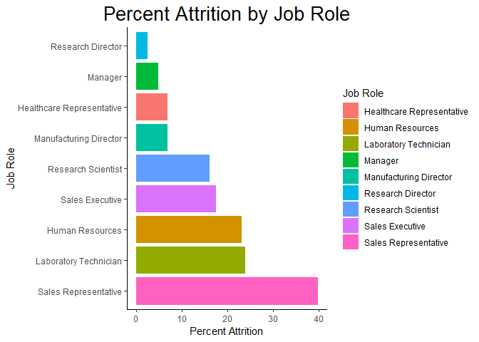<!-- -->

```r
# Percent Attrition by Department
depts %>% filter(Attrition == "Yes") %>% ggplot(aes(x = reorder(Department, -Percents), y = Percents, fill=Department)) + 
  geom_bar(stat = "identity") + 
  xlab("Department") + ylab("Percent Attrition") +
  ggtitle("Percent Attrition by Department") +
  theme_classic() +
  theme(plot.title = element_text(size = 20, hjust = 0.5)) +
  guides(fill=guide_legend(title="Department"))
```

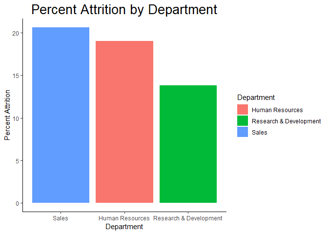<!-- -->

```r
# Percent Attrition by Travel
travel %>% filter(Attrition == "Yes") %>% ggplot(aes(x = reorder(Travel, -Percents), y = Percents, fill=Travel)) + 
  geom_bar(stat = "identity") + 
  xlab("Business Travel") + ylab("Percent Attrition") +
  ggtitle("Percent Attrition by Business Travel") +
  theme_classic() +
  theme(plot.title = element_text(size = 20, hjust = 0.5)) +
  guides(fill=guide_legend(title="Business Travel"))
```

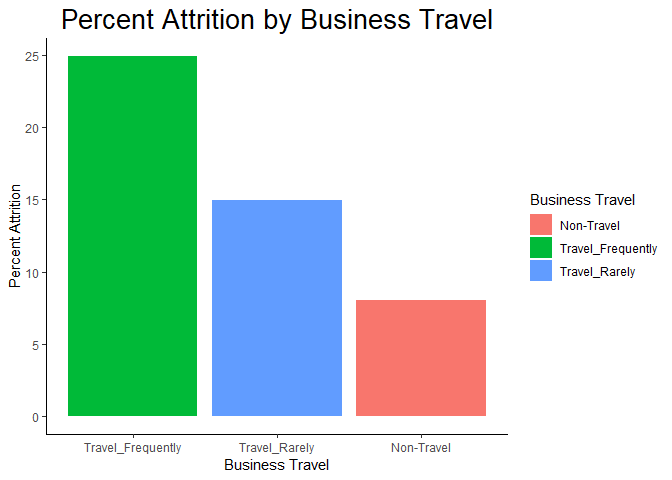<!-- -->

```r
# Percent Attrition by Education Field
educfield %>% filter(Attrition == "Yes") %>% ggplot(aes(x = reorder(EduField, -Percents), y = Percents, fill=EduField)) + 
  geom_bar(stat = "identity") + 
  xlab("Education Field") + ylab("Percent Attrition") +
  ggtitle("Percent Attrition by Field of Education") +
  theme_classic() +
  theme(plot.title = element_text(size = 20, hjust = 0.5)) +
  guides(fill=guide_legend(title="Education Field"))
```

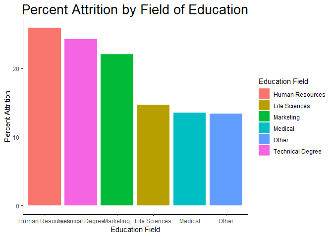<!-- -->

```r
# Percent Attrition by Gender
gender %>% filter(Attrition == "Yes") %>% ggplot(aes(x = reorder(Gender, -Percents), y = Percents, fill=Gender)) + 
  geom_bar(stat = "identity") + 
  xlab("Gender") + ylab("Percent Attrition") +
  ggtitle("Percent Attrition by Gender") +
  theme_classic() +
  theme(plot.title = element_text(size = 20, hjust = 0.5)) +
  guides(fill=guide_legend(title="Gender"))
```

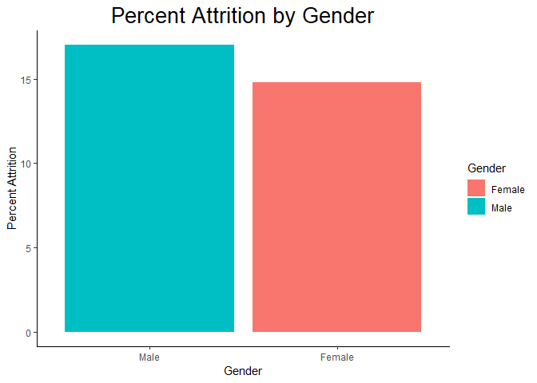<!-- -->

```r
# Percent Attrition by Years of Education
educyr %>% filter(Attrition == "Yes") %>% ggplot(aes(x = reorder(Education, -Percents), y = Percents, fill=Education)) + 
  geom_bar(stat = "identity") + 
  xlab("Years of Education") + ylab("Percent Attrition") +
  ggtitle("Percent Attrition by Years of Education") +
  theme_classic() +
  theme(plot.title = element_text(size = 20, hjust = 0.5)) +
  guides(fill=guide_legend(title="Years of Education"))
```

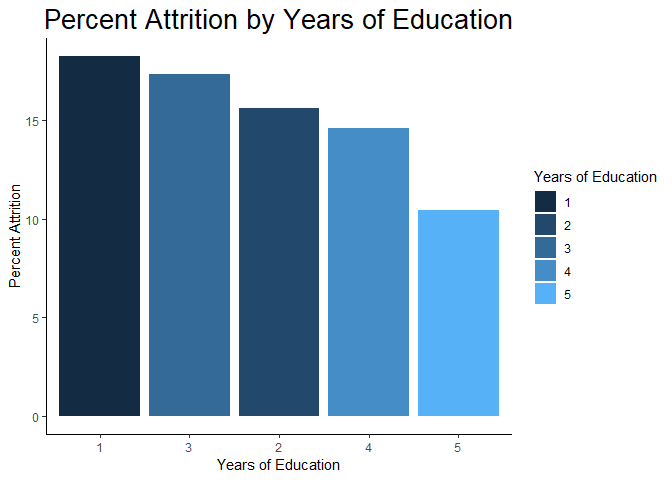<!-- -->

```r
# Percent Attrition by Marital Status
marital_status %>% filter(Attrition == "Yes") %>% ggplot(aes(x = reorder(MaritalStat, -Percents), y = Percents, fill=MaritalStat)) + 
  geom_bar(stat = "identity") + 
  xlab("Marital Status") + ylab("Percent Attrition") +
  ggtitle("Percent Attrition by Marital Status") +
  theme_classic() +
  theme(plot.title = element_text(size = 20, hjust = 0.5)) +
  guides(fill=guide_legend(title="Marital Status"))
```

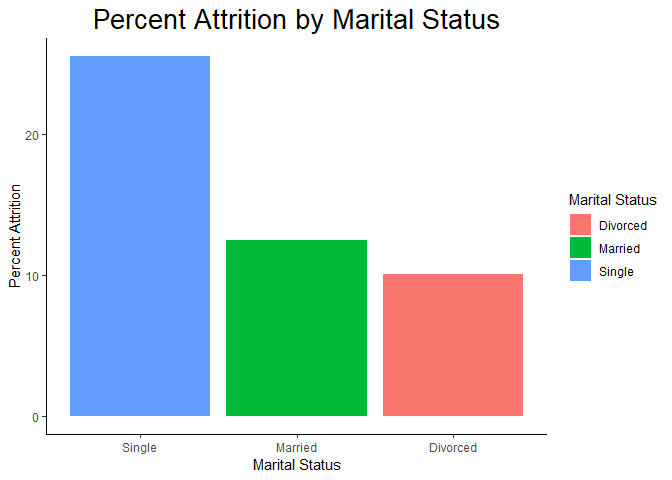<!-- -->

### 4C


```r
# Scatterplot for the relationship of an Emplyee's Monthly Income and their Age
ggplot(data=Employee_rawdata,aes(x=Age,y=MonIncome,color=Gender)) + 
  geom_point() + 
  geom_smooth(method = lm, se = FALSE, color = "black") +
  labs(title = "Correlation between Employee Age and Monthly Income", x = "Age (Years)", y = "Monthly Income ($)") +
  theme(plot.title = element_text(hjust = 0.5))
```

<!-- -->

```r
# lm() function fits the Monthly Income and Age variables of the complete Employee dataset with a linear model using Monthly Income as the response variable and Age as the explanatory variable
# summary() function produces the result summaries of the linear model fit
# the square root of the R^2 value provides the correlation coefficient for the linear fit model between Monthly Income and Employee's Age
LinearCorrelation <- lm(MonIncome ~ Age, data = Employee_rawdata)
summary(LinearCorrelation)
```

```
## 
## Call:
## lm(formula = MonIncome ~ Age, data = Employee_rawdata)
## 
## Residuals:
##     Min      1Q  Median      3Q     Max 
## -9990.1 -2592.7  -677.9  1810.5 12540.8 
## 
## Coefficients:
##             Estimate Std. Error t value Pr(>|t|)    
## (Intercept) -2970.67     443.70  -6.695 3.06e-11 ***
## Age           256.57      11.67  21.995  < 2e-16 ***
## ---
## Signif. codes:  0 '***' 0.001 '**' 0.01 '*' 0.05 '.' 0.1 ' ' 1
## 
## Residual standard error: 4084 on 1468 degrees of freedom
## Multiple R-squared:  0.2479,	Adjusted R-squared:  0.2473 
## F-statistic: 483.8 on 1 and 1468 DF,  p-value: < 2.2e-16
```

```r
# R_squared <- 0.2479
Correlation.Age_Income <- sqrt(summary(LinearCorrelation)$r.squared)
Correlation.Age_Income
```

```
## [1] 0.4978546
```
* There is an apparent relationship between Age and Income. The correlation coefficient of 0.4979 indicates a moderate positive linear correlation between Age and Income.

### 4D


```r
fit <- lm(Employee_rawdata$Age ~ Employee_rawdata$JobSatis + Employee_rawdata$RelateSatis + Employee_rawdata$WorkLifeBal )
summary(fit)
```

```
## 
## Call:
## lm(formula = Employee_rawdata$Age ~ Employee_rawdata$JobSatis + 
##     Employee_rawdata$RelateSatis + Employee_rawdata$WorkLifeBal)
## 
## Residuals:
##     Min      1Q  Median      3Q     Max 
## -19.560  -6.750  -1.226   5.982  23.520 
## 
## Coefficients:
##                              Estimate Std. Error t value Pr(>|t|)    
## (Intercept)                  36.60178    1.27935  28.610   <2e-16 ***
## Employee_rawdata$JobSatis    -0.03861    0.21603  -0.179   0.8582    
## Employee_rawdata$RelateSatis  0.45559    0.22036   2.067   0.0389 *  
## Employee_rawdata$WorkLifeBal -0.29273    0.33728  -0.868   0.3856    
## ---
## Signif. codes:  0 '***' 0.001 '**' 0.01 '*' 0.05 '.' 0.1 ' ' 1
## 
## Residual standard error: 9.129 on 1466 degrees of freedom
## Multiple R-squared:  0.003396,	Adjusted R-squared:  0.001356 
## F-statistic: 1.665 on 3 and 1466 DF,  p-value: 0.1726
```

```r
pairs(~Employee_rawdata$Age + Employee_rawdata$JobSatis + Employee_rawdata$RelateSatis + Employee_rawdata$WorkLifeBal)
```

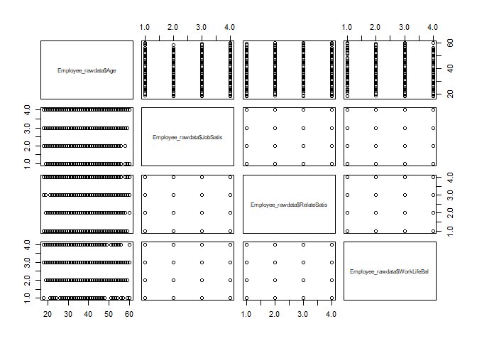<!-- -->

* Life Satisfaction -  Summing the Satisfaction variables (Job, Relationship) and Work Life Balance variable to create a Life Satisfaction score.  Comparing separately to Current and Former Employees.   
* Findings -  No correlation of between Age and Life Satisfaction variable were identified.

### Basic Linear Regression

```r
model <- glm(Attrition ~ Age+Travel+Department+DisFromHome+
               Education+EduField+EnvSatis+Gender+JobInvolve+
               JobLevel+JobRole+JobSatis+MaritalStat+MonIncome+NumCoWork+
               OverTime+SalaryIncr+PerformRate+RelateSatis+NumWorkYear+
               TrainTime+WorkLifeBal+YearsAtCo+DuraCurRole+LastPromote+
               CurManage,family=binomial(link='logit'),data=hr)
summary(model)
```

```
## 
## Call:
## glm(formula = Attrition ~ Age + Travel + Department + DisFromHome + 
##     Education + EduField + EnvSatis + Gender + JobInvolve + JobLevel + 
##     JobRole + JobSatis + MaritalStat + MonIncome + NumCoWork + 
##     OverTime + SalaryIncr + PerformRate + RelateSatis + NumWorkYear + 
##     TrainTime + WorkLifeBal + YearsAtCo + DuraCurRole + LastPromote + 
##     CurManage, family = binomial(link = "logit"), data = hr)
## 
## Deviance Residuals: 
##     Min       1Q   Median       3Q      Max  
## -2.0355  -0.5169  -0.2709  -0.1062   3.3789  
## 
## Coefficients:
##               Estimate Std. Error z value Pr(>|z|)    
## (Intercept)  2.010e+00  1.280e+00   1.570 0.116364    
## Age         -3.073e-02  1.312e-02  -2.342 0.019187 *  
## Travel       9.276e-01  1.663e-01   5.578 2.43e-08 ***
## Department   1.056e+00  2.769e-01   3.813 0.000137 ***
## DisFromHome  4.144e-02  1.025e-02   4.044 5.26e-05 ***
## Education   -9.880e-04  8.404e-02  -0.012 0.990620    
## EduField     7.198e-02  6.547e-02   1.100 0.271539    
## EnvSatis    -4.138e-01  7.928e-02  -5.220 1.79e-07 ***
## Gender       3.744e-01  1.773e-01   2.112 0.034720 *  
## JobInvolve  -5.436e-01  1.183e-01  -4.595 4.34e-06 ***
## JobLevel    -3.824e-01  2.805e-01  -1.363 0.172876    
## JobRole     -1.368e-01  5.428e-02  -2.521 0.011700 *  
## JobSatis    -4.249e-01  7.852e-02  -5.412 6.25e-08 ***
## MaritalStat -7.548e-01  1.255e-01  -6.012 1.83e-09 ***
## MonIncome   -3.827e-05  6.676e-05  -0.573 0.566525    
## NumCoWork    1.831e-01  3.672e-02   4.986 6.18e-07 ***
## OverTime     1.845e+00  1.838e-01  10.039  < 2e-16 ***
## SalaryIncr  -3.421e-02  3.763e-02  -0.909 0.363403    
## PerformRate  2.194e-01  3.819e-01   0.575 0.565559    
## RelateSatis -2.279e-01  7.931e-02  -2.874 0.004054 ** 
## NumWorkYear -5.869e-02  2.810e-02  -2.088 0.036785 *  
## TrainTime   -1.909e-01  7.061e-02  -2.704 0.006859 ** 
## WorkLifeBal -3.060e-01  1.178e-01  -2.597 0.009408 ** 
## YearsAtCo    1.024e-01  3.743e-02   2.737 0.006204 ** 
## DuraCurRole -1.502e-01  4.318e-02  -3.479 0.000503 ***
## LastPromote  1.685e-01  4.020e-02   4.191 2.78e-05 ***
## CurManage   -1.423e-01  4.511e-02  -3.154 0.001612 ** 
## ---
## Signif. codes:  0 '***' 0.001 '**' 0.01 '*' 0.05 '.' 0.1 ' ' 1
## 
## (Dispersion parameter for binomial family taken to be 1)
## 
##     Null deviance: 1298.58  on 1469  degrees of freedom
## Residual deviance:  905.65  on 1443  degrees of freedom
## AIC: 959.65
## 
## Number of Fisher Scoring iterations: 6
```

### Decision Tree

```r
term_vars <- c("Age","Education","MonthlyIncome","BusinessTravel","Department","DistanceFromHome","EducationField", "Gender","JobInvolvement","JobLevel", "JobRole", "JobSatisfaction", "MaritalStatus", "MonthlyIncome","NumCompaniesWorked", "OverTime","PercentSalaryHike","PerformanceRating", "StockOptionLevel", "TotalWorkingYears","TrainingTimesLastYear", "WorkLifeBalance","RelationshipSatisfaction","YearsAtCompany","YearsInCurrentRole", "YearsSinceLastPromotion","YearsWithCurrManager","Attrition")
emp_term_train <- subset(emp, Education < 4)
emp_term_test <- subset(emp, Education >= 4)
set.seed(99)  # set a pre-defined value for the random seed so that results are repeatable
# Decision tree model
rpart_model <- rpart(Attrition ~.,
                     data = emp_term_train[term_vars],
                     method = 'class',
                     parms = list(split='information'),
                     control = rpart.control(usesurrogate = 0,
                                             maxsurrogate = 0))
# Plot the decision tree
rpart.plot(rpart_model, roundint = FALSE, type = 3)
```

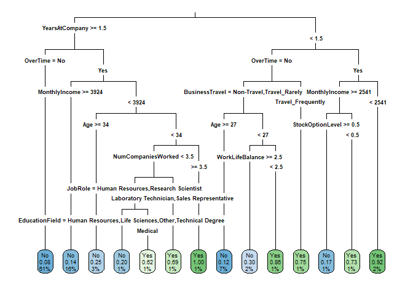<!-- -->

### Random Forest Analysis

```r
emp$resigned <- as.factor(emp$Attrition)  # create factor for Attrition field

emp_cat <- data.frame(emp$Age,emp$Education,emp$MonthlyIncome,emp$BusinessTravel,emp$Department,emp$DistanceFromHome,emp$EducationField, emp$Gender,emp$JobInvolvement,emp$JobLevel, emp$JobRole, emp$JobSatisfaction, emp$MaritalStatus, emp$MonthlyIncome,emp$NumCompaniesWorked, emp$OverTime,emp$PercentSalaryHike,emp$PerformanceRating, emp$StockOptionLevel, emp$TotalWorkingYears,emp$TrainingTimesLastYear, emp$WorkLifeBalance,emp$RelationshipSatisfaction,emp$YearsAtCompany,emp$YearsInCurrentRole, emp$YearsSinceLastPromotion,emp$YearsWithCurrManager,emp$resigned,emp$EmployeeNumber)


col_headings <- c("Age","Education","MonthlyIncome","BusinessTravel","Department","DistanceFromHome","EducationField", "Gender","JobInvolvement","JobLevel", "JobRole", "JobSatisfaction", "MaritalStatus", "MonthlyIncome","NumCompaniesWorked", "OverTime","PercentSalaryHike","PerformanceRating", "StockOptionLevel", "TotalWorkingYears","TrainingTimesLastYear", "WorkLifeBalance","RelationshipSatisfaction","YearsAtCompany","YearsInCurrentRole", "YearsSinceLastPromotion","YearsWithCurrManager","resigned","EmployeeNumber")

names(emp_cat) <- col_headings
emp_train <- subset(emp_cat, Education < 4)
emp_test <- subset(emp_cat, Education >= 4)

emp_train_rose <- ROSE(resigned ~ ., data = emp_train, seed=125)$data
# Tables to show balanced dataset sample sizes

res_vars <- c("Age","Education","BusinessTravel","Department","DistanceFromHome","EducationField", "Gender","JobInvolvement","JobLevel", "JobRole", "JobSatisfaction", "MaritalStatus", "MonthlyIncome","NumCompaniesWorked", "OverTime","PercentSalaryHike","PerformanceRating", "StockOptionLevel", "TotalWorkingYears","TrainingTimesLastYear", "WorkLifeBalance","RelationshipSatisfaction","YearsAtCompany","YearsInCurrentRole", "YearsSinceLastPromotion","YearsWithCurrManager","resigned")
set.seed(222)
emp_res_rose_RF <- randomForest(resigned ~ .,
                           data = emp_train_rose[res_vars],
                           ntree=500, importance = TRUE,
                           na.action = na.omit)
imp <- varImpPlot(emp_res_rose_RF, type=1, n.var = min(20), main="Attrition Variable Importance (Accuracy)", sub = "Random Forest Model", class = NULL, scale=TRUE)
```

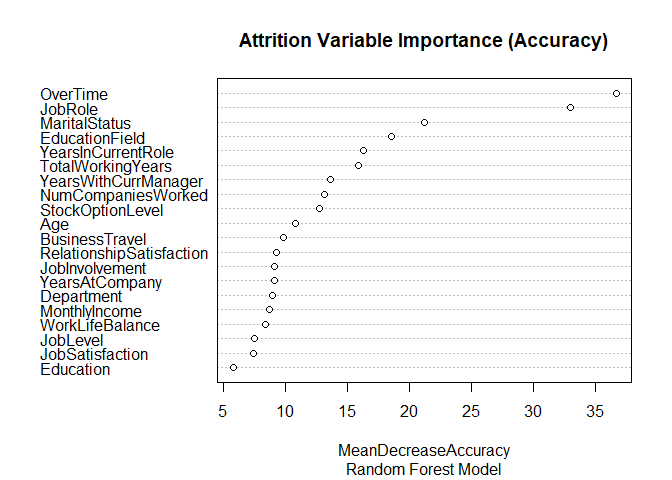<!-- -->

```r
imp <- as.data.frame(imp[1:20,])
imp$varnames <- rownames(imp) # row names to column
rownames(imp) <- NULL  
col_headings <- c("Importance", "varnames")
names(imp) <-col_headings
imp$var_categ <- rep(1:20)


ggplot(imp, aes(x=reorder(varnames, Importance), y=Importance, color=as.factor(var_categ))) + 
  geom_point() +
  geom_segment(aes(x=varnames,xend=varnames,y=0,yend=Importance)) +
  scale_color_discrete(name="Variable Group") +
  ggtitle("Attrition Variable Importance") +
  ylab("Importance Measurement") +
  xlab("Variable Name") +
  theme(legend.position = "none") +
  coord_flip()
```

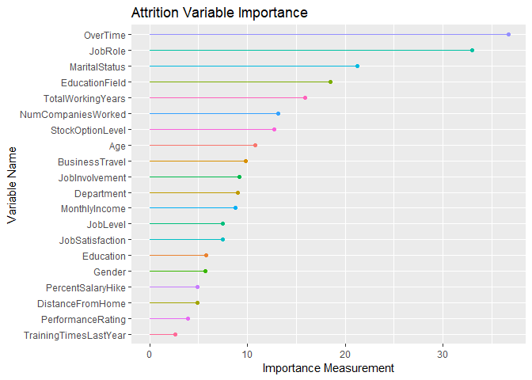<!-- -->

### Attrition Prediction using Random Forest

```r
# generate predictions based on test data ("emp_test")
emp_res_rose_RF_pred <- predict(emp_res_rose_RF, newdata = emp_test)
confusionMatrix(data = emp_res_rose_RF_pred,
                reference = emp_test$resigned,
                positive = "Yes", mode = "prec_recall")
```

```
## Confusion Matrix and Statistics
## 
##           Reference
## Prediction  No Yes
##        No  316  24
##        Yes  67  39
##                                           
##                Accuracy : 0.796           
##                  95% CI : (0.7555, 0.8324)
##     No Information Rate : 0.8587          
##     P-Value [Acc > NIR] : 0.9999          
##                                           
##                   Kappa : 0.3456          
##                                           
##  Mcnemar's Test P-Value : 1.069e-05       
##                                           
##               Precision : 0.36792         
##                  Recall : 0.61905         
##                      F1 : 0.46154         
##              Prevalence : 0.14126         
##          Detection Rate : 0.08744         
##    Detection Prevalence : 0.23767         
##       Balanced Accuracy : 0.72206         
##                                           
##        'Positive' Class : Yes             
## 
```
Note that the `echo = FALSE` parameter was added to the code chunk to prevent printing of the R code that generated the plot.


```r
# Calculate prediction probabilites of employees who will resign
emp_res_rose_RF_pred_probs <- predict(emp_res_rose_RF, emp_test, type="prob")
Employees_flight_risk <- as.data.frame(cbind(emp_test$EmployeeNumber,emp_res_rose_RF_pred_probs))

# Predition table formatting using kable

col_headings <- c("Employee Num","No","Yes")
names(Employees_flight_risk) <- col_headings
Employees_flight_risk <- arrange(Employees_flight_risk, desc(Yes))
Employees_flight_risk[1:25, 1 ] <- "####"
write.csv(Employees_flight_risk[1:25, ], file = "Data/FlightRiskData.csv")
Employees_flight_risk[1:25, 3]  <- paste(round((Employees_flight_risk[1:25, 3])*100,digits=0),"%",sep="")
Employees_flight_risk[, 2]  <- NULL
c1 <- c(1, 2, 3, 4, 5, 6, 7, 8, 9, 10, 11, 12, 13, 14, 15, 16, 17, 18, 19, 20)
df <- data.frame(c1, Employees_flight_risk[1:20, 1 ], Employees_flight_risk[1:20, 2])
col_headings <- c("#", "Employee Number","Predict Attrition %")
names(df) <- col_headings
kable(df, caption="Attrition Prediction Table") %>%
  kable_styling(bootstrap_options = "striped", font_size = 11)
```

<table class="table table-striped" style="font-size: 11px; margin-left: auto; margin-right: auto;">
<caption style="font-size: initial !important;">Attrition Prediction Table</caption>
 <thead>
  <tr>
   <th style="text-align:right;"> # </th>
   <th style="text-align:left;"> Employee Number </th>
   <th style="text-align:left;"> Predict Attrition % </th>
  </tr>
 </thead>
<tbody>
  <tr>
   <td style="text-align:right;"> 1 </td>
   <td style="text-align:left;"> #### </td>
   <td style="text-align:left;"> 94% </td>
  </tr>
  <tr>
   <td style="text-align:right;"> 2 </td>
   <td style="text-align:left;"> #### </td>
   <td style="text-align:left;"> 93% </td>
  </tr>
  <tr>
   <td style="text-align:right;"> 3 </td>
   <td style="text-align:left;"> #### </td>
   <td style="text-align:left;"> 91% </td>
  </tr>
  <tr>
   <td style="text-align:right;"> 4 </td>
   <td style="text-align:left;"> #### </td>
   <td style="text-align:left;"> 91% </td>
  </tr>
  <tr>
   <td style="text-align:right;"> 5 </td>
   <td style="text-align:left;"> #### </td>
   <td style="text-align:left;"> 90% </td>
  </tr>
  <tr>
   <td style="text-align:right;"> 6 </td>
   <td style="text-align:left;"> #### </td>
   <td style="text-align:left;"> 88% </td>
  </tr>
  <tr>
   <td style="text-align:right;"> 7 </td>
   <td style="text-align:left;"> #### </td>
   <td style="text-align:left;"> 88% </td>
  </tr>
  <tr>
   <td style="text-align:right;"> 8 </td>
   <td style="text-align:left;"> #### </td>
   <td style="text-align:left;"> 88% </td>
  </tr>
  <tr>
   <td style="text-align:right;"> 9 </td>
   <td style="text-align:left;"> #### </td>
   <td style="text-align:left;"> 87% </td>
  </tr>
  <tr>
   <td style="text-align:right;"> 10 </td>
   <td style="text-align:left;"> #### </td>
   <td style="text-align:left;"> 86% </td>
  </tr>
  <tr>
   <td style="text-align:right;"> 11 </td>
   <td style="text-align:left;"> #### </td>
   <td style="text-align:left;"> 86% </td>
  </tr>
  <tr>
   <td style="text-align:right;"> 12 </td>
   <td style="text-align:left;"> #### </td>
   <td style="text-align:left;"> 85% </td>
  </tr>
  <tr>
   <td style="text-align:right;"> 13 </td>
   <td style="text-align:left;"> #### </td>
   <td style="text-align:left;"> 84% </td>
  </tr>
  <tr>
   <td style="text-align:right;"> 14 </td>
   <td style="text-align:left;"> #### </td>
   <td style="text-align:left;"> 83% </td>
  </tr>
  <tr>
   <td style="text-align:right;"> 15 </td>
   <td style="text-align:left;"> #### </td>
   <td style="text-align:left;"> 82% </td>
  </tr>
  <tr>
   <td style="text-align:right;"> 16 </td>
   <td style="text-align:left;"> #### </td>
   <td style="text-align:left;"> 82% </td>
  </tr>
  <tr>
   <td style="text-align:right;"> 17 </td>
   <td style="text-align:left;"> #### </td>
   <td style="text-align:left;"> 82% </td>
  </tr>
  <tr>
   <td style="text-align:right;"> 18 </td>
   <td style="text-align:left;"> #### </td>
   <td style="text-align:left;"> 81% </td>
  </tr>
  <tr>
   <td style="text-align:right;"> 19 </td>
   <td style="text-align:left;"> #### </td>
   <td style="text-align:left;"> 81% </td>
  </tr>
  <tr>
   <td style="text-align:right;"> 20 </td>
   <td style="text-align:left;"> #### </td>
   <td style="text-align:left;"> 81% </td>
  </tr>
</tbody>
</table>

# Conclusion

Data analysis indicates that DDSAnalytics has higher attrition rates among younger people, which according to SHRM (the Society of Human Resource Management) is more common among that demographic in part due to the low unemployment rate in the current economy which makes it a job seeker's market. Another reason younger people may leave jobs is simply because as a demographic, younger people tend to continuously seek better employment opportunities.
Data analysis indicates that DDSAnalytics also has somewhat high attrition rates among employees with fewer years at the company. This is in line with the industry, and an effective way to curb this is to tweak the company's recruitment process and improve onboarding procedures. Ensuring potential hires have realistic expectations of the company and a good understanding of DDSAnalytics' corporate culture, and helping them develop loyalty to the company through an immersive onboarding process are two ways to reduce attrition for employees with less than two years of service with the company.
Finally, data analysis indicates that overall employee satisfaction with their job and the work environment, feeling involved in their job role, and a good work/life balance all have a significant impact on overall attrition. DDSAnalytics can reduce attrition rates resulting from these factors by introducing a flexible work schedule, involving employees in relevant decisionmaking processes, and reconfiguring the amount of overtime and/or business travel required.


