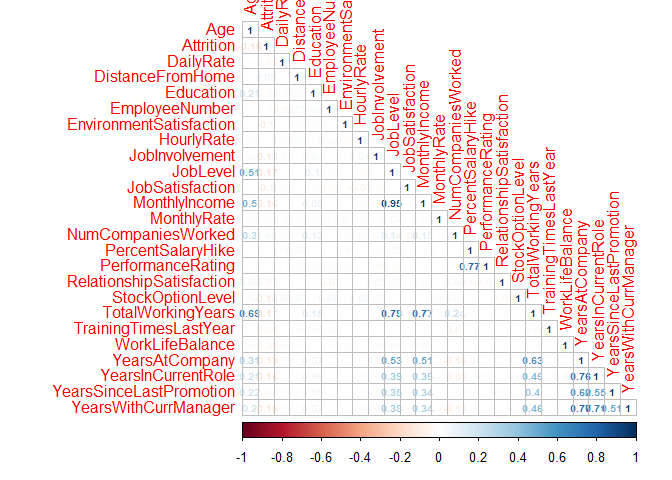
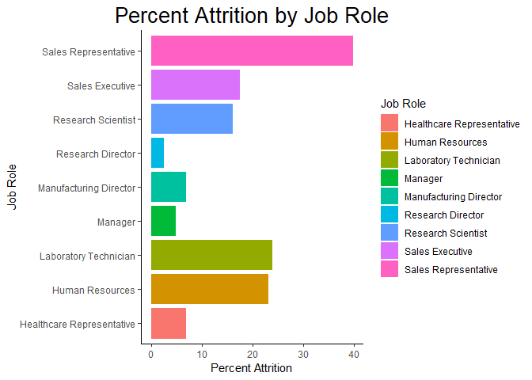
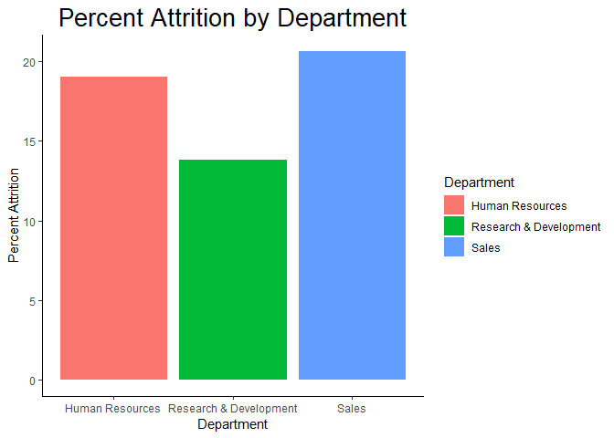
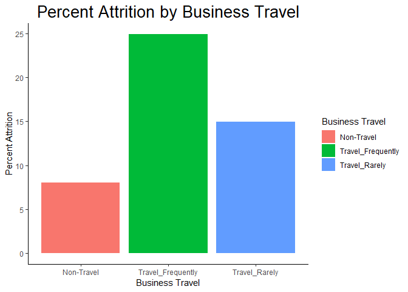
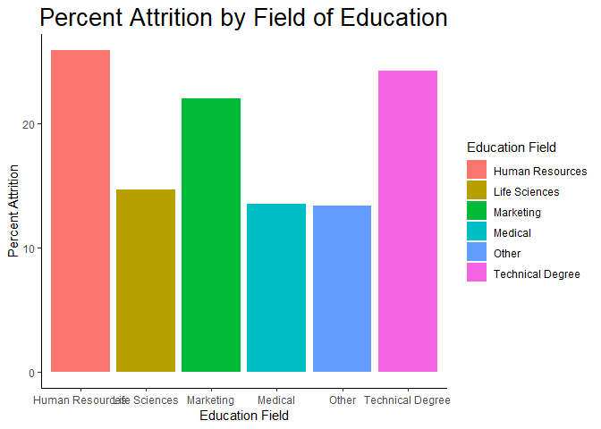
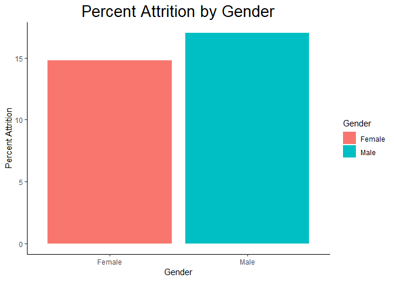
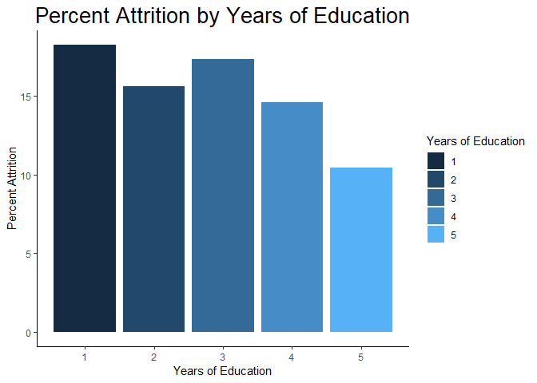

## Load Libraries

```r
# Load Libraries
library(tidyverse)
library(xlsx)
library(corrplot)
```

## Read in and Setup Data

```r
# Load the CaseStudy2 Data set as a dataframe
jobsdf <- read.xlsx("CaseStudy2-data.xlsx", sheetIndex = 1, header = T)
```


## Get information about the data frame jobsdf

```r
class(jobsdf)
```

```
## [1] "data.frame"
```

```r
str(jobsdf)
```

```
## 'data.frame':	1470 obs. of  35 variables:
##  $ Age                     : num  41 49 37 33 27 32 59 30 38 36 ...
##  $ Attrition               : Factor w/ 2 levels "No","Yes": 2 1 2 1 1 1 1 1 1 1 ...
##  $ BusinessTravel          : Factor w/ 3 levels "Non-Travel","Travel_Frequently",..: 3 2 3 2 3 2 3 3 2 3 ...
##  $ DailyRate               : num  1102 279 1373 1392 591 ...
##  $ Department              : Factor w/ 3 levels "Human Resources",..: 3 2 2 2 2 2 2 2 2 2 ...
##  $ DistanceFromHome        : num  1 8 2 3 2 2 3 24 23 27 ...
##  $ Education               : num  2 1 2 4 1 2 3 1 3 3 ...
##  $ EducationField          : Factor w/ 6 levels "Human Resources",..: 2 2 5 2 4 2 4 2 2 4 ...
##  $ EmployeeCount           : num  1 1 1 1 1 1 1 1 1 1 ...
##  $ EmployeeNumber          : num  1 2 4 5 7 8 10 11 12 13 ...
##  $ EnvironmentSatisfaction : num  2 3 4 4 1 4 3 4 4 3 ...
##  $ Gender                  : Factor w/ 2 levels "Female","Male": 1 2 2 1 2 2 1 2 2 2 ...
##  $ HourlyRate              : num  94 61 92 56 40 79 81 67 44 94 ...
##  $ JobInvolvement          : num  3 2 2 3 3 3 4 3 2 3 ...
##  $ JobLevel                : num  2 2 1 1 1 1 1 1 3 2 ...
##  $ JobRole                 : Factor w/ 9 levels "Healthcare Representative",..: 8 7 3 7 3 3 3 3 5 1 ...
##  $ JobSatisfaction         : num  4 2 3 3 2 4 1 3 3 3 ...
##  $ MaritalStatus           : Factor w/ 3 levels "Divorced","Married",..: 3 2 3 2 2 3 2 1 3 2 ...
##  $ MonthlyIncome           : num  5993 5130 2090 2909 3468 ...
##  $ MonthlyRate             : num  19479 24907 2396 23159 16632 ...
##  $ NumCompaniesWorked      : num  8 1 6 1 9 0 4 1 0 6 ...
##  $ Over18                  : Factor w/ 1 level "Y": 1 1 1 1 1 1 1 1 1 1 ...
##  $ OverTime                : Factor w/ 2 levels "No","Yes": 2 1 2 2 1 1 2 1 1 1 ...
##  $ PercentSalaryHike       : num  11 23 15 11 12 13 20 22 21 13 ...
##  $ PerformanceRating       : num  3 4 3 3 3 3 4 4 4 3 ...
##  $ RelationshipSatisfaction: num  1 4 2 3 4 3 1 2 2 2 ...
##  $ StandardHours           : num  80 80 80 80 80 80 80 80 80 80 ...
##  $ StockOptionLevel        : num  0 1 0 0 1 0 3 1 0 2 ...
##  $ TotalWorkingYears       : num  8 10 7 8 6 8 12 1 10 17 ...
##  $ TrainingTimesLastYear   : num  0 3 3 3 3 2 3 2 2 3 ...
##  $ WorkLifeBalance         : num  1 3 3 3 3 2 2 3 3 2 ...
##  $ YearsAtCompany          : num  6 10 0 8 2 7 1 1 9 7 ...
##  $ YearsInCurrentRole      : num  4 7 0 7 2 7 0 0 7 7 ...
##  $ YearsSinceLastPromotion : num  0 1 0 3 2 3 0 0 1 7 ...
##  $ YearsWithCurrManager    : num  5 7 0 0 2 6 0 0 8 7 ...
```

```r
head(jobsdf)
```

```
##   Age Attrition    BusinessTravel DailyRate             Department
## 1  41       Yes     Travel_Rarely      1102                  Sales
## 2  49        No Travel_Frequently       279 Research & Development
## 3  37       Yes     Travel_Rarely      1373 Research & Development
## 4  33        No Travel_Frequently      1392 Research & Development
## 5  27        No     Travel_Rarely       591 Research & Development
## 6  32        No Travel_Frequently      1005 Research & Development
##   DistanceFromHome Education EducationField EmployeeCount EmployeeNumber
## 1                1         2  Life Sciences             1              1
## 2                8         1  Life Sciences             1              2
## 3                2         2          Other             1              4
## 4                3         4  Life Sciences             1              5
## 5                2         1        Medical             1              7
## 6                2         2  Life Sciences             1              8
##   EnvironmentSatisfaction Gender HourlyRate JobInvolvement JobLevel
## 1                       2 Female         94              3        2
## 2                       3   Male         61              2        2
## 3                       4   Male         92              2        1
## 4                       4 Female         56              3        1
## 5                       1   Male         40              3        1
## 6                       4   Male         79              3        1
##                 JobRole JobSatisfaction MaritalStatus MonthlyIncome
## 1       Sales Executive               4        Single          5993
## 2    Research Scientist               2       Married          5130
## 3 Laboratory Technician               3        Single          2090
## 4    Research Scientist               3       Married          2909
## 5 Laboratory Technician               2       Married          3468
## 6 Laboratory Technician               4        Single          3068
##   MonthlyRate NumCompaniesWorked Over18 OverTime PercentSalaryHike
## 1       19479                  8      Y      Yes                11
## 2       24907                  1      Y       No                23
## 3        2396                  6      Y      Yes                15
## 4       23159                  1      Y      Yes                11
## 5       16632                  9      Y       No                12
## 6       11864                  0      Y       No                13
##   PerformanceRating RelationshipSatisfaction StandardHours
## 1                 3                        1            80
## 2                 4                        4            80
## 3                 3                        2            80
## 4                 3                        3            80
## 5                 3                        4            80
## 6                 3                        3            80
##   StockOptionLevel TotalWorkingYears TrainingTimesLastYear WorkLifeBalance
## 1                0                 8                     0               1
## 2                1                10                     3               3
## 3                0                 7                     3               3
## 4                0                 8                     3               3
## 5                1                 6                     3               3
## 6                0                 8                     2               2
##   YearsAtCompany YearsInCurrentRole YearsSinceLastPromotion
## 1              6                  4                       0
## 2             10                  7                       1
## 3              0                  0                       0
## 4              8                  7                       3
## 5              2                  2                       2
## 6              7                  7                       3
##   YearsWithCurrManager
## 1                    5
## 2                    7
## 3                    0
## 4                    0
## 5                    2
## 6                    6
```

```r
table(is.na(jobsdf))
```

```
## 
## FALSE 
## 51450
```

```r
summary(jobsdf)
```

```
##       Age        Attrition            BusinessTravel   DailyRate     
##  Min.   :18.00   No :1233   Non-Travel       : 150   Min.   : 102.0  
##  1st Qu.:30.00   Yes: 237   Travel_Frequently: 277   1st Qu.: 465.0  
##  Median :36.00              Travel_Rarely    :1043   Median : 802.0  
##  Mean   :36.92                                       Mean   : 802.5  
##  3rd Qu.:43.00                                       3rd Qu.:1157.0  
##  Max.   :60.00                                       Max.   :1499.0  
##                                                                      
##                   Department  DistanceFromHome   Education    
##  Human Resources       : 63   Min.   : 1.000   Min.   :1.000  
##  Research & Development:961   1st Qu.: 2.000   1st Qu.:2.000  
##  Sales                 :446   Median : 7.000   Median :3.000  
##                               Mean   : 9.193   Mean   :2.913  
##                               3rd Qu.:14.000   3rd Qu.:4.000  
##                               Max.   :29.000   Max.   :5.000  
##                                                               
##           EducationField EmployeeCount EmployeeNumber  
##  Human Resources : 27    Min.   :1     Min.   :   1.0  
##  Life Sciences   :606    1st Qu.:1     1st Qu.: 491.2  
##  Marketing       :159    Median :1     Median :1020.5  
##  Medical         :464    Mean   :1     Mean   :1024.9  
##  Other           : 82    3rd Qu.:1     3rd Qu.:1555.8  
##  Technical Degree:132    Max.   :1     Max.   :2068.0  
##                                                        
##  EnvironmentSatisfaction    Gender      HourlyRate     JobInvolvement
##  Min.   :1.000           Female:588   Min.   : 30.00   Min.   :1.00  
##  1st Qu.:2.000           Male  :882   1st Qu.: 48.00   1st Qu.:2.00  
##  Median :3.000                        Median : 66.00   Median :3.00  
##  Mean   :2.722                        Mean   : 65.89   Mean   :2.73  
##  3rd Qu.:4.000                        3rd Qu.: 83.75   3rd Qu.:3.00  
##  Max.   :4.000                        Max.   :100.00   Max.   :4.00  
##                                                                      
##     JobLevel                          JobRole    JobSatisfaction
##  Min.   :1.000   Sales Executive          :326   Min.   :1.000  
##  1st Qu.:1.000   Research Scientist       :292   1st Qu.:2.000  
##  Median :2.000   Laboratory Technician    :259   Median :3.000  
##  Mean   :2.064   Manufacturing Director   :145   Mean   :2.729  
##  3rd Qu.:3.000   Healthcare Representative:131   3rd Qu.:4.000  
##  Max.   :5.000   Manager                  :102   Max.   :4.000  
##                  (Other)                  :215                  
##   MaritalStatus MonthlyIncome    MonthlyRate    NumCompaniesWorked
##  Divorced:327   Min.   : 1009   Min.   : 2094   Min.   :0.000     
##  Married :673   1st Qu.: 2911   1st Qu.: 8047   1st Qu.:1.000     
##  Single  :470   Median : 4919   Median :14236   Median :2.000     
##                 Mean   : 6503   Mean   :14313   Mean   :2.693     
##                 3rd Qu.: 8379   3rd Qu.:20462   3rd Qu.:4.000     
##                 Max.   :19999   Max.   :26999   Max.   :9.000     
##                                                                   
##  Over18   OverTime   PercentSalaryHike PerformanceRating
##  Y:1470   No :1054   Min.   :11.00     Min.   :3.000    
##           Yes: 416   1st Qu.:12.00     1st Qu.:3.000    
##                      Median :14.00     Median :3.000    
##                      Mean   :15.21     Mean   :3.154    
##                      3rd Qu.:18.00     3rd Qu.:3.000    
##                      Max.   :25.00     Max.   :4.000    
##                                                         
##  RelationshipSatisfaction StandardHours StockOptionLevel TotalWorkingYears
##  Min.   :1.000            Min.   :80    Min.   :0.0000   Min.   : 0.00    
##  1st Qu.:2.000            1st Qu.:80    1st Qu.:0.0000   1st Qu.: 6.00    
##  Median :3.000            Median :80    Median :1.0000   Median :10.00    
##  Mean   :2.712            Mean   :80    Mean   :0.7939   Mean   :11.28    
##  3rd Qu.:4.000            3rd Qu.:80    3rd Qu.:1.0000   3rd Qu.:15.00    
##  Max.   :4.000            Max.   :80    Max.   :3.0000   Max.   :40.00    
##                                                                           
##  TrainingTimesLastYear WorkLifeBalance YearsAtCompany   YearsInCurrentRole
##  Min.   :0.000         Min.   :1.000   Min.   : 0.000   Min.   : 0.000    
##  1st Qu.:2.000         1st Qu.:2.000   1st Qu.: 3.000   1st Qu.: 2.000    
##  Median :3.000         Median :3.000   Median : 5.000   Median : 3.000    
##  Mean   :2.799         Mean   :2.761   Mean   : 7.008   Mean   : 4.229    
##  3rd Qu.:3.000         3rd Qu.:3.000   3rd Qu.: 9.000   3rd Qu.: 7.000    
##  Max.   :6.000         Max.   :4.000   Max.   :40.000   Max.   :18.000    
##                                                                           
##  YearsSinceLastPromotion YearsWithCurrManager
##  Min.   : 0.000          Min.   : 0.000      
##  1st Qu.: 0.000          1st Qu.: 2.000      
##  Median : 1.000          Median : 3.000      
##  Mean   : 2.188          Mean   : 4.123      
##  3rd Qu.: 3.000          3rd Qu.: 7.000      
##  Max.   :15.000          Max.   :17.000      
## 
```

## Change Attrition to values from Yes/No to 1 and 0

```r
jobsdf <- jobsdf %>% mutate(Attrition=ifelse(Attrition=="Yes", 1, 0))
```

## Remove non-numberical columns for correlation.

```r
jobcor <- jobsdf[-c(3,5,8:9,12,16,18,22,23,27)]
```

## Build Correlation Plot

```r
JobsCorr <- cor(jobcor)
corrplot(JobsCorr, method = 'number', number.cex = 0.65, type = 'lower')
```

<!-- -->

# Exploratory Data Analysis and Graphs

## Build the data frames for each of the following:

* Job Roles
* Departments
* Business Travel 
* Education Field
* Gender
* Years of Education
* Marital Status


```r
# Percent Attrition by Job Role
roles <- jobsdf %>% group_by(JobRole, Attrition) %>% summarise(n = n())
roles[,c("Totals", "Percents")] <- NA
for (x in roles$JobRole)
{
  roles$Totals[roles$JobRole == x] <- sum(jobsdf$JobRole == x)
  roles$Percents[roles$JobRole == x] <- roles$n[roles$JobRole == x] / roles$Totals[roles$JobRole == x] * 100
}
roles <- as.data.frame(roles)

# Percent Attrition by Department
depts <- jobsdf %>% group_by(Department, Attrition) %>% summarise(n = n())
depts[,c("Totals", "Percents")] <- NA
for (x in depts$Department)
{
  depts$Totals[depts$Department == x] <- sum(jobsdf$Department == x)
  depts$Percents[depts$Department == x] <- depts$n[depts$Department == x] / depts$Totals[depts$Department == x] * 100
}
depts <- as.data.frame(depts)

# Percent Attrition by Travel
travel <- jobsdf %>% group_by(BusinessTravel, Attrition) %>% summarise(n = n())
travel[,c("Totals", "Percents")] <- NA
for (x in travel$BusinessTravel)
{
  travel$Totals[travel$BusinessTravel == x] <- sum(jobsdf$BusinessTravel == x )
  travel$Percents[travel$BusinessTravel == x] <- travel$n[travel$BusinessTravel == x] / travel$Totals[travel$BusinessTravel == x] * 100
}
travel <- as.data.frame(travel)

# Percent Attrition by Education Field
educfield <- jobsdf %>% group_by(EducationField, Attrition) %>% summarise(n = n())
educfield[,c("Totals", "Percents")] <- NA
for (x in educfield$EducationField)
{
  educfield$Totals[educfield$EducationField == x] <- sum(jobsdf$EducationField == x)
  educfield$Percents[educfield$EducationField == x] <- educfield$n[educfield$EducationField == x] / educfield$Totals[educfield$EducationField == x] * 100
}
educfield <- as.data.frame(educfield)

# Percent Attrition by Gender
gender <- jobsdf %>% group_by(Gender, Attrition) %>% summarise(n = n())
gender[,c("Totals", "Percents")] <- NA
for (x in gender$Gender)
{
  gender$Totals[gender$Gender == x] <- sum(jobsdf$Gender == x)
  gender$Percents[gender$Gender == x] <- gender$n[gender$Gender == x] / gender$Totals[gender$Gender == x] * 100
}
gender <- as.data.frame(gender)

# Percent Attrition by Years of Education
educyr <- jobsdf %>% group_by(Education, Attrition) %>% summarise(n = n())
educyr[,c("Totals", "Percents")] <- NA
for (x in educyr$Education)
{
  educyr$Totals[educyr$Education == x] <- sum(jobsdf$Education == x)
  educyr$Percents[educyr$Education == x] <- educyr$n[educyr$Education == x] / educyr$Totals[educyr$Education == x] * 100
}
educyr <- as.data.frame(educyr)

# Percent Attrition by Marital Status
marital_status <- jobsdf %>% group_by(MaritalStatus, Attrition) %>% summarise(n = n())
marital_status[,c("Totals", "Percents")] <- NA
for (x in marital_status$MaritalStatus)
{
  marital_status$Totals[marital_status$MaritalStatus == x] <- sum(jobsdf$MaritalStatus == x)
  marital_status$Percents[marital_status$MaritalStatus == x] <- marital_status$n[marital_status$MaritalStatus == x] / marital_status$Totals[marital_status$MaritalStatus == x] * 100
}
marital_status <- as.data.frame(marital_status)
```

## EDA Graphs

```r
# Percent Attrition by JobRole
roles %>% filter(Attrition == 1) %>% ggplot(aes(x = JobRole, y = Percents, fill=JobRole)) + 
  geom_bar(stat = "identity") + 
  coord_flip() + 
  xlab("Job Role") + ylab("Percent Attrition") +
  ggtitle("Percent Attrition by Job Role") +
  theme_classic() +
  theme(plot.title = element_text(size = 20, hjust = 0.5)) +
  guides(fill=guide_legend(title="Job Role"))
```

<!-- -->

```r
# Percent Attrition by Department
depts %>% filter(Attrition == 1) %>% ggplot(aes(x = Department, y = Percents, fill=Department)) + 
  geom_bar(stat = "identity") + 
  xlab("Department") + ylab("Percent Attrition") +
  ggtitle("Percent Attrition by Department") +
  theme_classic() +
  theme(plot.title = element_text(size = 20, hjust = 0.5)) +
  guides(fill=guide_legend(title="Department"))
```

<!-- -->

```r
# Percent Attrition by Travel
travel %>% filter(Attrition == 1) %>% ggplot(aes(x = BusinessTravel, y = Percents, fill=BusinessTravel)) + 
  geom_bar(stat = "identity") + 
  xlab("Business Travel") + ylab("Percent Attrition") +
  ggtitle("Percent Attrition by Business Travel") +
  theme_classic() +
  theme(plot.title = element_text(size = 20, hjust = 0.5)) +
  guides(fill=guide_legend(title="Business Travel"))
```

<!-- -->

```r
# Percent Attrition by Education Field
educfield %>% filter(Attrition == 1) %>% ggplot(aes(x = EducationField, y = Percents, fill=EducationField)) + 
  geom_bar(stat = "identity") + 
  xlab("Education Field") + ylab("Percent Attrition") +
  ggtitle("Percent Attrition by Field of Education") +
  theme_classic() +
  theme(plot.title = element_text(size = 20, hjust = 0.5)) +
  guides(fill=guide_legend(title="Education Field"))
```

<!-- -->

```r
# Percent Attrition by Gender
gender %>% filter(Attrition == 1) %>% ggplot(aes(x = Gender, y = Percents, fill=Gender)) + 
  geom_bar(stat = "identity") + 
  xlab("Gender") + ylab("Percent Attrition") +
  ggtitle("Percent Attrition by Gender") +
  theme_classic() +
  theme(plot.title = element_text(size = 20, hjust = 0.5)) +
  guides(fill=guide_legend(title="Gender"))
```

<!-- -->

```r
# Percent Attrition by Years of Education
educyr %>% filter(Attrition == 1) %>% ggplot(aes(x = Education, y = Percents, fill=Education)) + 
  geom_bar(stat = "identity") + 
  xlab("Years of Education") + ylab("Percent Attrition") +
  ggtitle("Percent Attrition by Years of Education") +
  theme_classic() +
  theme(plot.title = element_text(size = 20, hjust = 0.5)) +
  guides(fill=guide_legend(title="Years of Education"))
```

<!-- -->

```r
# Percent Attrition by Marital Status
marital_status %>% filter(Attrition == 1) %>% ggplot(aes(x = MaritalStatus, y = Percents, fill=MaritalStatus)) + 
  geom_bar(stat = "identity") + 
  xlab("Marital Status") + ylab("Percent Attrition") +
  ggtitle("Percent Attrition by Marital Status") +
  theme_classic() +
  theme(plot.title = element_text(size = 20, hjust = 0.5)) +
  guides(fill=guide_legend(title="Marital Status"))
```

<!-- -->
