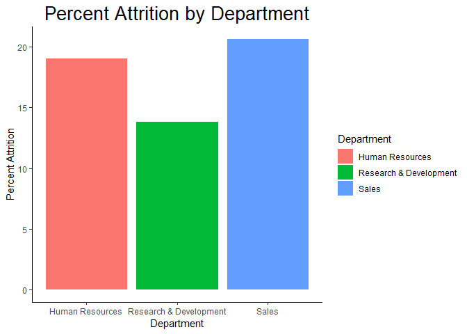
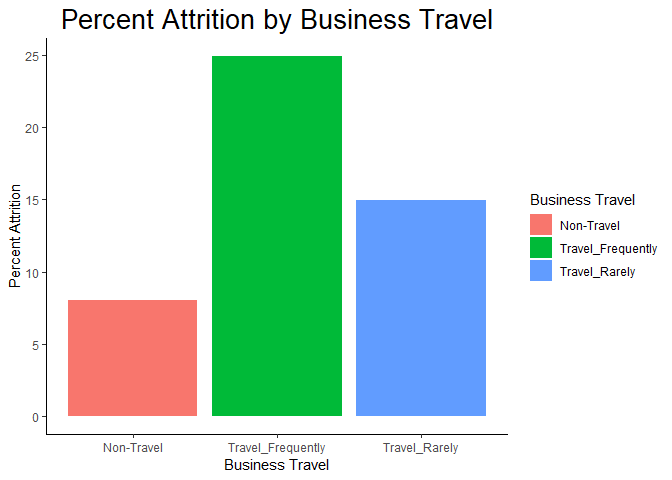
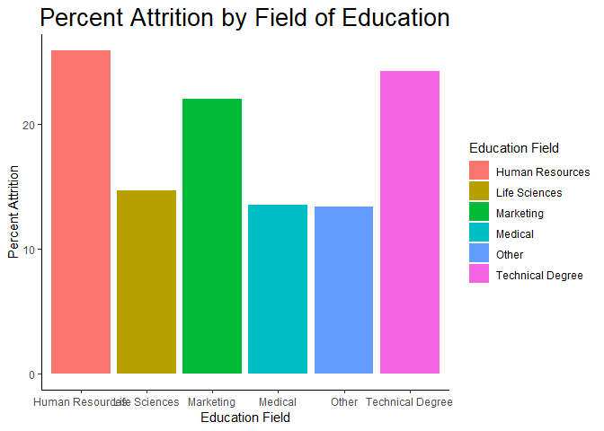
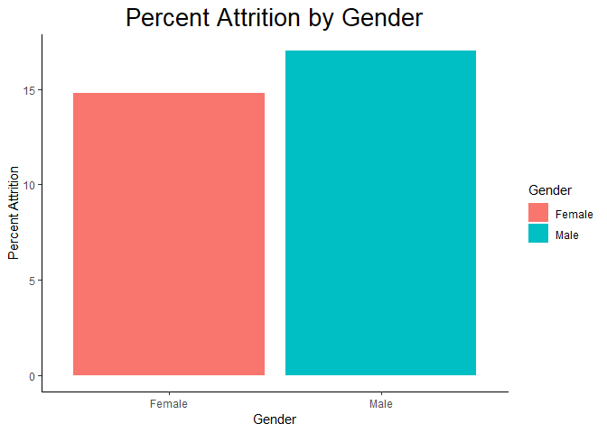
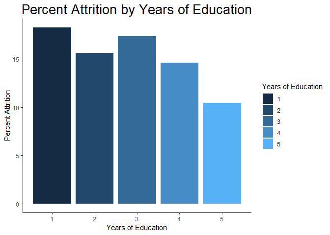
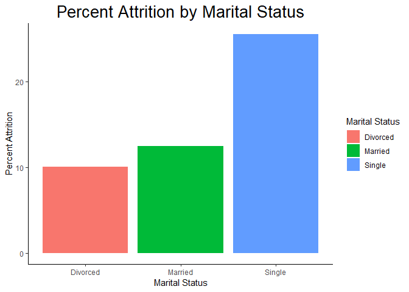

## Load Libraries

```r
# Load Libraries
library(tidyverse)
library(xlsx)
library(corrplot)
library(MASS)
```

## Read in and Setup Data

```r
# Load the CaseStudy2 Data set as a dataframe
jobsdf <- read.xlsx("CaseStudy Info/CaseStudy2-data.xlsx", sheetIndex = 1, header = T)
```


## Get information about the data frame jobsdf

```r
class(jobsdf)
```

```
## [1] "data.frame"
```

```r
str(jobsdf)
```

```
## 'data.frame':	1470 obs. of  35 variables:
##  $ Age                     : num  41 49 37 33 27 32 59 30 38 36 ...
##  $ Attrition               : Factor w/ 2 levels "No","Yes": 2 1 2 1 1 1 1 1 1 1 ...
##  $ BusinessTravel          : Factor w/ 3 levels "Non-Travel","Travel_Frequently",..: 3 2 3 2 3 2 3 3 2 3 ...
##  $ DailyRate               : num  1102 279 1373 1392 591 ...
##  $ Department              : Factor w/ 3 levels "Human Resources",..: 3 2 2 2 2 2 2 2 2 2 ...
##  $ DistanceFromHome        : num  1 8 2 3 2 2 3 24 23 27 ...
##  $ Education               : num  2 1 2 4 1 2 3 1 3 3 ...
##  $ EducationField          : Factor w/ 6 levels "Human Resources",..: 2 2 5 2 4 2 4 2 2 4 ...
##  $ EmployeeCount           : num  1 1 1 1 1 1 1 1 1 1 ...
##  $ EmployeeNumber          : num  1 2 4 5 7 8 10 11 12 13 ...
##  $ EnvironmentSatisfaction : num  2 3 4 4 1 4 3 4 4 3 ...
##  $ Gender                  : Factor w/ 2 levels "Female","Male": 1 2 2 1 2 2 1 2 2 2 ...
##  $ HourlyRate              : num  94 61 92 56 40 79 81 67 44 94 ...
##  $ JobInvolvement          : num  3 2 2 3 3 3 4 3 2 3 ...
##  $ JobLevel                : num  2 2 1 1 1 1 1 1 3 2 ...
##  $ JobRole                 : Factor w/ 9 levels "Healthcare Representative",..: 8 7 3 7 3 3 3 3 5 1 ...
##  $ JobSatisfaction         : num  4 2 3 3 2 4 1 3 3 3 ...
##  $ MaritalStatus           : Factor w/ 3 levels "Divorced","Married",..: 3 2 3 2 2 3 2 1 3 2 ...
##  $ MonthlyIncome           : num  5993 5130 2090 2909 3468 ...
##  $ MonthlyRate             : num  19479 24907 2396 23159 16632 ...
##  $ NumCompaniesWorked      : num  8 1 6 1 9 0 4 1 0 6 ...
##  $ Over18                  : Factor w/ 1 level "Y": 1 1 1 1 1 1 1 1 1 1 ...
##  $ OverTime                : Factor w/ 2 levels "No","Yes": 2 1 2 2 1 1 2 1 1 1 ...
##  $ PercentSalaryHike       : num  11 23 15 11 12 13 20 22 21 13 ...
##  $ PerformanceRating       : num  3 4 3 3 3 3 4 4 4 3 ...
##  $ RelationshipSatisfaction: num  1 4 2 3 4 3 1 2 2 2 ...
##  $ StandardHours           : num  80 80 80 80 80 80 80 80 80 80 ...
##  $ StockOptionLevel        : num  0 1 0 0 1 0 3 1 0 2 ...
##  $ TotalWorkingYears       : num  8 10 7 8 6 8 12 1 10 17 ...
##  $ TrainingTimesLastYear   : num  0 3 3 3 3 2 3 2 2 3 ...
##  $ WorkLifeBalance         : num  1 3 3 3 3 2 2 3 3 2 ...
##  $ YearsAtCompany          : num  6 10 0 8 2 7 1 1 9 7 ...
##  $ YearsInCurrentRole      : num  4 7 0 7 2 7 0 0 7 7 ...
##  $ YearsSinceLastPromotion : num  0 1 0 3 2 3 0 0 1 7 ...
##  $ YearsWithCurrManager    : num  5 7 0 0 2 6 0 0 8 7 ...
```

```r
head(jobsdf)
```

```
##   Age Attrition    BusinessTravel DailyRate             Department
## 1  41       Yes     Travel_Rarely      1102                  Sales
## 2  49        No Travel_Frequently       279 Research & Development
## 3  37       Yes     Travel_Rarely      1373 Research & Development
## 4  33        No Travel_Frequently      1392 Research & Development
## 5  27        No     Travel_Rarely       591 Research & Development
## 6  32        No Travel_Frequently      1005 Research & Development
##   DistanceFromHome Education EducationField EmployeeCount EmployeeNumber
## 1                1         2  Life Sciences             1              1
## 2                8         1  Life Sciences             1              2
## 3                2         2          Other             1              4
## 4                3         4  Life Sciences             1              5
## 5                2         1        Medical             1              7
## 6                2         2  Life Sciences             1              8
##   EnvironmentSatisfaction Gender HourlyRate JobInvolvement JobLevel
## 1                       2 Female         94              3        2
## 2                       3   Male         61              2        2
## 3                       4   Male         92              2        1
## 4                       4 Female         56              3        1
## 5                       1   Male         40              3        1
## 6                       4   Male         79              3        1
##                 JobRole JobSatisfaction MaritalStatus MonthlyIncome
## 1       Sales Executive               4        Single          5993
## 2    Research Scientist               2       Married          5130
## 3 Laboratory Technician               3        Single          2090
## 4    Research Scientist               3       Married          2909
## 5 Laboratory Technician               2       Married          3468
## 6 Laboratory Technician               4        Single          3068
##   MonthlyRate NumCompaniesWorked Over18 OverTime PercentSalaryHike
## 1       19479                  8      Y      Yes                11
## 2       24907                  1      Y       No                23
## 3        2396                  6      Y      Yes                15
## 4       23159                  1      Y      Yes                11
## 5       16632                  9      Y       No                12
## 6       11864                  0      Y       No                13
##   PerformanceRating RelationshipSatisfaction StandardHours
## 1                 3                        1            80
## 2                 4                        4            80
## 3                 3                        2            80
## 4                 3                        3            80
## 5                 3                        4            80
## 6                 3                        3            80
##   StockOptionLevel TotalWorkingYears TrainingTimesLastYear WorkLifeBalance
## 1                0                 8                     0               1
## 2                1                10                     3               3
## 3                0                 7                     3               3
## 4                0                 8                     3               3
## 5                1                 6                     3               3
## 6                0                 8                     2               2
##   YearsAtCompany YearsInCurrentRole YearsSinceLastPromotion
## 1              6                  4                       0
## 2             10                  7                       1
## 3              0                  0                       0
## 4              8                  7                       3
## 5              2                  2                       2
## 6              7                  7                       3
##   YearsWithCurrManager
## 1                    5
## 2                    7
## 3                    0
## 4                    0
## 5                    2
## 6                    6
```

```r
table(is.na(jobsdf))
```

```
## 
## FALSE 
## 51450
```

```r
summary(jobsdf)
```

```
##       Age        Attrition            BusinessTravel   DailyRate     
##  Min.   :18.00   No :1233   Non-Travel       : 150   Min.   : 102.0  
##  1st Qu.:30.00   Yes: 237   Travel_Frequently: 277   1st Qu.: 465.0  
##  Median :36.00              Travel_Rarely    :1043   Median : 802.0  
##  Mean   :36.92                                       Mean   : 802.5  
##  3rd Qu.:43.00                                       3rd Qu.:1157.0  
##  Max.   :60.00                                       Max.   :1499.0  
##                                                                      
##                   Department  DistanceFromHome   Education    
##  Human Resources       : 63   Min.   : 1.000   Min.   :1.000  
##  Research & Development:961   1st Qu.: 2.000   1st Qu.:2.000  
##  Sales                 :446   Median : 7.000   Median :3.000  
##                               Mean   : 9.193   Mean   :2.913  
##                               3rd Qu.:14.000   3rd Qu.:4.000  
##                               Max.   :29.000   Max.   :5.000  
##                                                               
##           EducationField EmployeeCount EmployeeNumber  
##  Human Resources : 27    Min.   :1     Min.   :   1.0  
##  Life Sciences   :606    1st Qu.:1     1st Qu.: 491.2  
##  Marketing       :159    Median :1     Median :1020.5  
##  Medical         :464    Mean   :1     Mean   :1024.9  
##  Other           : 82    3rd Qu.:1     3rd Qu.:1555.8  
##  Technical Degree:132    Max.   :1     Max.   :2068.0  
##                                                        
##  EnvironmentSatisfaction    Gender      HourlyRate     JobInvolvement
##  Min.   :1.000           Female:588   Min.   : 30.00   Min.   :1.00  
##  1st Qu.:2.000           Male  :882   1st Qu.: 48.00   1st Qu.:2.00  
##  Median :3.000                        Median : 66.00   Median :3.00  
##  Mean   :2.722                        Mean   : 65.89   Mean   :2.73  
##  3rd Qu.:4.000                        3rd Qu.: 83.75   3rd Qu.:3.00  
##  Max.   :4.000                        Max.   :100.00   Max.   :4.00  
##                                                                      
##     JobLevel                          JobRole    JobSatisfaction
##  Min.   :1.000   Sales Executive          :326   Min.   :1.000  
##  1st Qu.:1.000   Research Scientist       :292   1st Qu.:2.000  
##  Median :2.000   Laboratory Technician    :259   Median :3.000  
##  Mean   :2.064   Manufacturing Director   :145   Mean   :2.729  
##  3rd Qu.:3.000   Healthcare Representative:131   3rd Qu.:4.000  
##  Max.   :5.000   Manager                  :102   Max.   :4.000  
##                  (Other)                  :215                  
##   MaritalStatus MonthlyIncome    MonthlyRate    NumCompaniesWorked
##  Divorced:327   Min.   : 1009   Min.   : 2094   Min.   :0.000     
##  Married :673   1st Qu.: 2911   1st Qu.: 8047   1st Qu.:1.000     
##  Single  :470   Median : 4919   Median :14236   Median :2.000     
##                 Mean   : 6503   Mean   :14313   Mean   :2.693     
##                 3rd Qu.: 8379   3rd Qu.:20462   3rd Qu.:4.000     
##                 Max.   :19999   Max.   :26999   Max.   :9.000     
##                                                                   
##  Over18   OverTime   PercentSalaryHike PerformanceRating
##  Y:1470   No :1054   Min.   :11.00     Min.   :3.000    
##           Yes: 416   1st Qu.:12.00     1st Qu.:3.000    
##                      Median :14.00     Median :3.000    
##                      Mean   :15.21     Mean   :3.154    
##                      3rd Qu.:18.00     3rd Qu.:3.000    
##                      Max.   :25.00     Max.   :4.000    
##                                                         
##  RelationshipSatisfaction StandardHours StockOptionLevel TotalWorkingYears
##  Min.   :1.000            Min.   :80    Min.   :0.0000   Min.   : 0.00    
##  1st Qu.:2.000            1st Qu.:80    1st Qu.:0.0000   1st Qu.: 6.00    
##  Median :3.000            Median :80    Median :1.0000   Median :10.00    
##  Mean   :2.712            Mean   :80    Mean   :0.7939   Mean   :11.28    
##  3rd Qu.:4.000            3rd Qu.:80    3rd Qu.:1.0000   3rd Qu.:15.00    
##  Max.   :4.000            Max.   :80    Max.   :3.0000   Max.   :40.00    
##                                                                           
##  TrainingTimesLastYear WorkLifeBalance YearsAtCompany   YearsInCurrentRole
##  Min.   :0.000         Min.   :1.000   Min.   : 0.000   Min.   : 0.000    
##  1st Qu.:2.000         1st Qu.:2.000   1st Qu.: 3.000   1st Qu.: 2.000    
##  Median :3.000         Median :3.000   Median : 5.000   Median : 3.000    
##  Mean   :2.799         Mean   :2.761   Mean   : 7.008   Mean   : 4.229    
##  3rd Qu.:3.000         3rd Qu.:3.000   3rd Qu.: 9.000   3rd Qu.: 7.000    
##  Max.   :6.000         Max.   :4.000   Max.   :40.000   Max.   :18.000    
##                                                                           
##  YearsSinceLastPromotion YearsWithCurrManager
##  Min.   : 0.000          Min.   : 0.000      
##  1st Qu.: 0.000          1st Qu.: 2.000      
##  Median : 1.000          Median : 3.000      
##  Mean   : 2.188          Mean   : 4.123      
##  3rd Qu.: 3.000          3rd Qu.: 7.000      
##  Max.   :15.000          Max.   :17.000      
## 
```

## Change Attrition to values from Yes/No to 1 and 0

```r
jobsdf <- jobsdf %>% mutate(Attrition=ifelse(Attrition=="Yes", 1, 0))
```

# Exploratory Data Analysis and Graphs

## Build the data frames for each of the following:

* Job Roles
* Departments
* Business Travel 
* Education Field
* Gender
* Years of Education
* Marital Status


```r
# Percent Attrition by Job Role
roles <- jobsdf %>% group_by(JobRole, Attrition) %>% summarise(n = n())
roles[,c("Totals", "Percents")] <- NA
for (x in roles$JobRole)
{
  roles$Totals[roles$JobRole == x] <- sum(jobsdf$JobRole == x)
  roles$Percents[roles$JobRole == x] <- roles$n[roles$JobRole == x] / roles$Totals[roles$JobRole == x] * 100
}
roles <- as.data.frame(roles)

# Percent Attrition by Department
depts <- jobsdf %>% group_by(Department, Attrition) %>% summarise(n = n())
depts[,c("Totals", "Percents")] <- NA
for (x in depts$Department)
{
  depts$Totals[depts$Department == x] <- sum(jobsdf$Department == x)
  depts$Percents[depts$Department == x] <- depts$n[depts$Department == x] / depts$Totals[depts$Department == x] * 100
}
depts <- as.data.frame(depts)

# Percent Attrition by Travel
travel <- jobsdf %>% group_by(BusinessTravel, Attrition) %>% summarise(n = n())
travel[,c("Totals", "Percents")] <- NA
for (x in travel$BusinessTravel)
{
  travel$Totals[travel$BusinessTravel == x] <- sum(jobsdf$BusinessTravel == x )
  travel$Percents[travel$BusinessTravel == x] <- travel$n[travel$BusinessTravel == x] / travel$Totals[travel$BusinessTravel == x] * 100
}
travel <- as.data.frame(travel)

# Percent Attrition by Education Field
educfield <- jobsdf %>% group_by(EducationField, Attrition) %>% summarise(n = n())
educfield[,c("Totals", "Percents")] <- NA
for (x in educfield$EducationField)
{
  educfield$Totals[educfield$EducationField == x] <- sum(jobsdf$EducationField == x)
  educfield$Percents[educfield$EducationField == x] <- educfield$n[educfield$EducationField == x] / educfield$Totals[educfield$EducationField == x] * 100
}
educfield <- as.data.frame(educfield)

# Percent Attrition by Gender
gender <- jobsdf %>% group_by(Gender, Attrition) %>% summarise(n = n())
gender[,c("Totals", "Percents")] <- NA
for (x in gender$Gender)
{
  gender$Totals[gender$Gender == x] <- sum(jobsdf$Gender == x)
  gender$Percents[gender$Gender == x] <- gender$n[gender$Gender == x] / gender$Totals[gender$Gender == x] * 100
}
gender <- as.data.frame(gender)

# Percent Attrition by Years of Education
educyr <- jobsdf %>% group_by(Education, Attrition) %>% summarise(n = n())
educyr[,c("Totals", "Percents")] <- NA
for (x in educyr$Education)
{
  educyr$Totals[educyr$Education == x] <- sum(jobsdf$Education == x)
  educyr$Percents[educyr$Education == x] <- educyr$n[educyr$Education == x] / educyr$Totals[educyr$Education == x] * 100
}
educyr <- as.data.frame(educyr)

# Percent Attrition by Marital Status
marital_status <- jobsdf %>% group_by(MaritalStatus, Attrition) %>% summarise(n = n())
marital_status[,c("Totals", "Percents")] <- NA
for (x in marital_status$MaritalStatus)
{
  marital_status$Totals[marital_status$MaritalStatus == x] <- sum(jobsdf$MaritalStatus == x)
  marital_status$Percents[marital_status$MaritalStatus == x] <- marital_status$n[marital_status$MaritalStatus == x] / marital_status$Totals[marital_status$MaritalStatus == x] * 100
}
marital_status <- as.data.frame(marital_status)
```

## EDA Graphs

```r
# Percent Attrition by JobRole
roles %>% filter(Attrition == 1) %>% ggplot(aes(x = JobRole, y = Percents, fill=JobRole)) + 
  geom_bar(stat = "identity") + 
  coord_flip() + 
  xlab("Job Role") + ylab("Percent Attrition") +
  ggtitle("Percent Attrition by Job Role") +
  theme_classic() +
  theme(plot.title = element_text(size = 20, hjust = 0.5)) +
  guides(fill=guide_legend(title="Job Role"))
```

<!-- -->

```r
# Percent Attrition by Department
depts %>% filter(Attrition == 1) %>% ggplot(aes(x = Department, y = Percents, fill=Department)) + 
  geom_bar(stat = "identity") + 
  xlab("Department") + ylab("Percent Attrition") +
  ggtitle("Percent Attrition by Department") +
  theme_classic() +
  theme(plot.title = element_text(size = 20, hjust = 0.5)) +
  guides(fill=guide_legend(title="Department"))
```

<!-- -->

```r
# Percent Attrition by Travel
travel %>% filter(Attrition == 1) %>% ggplot(aes(x = BusinessTravel, y = Percents, fill=BusinessTravel)) + 
  geom_bar(stat = "identity") + 
  xlab("Business Travel") + ylab("Percent Attrition") +
  ggtitle("Percent Attrition by Business Travel") +
  theme_classic() +
  theme(plot.title = element_text(size = 20, hjust = 0.5)) +
  guides(fill=guide_legend(title="Business Travel"))
```

<!-- -->

```r
# Percent Attrition by Education Field
educfield %>% filter(Attrition == 1) %>% ggplot(aes(x = EducationField, y = Percents, fill=EducationField)) + 
  geom_bar(stat = "identity") + 
  xlab("Education Field") + ylab("Percent Attrition") +
  ggtitle("Percent Attrition by Field of Education") +
  theme_classic() +
  theme(plot.title = element_text(size = 20, hjust = 0.5)) +
  guides(fill=guide_legend(title="Education Field"))
```

<!-- -->

```r
# Percent Attrition by Gender
gender %>% filter(Attrition == 1) %>% ggplot(aes(x = Gender, y = Percents, fill=Gender)) + 
  geom_bar(stat = "identity") + 
  xlab("Gender") + ylab("Percent Attrition") +
  ggtitle("Percent Attrition by Gender") +
  theme_classic() +
  theme(plot.title = element_text(size = 20, hjust = 0.5)) +
  guides(fill=guide_legend(title="Gender"))
```

<!-- -->

```r
# Percent Attrition by Years of Education
educyr %>% filter(Attrition == 1) %>% ggplot(aes(x = Education, y = Percents, fill=Education)) + 
  geom_bar(stat = "identity") + 
  xlab("Years of Education") + ylab("Percent Attrition") +
  ggtitle("Percent Attrition by Years of Education") +
  theme_classic() +
  theme(plot.title = element_text(size = 20, hjust = 0.5)) +
  guides(fill=guide_legend(title="Years of Education"))
```

<!-- -->

```r
# Percent Attrition by Marital Status
marital_status %>% filter(Attrition == 1) %>% ggplot(aes(x = MaritalStatus, y = Percents, fill=MaritalStatus)) + 
  geom_bar(stat = "identity") + 
  xlab("Marital Status") + ylab("Percent Attrition") +
  ggtitle("Percent Attrition by Marital Status") +
  theme_classic() +
  theme(plot.title = element_text(size = 20, hjust = 0.5)) +
  guides(fill=guide_legend(title="Marital Status"))
```

<!-- -->


## Regression
### Set JObRole, Department, Marital Status, Gender, Business Travel, Education Field
### Over18, and OverTime to indicator variables

```r
jobsdf <- jobsdf %>% mutate(BusinessTravel=ifelse(BusinessTravel=="Travel_Rarely", 2, 
                                                  ifelse(BusinessTravel=="Travel_Frequently", 3, 1)))

jobsdf <- jobsdf %>% mutate(Department=ifelse(Department=="Research & Development", 2, 
                                              ifelse(Department=="Sales", 3, 1)))

jobsdf <- jobsdf %>% mutate(EducationField=ifelse(EducationField=="Life Sciences", 2, 
                                              ifelse(EducationField=="Marketing", 3, 
                                                     ifelse(EducationField=="Medical", 4,
                                                            ifelse(EducationField=="Other", 5,
                                                                   ifelse(EducationField=="Technical Degree", 6, 1))))))

jobsdf <- jobsdf %>% mutate(Gender=ifelse(Gender=="Male", 1, 0))

jobsdf <- jobsdf %>% mutate(JobRole=ifelse(JobRole=="Healthcare Representative", 2,
                                    ifelse(JobRole=="Laboratory Technician", 3,
                                           ifelse(JobRole=="Manager", 4,
                                                  ifelse(JobRole=="Manufacturing Director", 5,
                                                         ifelse(JobRole=="Research Director", 6, 
                                                                ifelse(JobRole=="Research Scientist", 7,
                                                                       ifelse(JobRole=="Sales Executive", 8,
                                                                              ifelse(JobRole=="Sales Representative", 9, 0)))))))))

jobsdf <- jobsdf %>% mutate(MaritalStatus=ifelse(MaritalStatus=="Married", 2,
                                                 ifelse(MaritalStatus=="Divorced", 3, 1)))


jobsdf <- jobsdf %>% mutate(Over18=ifelse(Over18=="Y", 1, 0))

jobsdf <- jobsdf %>% mutate(OverTime=ifelse(OverTime=="Yes", 1, 0))
```

### Remove EmployeeCount, Over18, StandardHour due to the standard deviation is zero

```r
jobsdf <- jobsdf[,-c(9,22,27)]
```

### Build Correlation Plot

```r
JobsCorr <- cor(jobsdf)
corrplot(JobsCorr, method = 'number', number.cex = 0.65, type = 'full')
```

<!-- -->

### Basic Linear Regression

```r
attritlm <- lm(Attrition ~ ., data = jobsdf)
summary(attritlm)
```

```
## 
## Call:
## lm(formula = Attrition ~ ., data = jobsdf)
## 
## Residuals:
##      Min       1Q   Median       3Q      Max 
## -0.59553 -0.21218 -0.08490  0.07369  1.13985 
## 
## Coefficients:
##                            Estimate Std. Error t value Pr(>|t|)    
## (Intercept)               6.469e-01  1.367e-01   4.732 2.44e-06 ***
## Age                      -3.796e-03  1.336e-03  -2.842 0.004550 ** 
## BusinessTravel            8.238e-02  1.610e-02   5.118 3.51e-07 ***
## DailyRate                -3.170e-05  2.137e-05  -1.483 0.138242    
## Department                7.432e-02  2.410e-02   3.084 0.002080 ** 
## DistanceFromHome          3.544e-03  1.059e-03   3.346 0.000841 ***
## Education                 4.802e-04  8.580e-03   0.056 0.955375    
## EducationField            6.668e-03  6.449e-03   1.034 0.301333    
## EmployeeNumber           -8.218e-06  1.430e-05  -0.575 0.565631    
## EnvironmentSatisfaction  -4.030e-02  7.858e-03  -5.129 3.31e-07 ***
## Gender                    3.909e-02  1.755e-02   2.227 0.026111 *  
## HourlyRate               -2.468e-04  4.231e-04  -0.583 0.559769    
## JobInvolvement           -6.139e-02  1.209e-02  -5.079 4.30e-07 ***
## JobLevel                 -3.584e-02  2.639e-02  -1.358 0.174654    
## JobRole                  -8.061e-03  5.135e-03  -1.570 0.116661    
## JobSatisfaction          -3.877e-02  7.804e-03  -4.968 7.57e-07 ***
## MaritalStatus            -5.388e-02  1.583e-02  -3.403 0.000685 ***
## MonthlyIncome             1.288e-06  6.002e-06   0.215 0.830133    
## MonthlyRate               5.262e-07  1.205e-06   0.437 0.662502    
## NumCompaniesWorked        1.691e-02  3.831e-03   4.414 1.09e-05 ***
## OverTime                  2.074e-01  1.918e-02  10.814  < 2e-16 ***
## PercentSalaryHike        -3.415e-03  3.697e-03  -0.924 0.355700    
## PerformanceRating         2.263e-02  3.748e-02   0.604 0.546003    
## RelationshipSatisfaction -2.230e-02  7.968e-03  -2.799 0.005197 ** 
## StockOptionLevel         -2.321e-02  1.351e-02  -1.717 0.086129 .  
## TotalWorkingYears        -3.452e-03  2.404e-03  -1.436 0.151123    
## TrainingTimesLastYear    -1.258e-02  6.682e-03  -1.882 0.059986 .  
## WorkLifeBalance          -2.778e-02  1.216e-02  -2.285 0.022439 *  
## YearsAtCompany            5.970e-03  2.981e-03   2.003 0.045404 *  
## YearsInCurrentRole       -1.026e-02  3.881e-03  -2.644 0.008278 ** 
## YearsSinceLastPromotion   1.110e-02  3.421e-03   3.245 0.001202 ** 
## YearsWithCurrManager     -1.045e-02  3.979e-03  -2.627 0.008700 ** 
## ---
## Signif. codes:  0 '***' 0.001 '**' 0.01 '*' 0.05 '.' 0.1 ' ' 1
## 
## Residual standard error: 0.3263 on 1438 degrees of freedom
## Multiple R-squared:  0.2299,	Adjusted R-squared:  0.2133 
## F-statistic: 13.85 on 31 and 1438 DF,  p-value: < 2.2e-16
```

### Stepwise variable selction using AIC as the stop criteria

```r
fit1lm <- stepAIC(attritlm, direction = "both")
```

```
## Start:  AIC=-3261.23
## Attrition ~ Age + BusinessTravel + DailyRate + Department + DistanceFromHome + 
##     Education + EducationField + EmployeeNumber + EnvironmentSatisfaction + 
##     Gender + HourlyRate + JobInvolvement + JobLevel + JobRole + 
##     JobSatisfaction + MaritalStatus + MonthlyIncome + MonthlyRate + 
##     NumCompaniesWorked + OverTime + PercentSalaryHike + PerformanceRating + 
##     RelationshipSatisfaction + StockOptionLevel + TotalWorkingYears + 
##     TrainingTimesLastYear + WorkLifeBalance + YearsAtCompany + 
##     YearsInCurrentRole + YearsSinceLastPromotion + YearsWithCurrManager
## 
##                            Df Sum of Sq    RSS     AIC
## - Education                 1    0.0003 153.08 -3263.2
## - MonthlyIncome             1    0.0049 153.09 -3263.2
## - MonthlyRate               1    0.0203 153.10 -3263.0
## - EmployeeNumber            1    0.0352 153.12 -3262.9
## - HourlyRate                1    0.0362 153.12 -3262.9
## - PerformanceRating         1    0.0388 153.12 -3262.9
## - PercentSalaryHike         1    0.0909 153.17 -3262.4
## - EducationField            1    0.1138 153.19 -3262.1
## - JobLevel                  1    0.1963 153.28 -3261.3
## <none>                                  153.08 -3261.2
## - TotalWorkingYears         1    0.2196 153.30 -3261.1
## - DailyRate                 1    0.2342 153.31 -3261.0
## - JobRole                   1    0.2624 153.34 -3260.7
## - StockOptionLevel          1    0.3140 153.39 -3260.2
## - TrainingTimesLastYear     1    0.3772 153.46 -3259.6
## - YearsAtCompany            1    0.4269 153.51 -3259.1
## - Gender                    1    0.5279 153.61 -3258.2
## - WorkLifeBalance           1    0.5560 153.64 -3257.9
## - YearsWithCurrManager      1    0.7348 153.81 -3256.2
## - YearsInCurrentRole        1    0.7443 153.82 -3256.1
## - RelationshipSatisfaction  1    0.8339 153.91 -3255.2
## - Age                       1    0.8597 153.94 -3255.0
## - Department                1    1.0126 154.09 -3253.5
## - YearsSinceLastPromotion   1    1.1209 154.20 -3252.5
## - DistanceFromHome          1    1.1917 154.27 -3251.8
## - MaritalStatus             1    1.2327 154.31 -3251.4
## - NumCompaniesWorked        1    2.0740 155.15 -3243.4
## - JobSatisfaction           1    2.6276 155.71 -3238.2
## - JobInvolvement            1    2.7458 155.83 -3237.1
## - BusinessTravel            1    2.7883 155.87 -3236.7
## - EnvironmentSatisfaction   1    2.8006 155.88 -3236.6
## - OverTime                  1   12.4479 165.53 -3148.3
## 
## Step:  AIC=-3263.22
## Attrition ~ Age + BusinessTravel + DailyRate + Department + DistanceFromHome + 
##     EducationField + EmployeeNumber + EnvironmentSatisfaction + 
##     Gender + HourlyRate + JobInvolvement + JobLevel + JobRole + 
##     JobSatisfaction + MaritalStatus + MonthlyIncome + MonthlyRate + 
##     NumCompaniesWorked + OverTime + PercentSalaryHike + PerformanceRating + 
##     RelationshipSatisfaction + StockOptionLevel + TotalWorkingYears + 
##     TrainingTimesLastYear + WorkLifeBalance + YearsAtCompany + 
##     YearsInCurrentRole + YearsSinceLastPromotion + YearsWithCurrManager
## 
##                            Df Sum of Sq    RSS     AIC
## - MonthlyIncome             1    0.0049 153.09 -3265.2
## - MonthlyRate               1    0.0201 153.10 -3265.0
## - EmployeeNumber            1    0.0349 153.12 -3264.9
## - HourlyRate                1    0.0362 153.12 -3264.9
## - PerformanceRating         1    0.0387 153.12 -3264.9
## - PercentSalaryHike         1    0.0908 153.17 -3264.4
## - EducationField            1    0.1135 153.19 -3264.1
## - JobLevel                  1    0.1963 153.28 -3263.3
## <none>                                  153.08 -3263.2
## - TotalWorkingYears         1    0.2195 153.30 -3263.1
## - DailyRate                 1    0.2346 153.31 -3263.0
## - JobRole                   1    0.2620 153.34 -3262.7
## - StockOptionLevel          1    0.3136 153.39 -3262.2
## - TrainingTimesLastYear     1    0.3777 153.46 -3261.6
## + Education                 1    0.0003 153.08 -3261.2
## - YearsAtCompany            1    0.4268 153.51 -3261.1
## - Gender                    1    0.5277 153.61 -3260.2
## - WorkLifeBalance           1    0.5557 153.64 -3259.9
## - YearsWithCurrManager      1    0.7345 153.81 -3258.2
## - YearsInCurrentRole        1    0.7442 153.82 -3258.1
## - RelationshipSatisfaction  1    0.8349 153.91 -3257.2
## - Age                       1    0.8712 153.95 -3256.9
## - Department                1    1.0123 154.09 -3255.5
## - YearsSinceLastPromotion   1    1.1211 154.20 -3254.5
## - DistanceFromHome          1    1.1931 154.27 -3253.8
## - MaritalStatus             1    1.2358 154.32 -3253.4
## - NumCompaniesWorked        1    2.0881 155.17 -3245.3
## - JobSatisfaction           1    2.6279 155.71 -3240.2
## - JobInvolvement            1    2.7470 155.83 -3239.1
## - BusinessTravel            1    2.7881 155.87 -3238.7
## - EnvironmentSatisfaction   1    2.8045 155.88 -3238.5
## - OverTime                  1   12.4501 165.53 -3150.3
## 
## Step:  AIC=-3265.18
## Attrition ~ Age + BusinessTravel + DailyRate + Department + DistanceFromHome + 
##     EducationField + EmployeeNumber + EnvironmentSatisfaction + 
##     Gender + HourlyRate + JobInvolvement + JobLevel + JobRole + 
##     JobSatisfaction + MaritalStatus + MonthlyRate + NumCompaniesWorked + 
##     OverTime + PercentSalaryHike + PerformanceRating + RelationshipSatisfaction + 
##     StockOptionLevel + TotalWorkingYears + TrainingTimesLastYear + 
##     WorkLifeBalance + YearsAtCompany + YearsInCurrentRole + YearsSinceLastPromotion + 
##     YearsWithCurrManager
## 
##                            Df Sum of Sq    RSS     AIC
## - MonthlyRate               1    0.0200 153.10 -3267.0
## - EmployeeNumber            1    0.0346 153.12 -3266.8
## - HourlyRate                1    0.0353 153.12 -3266.8
## - PerformanceRating         1    0.0383 153.12 -3266.8
## - PercentSalaryHike         1    0.0897 153.18 -3266.3
## - EducationField            1    0.1137 153.20 -3266.1
## <none>                                  153.09 -3265.2
## - TotalWorkingYears         1    0.2147 153.30 -3265.1
## - DailyRate                 1    0.2337 153.32 -3264.9
## - JobRole                   1    0.2584 153.34 -3264.7
## - StockOptionLevel          1    0.3162 153.40 -3264.1
## - TrainingTimesLastYear     1    0.3780 153.46 -3263.5
## + MonthlyIncome             1    0.0049 153.08 -3263.2
## + Education                 1    0.0003 153.09 -3263.2
## - YearsAtCompany            1    0.4289 153.51 -3263.1
## - Gender                    1    0.5295 153.62 -3262.1
## - WorkLifeBalance           1    0.5567 153.64 -3261.8
## - JobLevel                  1    0.6224 153.71 -3261.2
## - YearsInCurrentRole        1    0.7472 153.83 -3260.0
## - YearsWithCurrManager      1    0.7481 153.83 -3260.0
## - RelationshipSatisfaction  1    0.8334 153.92 -3259.2
## - Age                       1    0.8802 153.97 -3258.7
## - Department                1    1.0112 154.10 -3257.5
## - YearsSinceLastPromotion   1    1.1280 154.21 -3256.4
## - DistanceFromHome          1    1.1883 154.27 -3255.8
## - MaritalStatus             1    1.2332 154.32 -3255.4
## - NumCompaniesWorked        1    2.0887 155.17 -3247.3
## - JobSatisfaction           1    2.6308 155.72 -3242.1
## - JobInvolvement            1    2.7500 155.84 -3241.0
## - BusinessTravel            1    2.7854 155.87 -3240.7
## - EnvironmentSatisfaction   1    2.8126 155.90 -3240.4
## - OverTime                  1   12.4585 165.54 -3152.2
## 
## Step:  AIC=-3266.98
## Attrition ~ Age + BusinessTravel + DailyRate + Department + DistanceFromHome + 
##     EducationField + EmployeeNumber + EnvironmentSatisfaction + 
##     Gender + HourlyRate + JobInvolvement + JobLevel + JobRole + 
##     JobSatisfaction + MaritalStatus + NumCompaniesWorked + OverTime + 
##     PercentSalaryHike + PerformanceRating + RelationshipSatisfaction + 
##     StockOptionLevel + TotalWorkingYears + TrainingTimesLastYear + 
##     WorkLifeBalance + YearsAtCompany + YearsInCurrentRole + YearsSinceLastPromotion + 
##     YearsWithCurrManager
## 
##                            Df Sum of Sq    RSS     AIC
## - EmployeeNumber            1    0.0339 153.14 -3268.7
## - HourlyRate                1    0.0360 153.14 -3268.6
## - PerformanceRating         1    0.0379 153.14 -3268.6
## - PercentSalaryHike         1    0.0896 153.19 -3268.1
## - EducationField            1    0.1112 153.22 -3267.9
## <none>                                  153.10 -3267.0
## - TotalWorkingYears         1    0.2127 153.32 -3266.9
## - DailyRate                 1    0.2385 153.34 -3266.7
## - JobRole                   1    0.2591 153.36 -3266.5
## - StockOptionLevel          1    0.3207 153.43 -3265.9
## - TrainingTimesLastYear     1    0.3771 153.48 -3265.4
## + MonthlyRate               1    0.0200 153.09 -3265.2
## + MonthlyIncome             1    0.0047 153.10 -3265.0
## + Education                 1    0.0002 153.10 -3265.0
## - YearsAtCompany            1    0.4231 153.53 -3264.9
## - Gender                    1    0.5223 153.63 -3264.0
## - WorkLifeBalance           1    0.5556 153.66 -3263.7
## - JobLevel                  1    0.6170 153.72 -3263.1
## - YearsInCurrentRole        1    0.7433 153.85 -3261.9
## - YearsWithCurrManager      1    0.7557 153.86 -3261.7
## - RelationshipSatisfaction  1    0.8347 153.94 -3261.0
## - Age                       1    0.8791 153.98 -3260.6
## - Department                1    1.0161 154.12 -3259.3
## - YearsSinceLastPromotion   1    1.1333 154.24 -3258.1
## - DistanceFromHome          1    1.1984 154.30 -3257.5
## - MaritalStatus             1    1.2329 154.34 -3257.2
## - NumCompaniesWorked        1    2.0864 155.19 -3249.1
## - JobSatisfaction           1    2.6303 155.74 -3243.9
## - JobInvolvement            1    2.7555 155.86 -3242.8
## - BusinessTravel            1    2.7805 155.89 -3242.5
## - EnvironmentSatisfaction   1    2.7989 155.90 -3242.4
## - OverTime                  1   12.4775 165.58 -3153.8
## 
## Step:  AIC=-3268.66
## Attrition ~ Age + BusinessTravel + DailyRate + Department + DistanceFromHome + 
##     EducationField + EnvironmentSatisfaction + Gender + HourlyRate + 
##     JobInvolvement + JobLevel + JobRole + JobSatisfaction + MaritalStatus + 
##     NumCompaniesWorked + OverTime + PercentSalaryHike + PerformanceRating + 
##     RelationshipSatisfaction + StockOptionLevel + TotalWorkingYears + 
##     TrainingTimesLastYear + WorkLifeBalance + YearsAtCompany + 
##     YearsInCurrentRole + YearsSinceLastPromotion + YearsWithCurrManager
## 
##                            Df Sum of Sq    RSS     AIC
## - HourlyRate                1    0.0380 153.18 -3270.3
## - PerformanceRating         1    0.0391 153.18 -3270.3
## - PercentSalaryHike         1    0.0899 153.23 -3269.8
## - EducationField            1    0.1117 153.25 -3269.6
## <none>                                  153.14 -3268.7
## - TotalWorkingYears         1    0.2133 153.35 -3268.6
## - DailyRate                 1    0.2303 153.37 -3268.4
## - JobRole                   1    0.2562 153.40 -3268.2
## - StockOptionLevel          1    0.3375 153.48 -3267.4
## - TrainingTimesLastYear     1    0.3825 153.52 -3267.0
## + EmployeeNumber            1    0.0339 153.10 -3267.0
## + MonthlyRate               1    0.0193 153.12 -3266.8
## + MonthlyIncome             1    0.0044 153.13 -3266.7
## + Education                 1    0.0000 153.14 -3266.7
## - YearsAtCompany            1    0.4227 153.56 -3266.6
## - Gender                    1    0.5161 153.66 -3265.7
## - WorkLifeBalance           1    0.5579 153.70 -3265.3
## - JobLevel                  1    0.6138 153.75 -3264.8
## - YearsInCurrentRole        1    0.7430 153.88 -3263.5
## - YearsWithCurrManager      1    0.7540 153.89 -3263.4
## - RelationshipSatisfaction  1    0.8158 153.96 -3262.8
## - Age                       1    0.8789 154.02 -3262.2
## - Department                1    1.0148 154.15 -3260.9
## - YearsSinceLastPromotion   1    1.1339 154.27 -3259.8
## - DistanceFromHome          1    1.1870 154.33 -3259.3
## - MaritalStatus             1    1.2179 154.36 -3259.0
## - NumCompaniesWorked        1    2.0858 155.22 -3250.8
## - JobSatisfaction           1    2.6086 155.75 -3245.8
## - JobInvolvement            1    2.7529 155.89 -3244.5
## - BusinessTravel            1    2.7905 155.93 -3244.1
## - EnvironmentSatisfaction   1    2.8131 155.95 -3243.9
## - OverTime                  1   12.5010 165.64 -3155.3
## 
## Step:  AIC=-3270.29
## Attrition ~ Age + BusinessTravel + DailyRate + Department + DistanceFromHome + 
##     EducationField + EnvironmentSatisfaction + Gender + JobInvolvement + 
##     JobLevel + JobRole + JobSatisfaction + MaritalStatus + NumCompaniesWorked + 
##     OverTime + PercentSalaryHike + PerformanceRating + RelationshipSatisfaction + 
##     StockOptionLevel + TotalWorkingYears + TrainingTimesLastYear + 
##     WorkLifeBalance + YearsAtCompany + YearsInCurrentRole + YearsSinceLastPromotion + 
##     YearsWithCurrManager
## 
##                            Df Sum of Sq    RSS     AIC
## - PerformanceRating         1    0.0384 153.22 -3271.9
## - PercentSalaryHike         1    0.0881 153.26 -3271.4
## - EducationField            1    0.1146 153.29 -3271.2
## <none>                                  153.18 -3270.3
## - TotalWorkingYears         1    0.2154 153.39 -3270.2
## - DailyRate                 1    0.2350 153.41 -3270.0
## - JobRole                   1    0.2523 153.43 -3269.9
## - StockOptionLevel          1    0.3508 153.53 -3268.9
## + HourlyRate                1    0.0380 153.14 -3268.7
## - TrainingTimesLastYear     1    0.3804 153.56 -3268.6
## + EmployeeNumber            1    0.0360 153.14 -3268.6
## + MonthlyRate               1    0.0200 153.16 -3268.5
## + MonthlyIncome             1    0.0035 153.17 -3268.3
## + Education                 1    0.0000 153.18 -3268.3
## - YearsAtCompany            1    0.4194 153.60 -3268.3
## - Gender                    1    0.5158 153.69 -3267.4
## - WorkLifeBalance           1    0.5584 153.74 -3266.9
## - JobLevel                  1    0.6027 153.78 -3266.5
## - YearsInCurrentRole        1    0.7390 153.92 -3265.2
## - YearsWithCurrManager      1    0.7507 153.93 -3265.1
## - RelationshipSatisfaction  1    0.8155 153.99 -3264.5
## - Age                       1    0.8898 154.07 -3263.8
## - Department                1    1.0076 154.19 -3262.7
## - YearsSinceLastPromotion   1    1.1411 154.32 -3261.4
## - DistanceFromHome          1    1.1759 154.35 -3261.1
## - MaritalStatus             1    1.2072 154.38 -3260.8
## - NumCompaniesWorked        1    2.0827 155.26 -3252.4
## - JobSatisfaction           1    2.5765 155.75 -3247.8
## - JobInvolvement            1    2.7824 155.96 -3245.8
## - EnvironmentSatisfaction   1    2.7878 155.97 -3245.8
## - BusinessTravel            1    2.7935 155.97 -3245.7
## - OverTime                  1   12.5076 165.69 -3156.9
## 
## Step:  AIC=-3271.92
## Attrition ~ Age + BusinessTravel + DailyRate + Department + DistanceFromHome + 
##     EducationField + EnvironmentSatisfaction + Gender + JobInvolvement + 
##     JobLevel + JobRole + JobSatisfaction + MaritalStatus + NumCompaniesWorked + 
##     OverTime + PercentSalaryHike + RelationshipSatisfaction + 
##     StockOptionLevel + TotalWorkingYears + TrainingTimesLastYear + 
##     WorkLifeBalance + YearsAtCompany + YearsInCurrentRole + YearsSinceLastPromotion + 
##     YearsWithCurrManager
## 
##                            Df Sum of Sq    RSS     AIC
## - PercentSalaryHike         1    0.0526 153.27 -3273.4
## - EducationField            1    0.1155 153.33 -3272.8
## <none>                                  153.22 -3271.9
## - TotalWorkingYears         1    0.2094 153.43 -3271.9
## - DailyRate                 1    0.2401 153.46 -3271.6
## - JobRole                   1    0.2585 153.47 -3271.4
## - StockOptionLevel          1    0.3529 153.57 -3270.5
## + PerformanceRating         1    0.0384 153.18 -3270.3
## + HourlyRate                1    0.0373 153.18 -3270.3
## + EmployeeNumber            1    0.0372 153.18 -3270.3
## - TrainingTimesLastYear     1    0.3850 153.60 -3270.2
## + MonthlyRate               1    0.0196 153.20 -3270.1
## + MonthlyIncome             1    0.0032 153.21 -3270.0
## - YearsAtCompany            1    0.4160 153.63 -3269.9
## + Education                 1    0.0000 153.22 -3269.9
## - Gender                    1    0.5095 153.72 -3269.0
## - WorkLifeBalance           1    0.5565 153.77 -3268.6
## - JobLevel                  1    0.6129 153.83 -3268.1
## - YearsInCurrentRole        1    0.7310 153.95 -3266.9
## - YearsWithCurrManager      1    0.7474 153.96 -3266.8
## - RelationshipSatisfaction  1    0.8151 154.03 -3266.1
## - Age                       1    0.9008 154.12 -3265.3
## - Department                1    1.0086 154.22 -3264.3
## - YearsSinceLastPromotion   1    1.1535 154.37 -3262.9
## - DistanceFromHome          1    1.1725 154.39 -3262.7
## - MaritalStatus             1    1.2023 154.42 -3262.4
## - NumCompaniesWorked        1    2.0787 155.29 -3254.1
## - JobSatisfaction           1    2.5879 155.80 -3249.3
## - EnvironmentSatisfaction   1    2.7948 156.01 -3247.4
## - JobInvolvement            1    2.7998 156.01 -3247.3
## - BusinessTravel            1    2.8173 156.03 -3247.1
## - OverTime                  1   12.5308 165.75 -3158.4
## 
## Step:  AIC=-3273.42
## Attrition ~ Age + BusinessTravel + DailyRate + Department + DistanceFromHome + 
##     EducationField + EnvironmentSatisfaction + Gender + JobInvolvement + 
##     JobLevel + JobRole + JobSatisfaction + MaritalStatus + NumCompaniesWorked + 
##     OverTime + RelationshipSatisfaction + StockOptionLevel + 
##     TotalWorkingYears + TrainingTimesLastYear + WorkLifeBalance + 
##     YearsAtCompany + YearsInCurrentRole + YearsSinceLastPromotion + 
##     YearsWithCurrManager
## 
##                            Df Sum of Sq    RSS     AIC
## - EducationField            1    0.1174 153.38 -3274.3
## <none>                                  153.27 -3273.4
## - TotalWorkingYears         1    0.2114 153.48 -3273.4
## - DailyRate                 1    0.2453 153.51 -3273.1
## - JobRole                   1    0.2605 153.53 -3272.9
## - StockOptionLevel          1    0.3568 153.62 -3272.0
## + PercentSalaryHike         1    0.0526 153.22 -3271.9
## + HourlyRate                1    0.0362 153.23 -3271.8
## + EmployeeNumber            1    0.0357 153.23 -3271.8
## - TrainingTimesLastYear     1    0.3840 153.65 -3271.7
## + MonthlyRate               1    0.0200 153.25 -3271.6
## + PerformanceRating         1    0.0029 153.26 -3271.4
## + MonthlyIncome             1    0.0027 153.26 -3271.4
## + Education                 1    0.0000 153.27 -3271.4
## - YearsAtCompany            1    0.4295 153.70 -3271.3
## - Gender                    1    0.5085 153.78 -3270.6
## - WorkLifeBalance           1    0.5569 153.82 -3270.1
## - JobLevel                  1    0.6046 153.87 -3269.6
## - YearsInCurrentRole        1    0.7444 154.01 -3268.3
## - YearsWithCurrManager      1    0.7527 154.02 -3268.2
## - RelationshipSatisfaction  1    0.8010 154.07 -3267.8
## - Age                       1    0.9122 154.18 -3266.7
## - Department                1    1.0143 154.28 -3265.7
## - DistanceFromHome          1    1.1549 154.42 -3264.4
## - YearsSinceLastPromotion   1    1.1551 154.42 -3264.4
## - MaritalStatus             1    1.1925 154.46 -3264.0
## - NumCompaniesWorked        1    2.0914 155.36 -3255.5
## - JobSatisfaction           1    2.6011 155.87 -3250.7
## - EnvironmentSatisfaction   1    2.7733 156.04 -3249.1
## - JobInvolvement            1    2.7851 156.05 -3248.9
## - BusinessTravel            1    2.8385 156.11 -3248.4
## - OverTime                  1   12.5347 165.80 -3159.9
## 
## Step:  AIC=-3274.29
## Attrition ~ Age + BusinessTravel + DailyRate + Department + DistanceFromHome + 
##     EnvironmentSatisfaction + Gender + JobInvolvement + JobLevel + 
##     JobRole + JobSatisfaction + MaritalStatus + NumCompaniesWorked + 
##     OverTime + RelationshipSatisfaction + StockOptionLevel + 
##     TotalWorkingYears + TrainingTimesLastYear + WorkLifeBalance + 
##     YearsAtCompany + YearsInCurrentRole + YearsSinceLastPromotion + 
##     YearsWithCurrManager
## 
##                            Df Sum of Sq    RSS     AIC
## - TotalWorkingYears         1    0.2027 153.59 -3274.4
## <none>                                  153.38 -3274.3
## - DailyRate                 1    0.2322 153.62 -3274.1
## - JobRole                   1    0.2503 153.64 -3273.9
## + EducationField            1    0.1174 153.27 -3273.4
## - StockOptionLevel          1    0.3623 153.75 -3272.8
## + PercentSalaryHike         1    0.0546 153.33 -3272.8
## - TrainingTimesLastYear     1    0.3639 153.75 -3272.8
## + HourlyRate                1    0.0391 153.35 -3272.7
## + EmployeeNumber            1    0.0363 153.35 -3272.6
## + MonthlyRate               1    0.0174 153.37 -3272.5
## + PerformanceRating         1    0.0031 153.38 -3272.3
## + MonthlyIncome             1    0.0028 153.38 -3272.3
## + Education                 1    0.0001 153.38 -3272.3
## - YearsAtCompany            1    0.4243 153.81 -3272.2
## - Gender                    1    0.5088 153.89 -3271.4
## - WorkLifeBalance           1    0.5366 153.92 -3271.2
## - JobLevel                  1    0.6272 154.01 -3270.3
## - YearsWithCurrManager      1    0.7454 154.13 -3269.2
## - YearsInCurrentRole        1    0.7497 154.13 -3269.1
## - RelationshipSatisfaction  1    0.8038 154.19 -3268.6
## - Age                       1    0.9327 154.32 -3267.4
## - Department                1    1.0078 154.39 -3266.7
## - DistanceFromHome          1    1.1595 154.54 -3265.2
## - YearsSinceLastPromotion   1    1.1699 154.56 -3265.1
## - MaritalStatus             1    1.1919 154.58 -3264.9
## - NumCompaniesWorked        1    2.0912 155.48 -3256.4
## - JobSatisfaction           1    2.6407 156.03 -3251.2
## - EnvironmentSatisfaction   1    2.7299 156.12 -3250.4
## - JobInvolvement            1    2.7881 156.17 -3249.8
## - BusinessTravel            1    2.8105 156.20 -3249.6
## - OverTime                  1   12.5472 165.93 -3160.7
## 
## Step:  AIC=-3274.35
## Attrition ~ Age + BusinessTravel + DailyRate + Department + DistanceFromHome + 
##     EnvironmentSatisfaction + Gender + JobInvolvement + JobLevel + 
##     JobRole + JobSatisfaction + MaritalStatus + NumCompaniesWorked + 
##     OverTime + RelationshipSatisfaction + StockOptionLevel + 
##     TrainingTimesLastYear + WorkLifeBalance + YearsAtCompany + 
##     YearsInCurrentRole + YearsSinceLastPromotion + YearsWithCurrManager
## 
##                            Df Sum of Sq    RSS     AIC
## <none>                                  153.59 -3274.4
## + TotalWorkingYears         1    0.2027 153.38 -3274.3
## - DailyRate                 1    0.2497 153.84 -3274.0
## - JobRole                   1    0.2549 153.84 -3273.9
## - YearsAtCompany            1    0.2929 153.88 -3273.6
## + EducationField            1    0.1087 153.48 -3273.4
## - StockOptionLevel          1    0.3490 153.94 -3273.0
## - TrainingTimesLastYear     1    0.3500 153.94 -3273.0
## + PercentSalaryHike         1    0.0564 153.53 -3272.9
## + HourlyRate                1    0.0410 153.55 -3272.7
## + EmployeeNumber            1    0.0368 153.55 -3272.7
## + MonthlyRate               1    0.0157 153.57 -3272.5
## + PerformanceRating         1    0.0047 153.58 -3272.4
## + MonthlyIncome             1    0.0001 153.59 -3272.4
## + Education                 1    0.0001 153.59 -3272.4
## - Gender                    1    0.5144 154.10 -3271.4
## - WorkLifeBalance           1    0.5250 154.11 -3271.3
## - YearsInCurrentRole        1    0.7478 154.34 -3269.2
## - YearsWithCurrManager      1    0.7656 154.35 -3269.0
## - RelationshipSatisfaction  1    0.7761 154.36 -3268.9
## - Department                1    1.0963 154.68 -3265.9
## - DistanceFromHome          1    1.1509 154.74 -3265.4
## - YearsSinceLastPromotion   1    1.1818 154.77 -3265.1
## - MaritalStatus             1    1.1869 154.78 -3265.0
## - JobLevel                  1    1.6886 155.28 -3260.3
## - Age                       1    1.8927 155.48 -3258.3
## - NumCompaniesWorked        1    1.9081 155.50 -3258.2
## - JobSatisfaction           1    2.6096 156.20 -3251.6
## - EnvironmentSatisfaction   1    2.6995 156.29 -3250.7
## - BusinessTravel            1    2.7548 156.34 -3250.2
## - JobInvolvement            1    2.7629 156.35 -3250.1
## - OverTime                  1   12.4887 166.08 -3161.4
```

```r
summary(fit1lm)
```

```
## 
## Call:
## lm(formula = Attrition ~ Age + BusinessTravel + DailyRate + Department + 
##     DistanceFromHome + EnvironmentSatisfaction + Gender + JobInvolvement + 
##     JobLevel + JobRole + JobSatisfaction + MaritalStatus + NumCompaniesWorked + 
##     OverTime + RelationshipSatisfaction + StockOptionLevel + 
##     TrainingTimesLastYear + WorkLifeBalance + YearsAtCompany + 
##     YearsInCurrentRole + YearsSinceLastPromotion + YearsWithCurrManager, 
##     data = jobsdf)
## 
## Residuals:
##      Min       1Q   Median       3Q      Max 
## -0.56937 -0.21102 -0.08677  0.06624  1.13606 
## 
## Coefficients:
##                            Estimate Std. Error t value Pr(>|t|)    
## (Intercept)               6.897e-01  9.332e-02   7.390 2.46e-13 ***
## Age                      -4.818e-03  1.141e-03  -4.223 2.56e-05 ***
## BusinessTravel            8.170e-02  1.604e-02   5.094 3.96e-07 ***
## DailyRate                -3.259e-05  2.125e-05  -1.534 0.125267    
## Department                7.635e-02  2.376e-02   3.214 0.001339 ** 
## DistanceFromHome          3.466e-03  1.053e-03   3.293 0.001016 ** 
## EnvironmentSatisfaction  -3.939e-02  7.811e-03  -5.043 5.16e-07 ***
## Gender                    3.853e-02  1.750e-02   2.201 0.027864 *  
## JobInvolvement           -6.144e-02  1.204e-02  -5.102 3.81e-07 ***
## JobLevel                 -4.119e-02  1.033e-02  -3.989 6.98e-05 ***
## JobRole                  -7.912e-03  5.106e-03  -1.550 0.121469    
## JobSatisfaction          -3.845e-02  7.754e-03  -4.958 7.95e-07 ***
## MaritalStatus            -5.275e-02  1.577e-02  -3.344 0.000847 ***
## NumCompaniesWorked        1.579e-02  3.724e-03   4.240 2.38e-05 ***
## OverTime                  2.076e-01  1.914e-02  10.847  < 2e-16 ***
## RelationshipSatisfaction -2.143e-02  7.924e-03  -2.704 0.006929 ** 
## StockOptionLevel         -2.433e-02  1.342e-02  -1.813 0.069978 .  
## TrainingTimesLastYear    -1.209e-02  6.658e-03  -1.816 0.069580 .  
## WorkLifeBalance          -2.697e-02  1.212e-02  -2.224 0.026299 *  
## YearsAtCompany            4.707e-03  2.834e-03   1.661 0.096899 .  
## YearsInCurrentRole       -1.027e-02  3.870e-03  -2.654 0.008035 ** 
## YearsSinceLastPromotion   1.138e-02  3.410e-03   3.337 0.000869 ***
## YearsWithCurrManager     -1.063e-02  3.956e-03  -2.686 0.007320 ** 
## ---
## Signif. codes:  0 '***' 0.001 '**' 0.01 '*' 0.05 '.' 0.1 ' ' 1
## 
## Residual standard error: 0.3258 on 1447 degrees of freedom
## Multiple R-squared:  0.2274,	Adjusted R-squared:  0.2156 
## F-statistic: 19.36 on 22 and 1447 DF,  p-value: < 2.2e-16
```

### logistic regression

```r
glm_test <- glm(Attrition ~ ., data = jobsdf, family = binomial(link = "logit"))
summary(glm_test)
```

```
## 
## Call:
## glm(formula = Attrition ~ ., family = binomial(link = "logit"), 
##     data = jobsdf)
## 
## Deviance Residuals: 
##     Min       1Q   Median       3Q      Max  
## -2.1088  -0.5191  -0.2658  -0.1021   3.3955  
## 
## Coefficients:
##                            Estimate Std. Error z value Pr(>|z|)    
## (Intercept)               2.083e+00  1.365e+00   1.527 0.126872    
## Age                      -2.996e-02  1.318e-02  -2.273 0.023035 *  
## BusinessTravel            9.287e-01  1.676e-01   5.542 3.00e-08 ***
## DailyRate                -3.106e-04  2.132e-04  -1.456 0.145270    
## Department                1.102e+00  2.786e-01   3.955 7.66e-05 ***
## DistanceFromHome          4.274e-02  1.042e-02   4.103 4.07e-05 ***
## Education                 1.153e-02  8.488e-02   0.136 0.891973    
## EducationField            7.520e-02  6.583e-02   1.142 0.253346    
## EmployeeNumber           -1.388e-04  1.457e-04  -0.952 0.340913    
## EnvironmentSatisfaction  -4.148e-01  7.983e-02  -5.197 2.03e-07 ***
## Gender                    4.043e-01  1.790e-01   2.259 0.023884 *  
## HourlyRate               -2.449e-04  4.255e-03  -0.058 0.954091    
## JobInvolvement           -5.353e-01  1.196e-01  -4.475 7.63e-06 ***
## JobLevel                 -3.817e-01  2.823e-01  -1.352 0.176312    
## JobRole                  -1.433e-01  5.462e-02  -2.624 0.008688 ** 
## JobSatisfaction          -4.190e-01  7.926e-02  -5.286 1.25e-07 ***
## MaritalStatus            -5.445e-01  1.671e-01  -3.259 0.001119 ** 
## MonthlyIncome            -4.089e-05  6.679e-05  -0.612 0.540386    
## MonthlyRate               2.615e-06  1.215e-05   0.215 0.829552    
## NumCompaniesWorked        1.871e-01  3.698e-02   5.059 4.22e-07 ***
## OverTime                  1.866e+00  1.854e-01  10.067  < 2e-16 ***
## PercentSalaryHike        -3.226e-02  3.801e-02  -0.849 0.395994    
## PerformanceRating         1.827e-01  3.853e-01   0.474 0.635379    
## RelationshipSatisfaction -2.459e-01  8.025e-02  -3.064 0.002187 ** 
## StockOptionLevel         -2.563e-01  1.467e-01  -1.747 0.080626 .  
## TotalWorkingYears        -6.038e-02  2.821e-02  -2.140 0.032359 *  
## TrainingTimesLastYear    -1.868e-01  7.080e-02  -2.638 0.008337 ** 
## WorkLifeBalance          -3.027e-01  1.184e-01  -2.556 0.010590 *  
## YearsAtCompany            1.033e-01  3.751e-02   2.754 0.005888 ** 
## YearsInCurrentRole       -1.493e-01  4.359e-02  -3.426 0.000613 ***
## YearsSinceLastPromotion   1.633e-01  4.069e-02   4.013 5.99e-05 ***
## YearsWithCurrManager     -1.411e-01  4.505e-02  -3.132 0.001737 ** 
## ---
## Signif. codes:  0 '***' 0.001 '**' 0.01 '*' 0.05 '.' 0.1 ' ' 1
## 
## (Dispersion parameter for binomial family taken to be 1)
## 
##     Null deviance: 1298.58  on 1469  degrees of freedom
## Residual deviance:  899.18  on 1438  degrees of freedom
## AIC: 963.18
## 
## Number of Fisher Scoring iterations: 6
```
